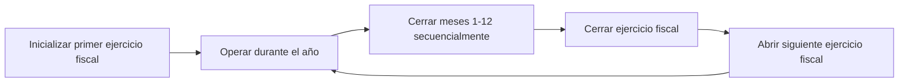

# Año Fiscal

Un año fiscal es el período contable fundamental en Lana. Define la ventana de doce meses durante la cual se mide el desempeño financiero y controla cuándo el libro mayor puede aceptar transacciones. No se pueden registrar transacciones contables hasta que se haya inicializado un año fiscal, lo que lo convierte en un requisito previo para todas las operaciones financieras en el sistema.

## Supuestos Importantes

- Las cuentas del estado de pérdidas y ganancias operan únicamente en USD. Todos los ingresos y gastos se rastrean en dólares estadounidenses.
- Los años fiscales son secuenciales y no se superponen. Cada año fiscal abarca exactamente doce meses.
- Todas las operaciones dentro del marco del año fiscal son irreversibles. Una vez que se cierra un mes o año, no se puede volver a abrir.

## Inicialización

El primer año fiscal debe inicializarse antes de que el sistema pueda procesar cualquier transacción financiera. Esta inicialización establece la fecha de inicio de los registros contables del banco y habilita los controles de velocidad del libro mayor, que determinan cuándo se pueden registrar las transacciones.

Existen dos formas de inicializar el primer año fiscal:

### Inicialización Automática

Si la configuración de inicialización contable incluye una fecha de apertura, el sistema creará automáticamente el primer año fiscal al iniciarse. Este es el enfoque típico para nuevas implementaciones donde el banco desea comenzar operaciones de inmediato.

### Inicialización Manual

Un operador puede inicializar el primer año fiscal a través del panel de administración o la API del sistema. Este enfoque se utiliza cuando el banco necesita controlar la fecha exacta de inicio, por ejemplo, al migrar desde otro sistema o cuando el inicio de operaciones no coincide con la implementación.

### Qué hace la inicialización

Cuando se inicializa un año fiscal, el sistema:

1. Crea la entidad del año fiscal con sus fechas de inicio y fin.
2. Actualiza los metadatos del conjunto de cuentas en la raíz del catálogo de cuentas para habilitar los controles de velocidad.
3. Abre el libro mayor para transacciones dentro del rango de fechas del año fiscal.

Después de la inicialización, se pueden registrar depósitos, crear facilidades de crédito y proceder con todas las demás operaciones financieras.

## Cierre mensual

Cada año fiscal está compuesto por meses individuales que deben cerrarse secuencialmente. El cierre mensual bloquea el libro mayor contra transacciones con fecha efectiva en o antes de la fecha de cierre.

### Requisito de cierre secuencial

Los meses deben cerrarse en orden cronológico. El sistema siempre aplica el cierre al mes no cerrado más antiguo del año fiscal. Un operador no puede cerrar marzo antes de cerrar febrero. Esto garantiza que los registros de cada período se revisen y finalicen antes de continuar.

### Condiciones previas

Un mes solo puede cerrarse si el mes calendario ha transcurrido según la hora actual del sistema. Enero no puede cerrarse hasta el 1 de febrero como mínimo. Esto evita un cierre prematuro que podría bloquear transacciones legítimas.

### Efecto en el libro mayor

Una vez que se cierra un mes, los controles de velocidad del libro mayor de Cala rechazan cualquier transacción que intente registrarse con una fecha efectiva dentro o antes del mes cerrado. Esto proporciona una garantía absoluta de que los registros históricos son inmutables. Si se descubre un error después del cierre, debe corregirse con una nueva transacción en el período abierto actual, no modificando el período cerrado.

### Mejores Prácticas Operativas

Antes de cerrar un mes, los operadores deben:

1. **Revisar el balance de comprobación** para confirmar que los débitos sean iguales a los créditos.
2. **Verificar los asientos automatizados** — comprobar que todos los asientos contables automatizados esperados (devengos de intereses, reconocimiento de comisiones y otros) se hayan registrado para el período.
3. **Procesar ajustes manuales** — registrar cualquier ajuste de fin de período (provisiones para pérdidas crediticias, correcciones de devengos, reclasificaciones) antes del cierre.
4. **Conciliar datos externos** — comparar los extractos bancarios, informes de custodia y otras fuentes externas con los saldos del libro mayor.

## Cierre del Ejercicio Fiscal

Una vez que los doce meses han sido cerrados individualmente, el ejercicio fiscal en sí puede cerrarse. Este es el procedimiento de fin de año que transfiere la utilidad neta del Estado de Resultados al Balance General.

### El Asiento de Cierre

El cierre del ejercicio fiscal registra una transacción especial en el libro mayor con una fecha efectiva correspondiente a la fecha de cierre del ejercicio fiscal. Esta transacción:

- Compensa todos los saldos de las cuentas de ingresos, costo de ventas y gastos, dejándolos en cero.
- Registra el resultado neto (ingresos menos gastos) en las cuentas de utilidades retenidas en la sección de patrimonio del balance general.
- Si el resultado es una ganancia, se acredita a la cuenta de ganancias retenidas.
- Si el resultado es una pérdida, se debita a la cuenta de pérdidas retenidas.

Después de este asiento, las cuentas del Estado de Resultados inician el siguiente ejercicio fiscal con saldos en cero, mientras que el balance general arrastra las utilidades retenidas acumuladas.

### Irreversibilidad

Al igual que los cierres mensuales, el cierre del ejercicio fiscal es irreversible. Una vez completado, el asiento de cierre de fin de año no puede revertirse ni modificarse. Los estados financieros del año cerrado son definitivos.

## Apertura del Siguiente Año Fiscal

Después de cerrar un año fiscal, el siguiente año fiscal debe abrirse explícitamente antes de que se puedan registrar transacciones en el nuevo período. Esta es una decisión de diseño intencional que requiere una decisión consciente para avanzar el calendario contable.

El nuevo año fiscal comienza el día después de la fecha de cierre del año anterior y abarca doce meses. Hasta que se abra, el sistema rechazará cualquier transacción con fechas efectivas en el nuevo período.

### Resumen del Flujo de Trabajo

Este ciclo se repite anualmente. Cada ejercicio fiscal proporciona un límite claro para la presentación de informes financieros y garantiza que los libros del banco se cierren y trasladen adecuadamente a intervalos regulares.
