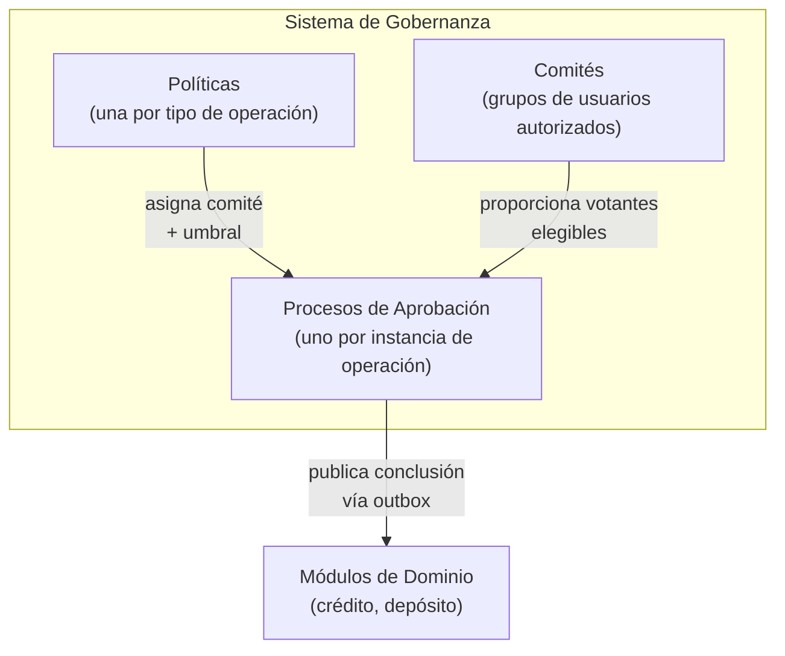
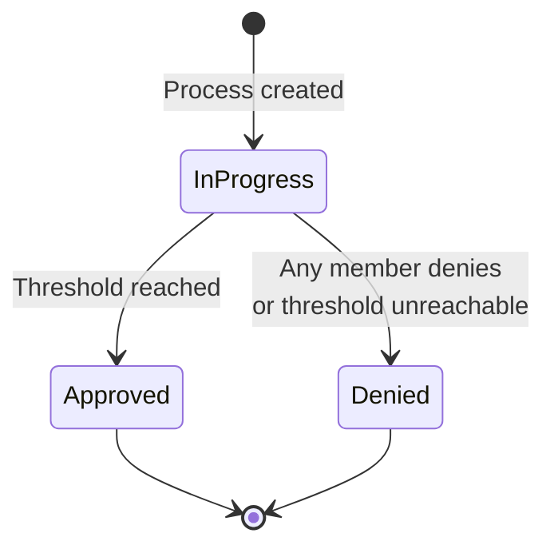

# Sistema de Gobernanza y Aprobación

El sistema de gobernanza proporciona autorización estructurada multipartita para operaciones financieras críticas. Antes de que una propuesta de línea de crédito pueda proceder, antes de que un desembolso libere fondos, o antes de que se confirme un retiro, el sistema de gobernanza garantiza que las personas apropiadas hayan revisado y aprobado la acción.

El sistema se basa en tres conceptos fundamentales: las **políticas** definen las reglas, los **comités** proporcionan las personas, y los **procesos de aprobación** ejecutan el flujo de trabajo para cada operación individual.

## Cómo Funciona

```mermaid
graph TD
    subgraph GOV["Sistema de Gobernanza"]
        POL["Políticas<br/>(una por tipo de operación)"]
        COM["Comités<br/>(grupos de usuarios autorizados)"]
        PROC["Procesos de Aprobación<br/>(uno por instancia de operación)"]
    end
    POL -->|"asigna comité<br/>+ umbral"| PROC
    COM -->|"proporciona votantes<br/>elegibles"| PROC
    PROC -->|"publica conclusión<br/>vía outbox"| EVT["Módulos de Dominio<br/>(crédito, depósito)"]
```

Cuando una operación de dominio requiere aprobación:

1. El módulo originador (crédito o depósito) llama al sistema de gobernanza para **iniciar un proceso de aprobación**.
2. El sistema de gobernanza busca la **política** configurada para ese tipo de operación.
3. Las **reglas** de la política se copian en el nuevo proceso (ya sea aprobación automática o umbral de comité).
4. Si las reglas requieren aprobación del comité, **los miembros del comité votan** para aprobar o denegar.
5. Cuando se alcanza el umbral (o se produce una denegación), el proceso **concluye** y publica un evento outbox.
6. El módulo originador reacciona al evento de conclusión y procede en consecuencia (por ejemplo, liquidando un desembolso o revirtiendo una retención de retiro).

## Tipos de Operaciones Gobernadas

Tres tipos de operaciones son gobernados por el sistema de aprobación:

| Operación | Tipo de Proceso | Se Activa Cuando | Al Aprobar | Al Denegar |
|-----------|-------------|----------------|-------------|-----------|
| **Propuesta de Línea de Crédito** | `credit-facility-proposal` | El cliente acepta una propuesta | La propuesta se convierte en una línea pendiente | La propuesta es rechazada |
| **Desembolso** | `disbursal` | El operador crea un desembolso | El desembolso se liquida, los fondos se acreditan | El desembolso se cancela, no se liberan fondos |
| **Retiro** | `withdraw` | El operador inicia un retiro | El retiro procede a confirmación | El retiro es denegado, los fondos retenidos se restauran |

Cada tipo de operación tiene exactamente una política. Por defecto, todas las políticas comienzan con reglas `AutoApprove`, lo que significa que las operaciones se aprueban instantáneamente sin intervención humana. Un administrador puede entonces asignar un comité y umbral a cualquier política, cambiándola para requerir aprobación manual.

## Reglas de Aprobación

Las reglas determinan cómo un proceso de aprobación llega a su conclusión. Existen dos modos:

### Aprobación Automática del Sistema

El modo predeterminado para todas las políticas. Cuando se crea un proceso de aprobación bajo una política `AutoApprove`, concluye inmediatamente con un resultado aprobado. No se necesita intervención humana.

Esto es apropiado para operaciones de bajo riesgo o durante la configuración inicial del sistema antes de que se configuren los comités de gobernanza.

### Umbral del Comité

Cuando una política se configura con un comité y un número umbral, cada proceso de aprobación requiere que al menos N miembros elegibles del comité voten para aprobar antes de que el proceso concluya. El umbral debe ser:

- Al menos 1 (no se permiten políticas con umbral cero)
- Como máximo igual al número actual de miembros del comité

**La denegación es inmediata**: Un solo voto de rechazo de cualquier miembro elegible del comité hace que todo el proceso sea denegado, independientemente de cuántas aprobaciones ya se hayan emitido. Esto otorga a cada miembro del comité un poder de veto efectivo.

**Los votantes elegibles se evalúan en el momento de votar**: Si se añade un miembro a un comité después de que comienza un proceso, aún puede votar en ese proceso. Si se elimina un miembro, sus votos existentes aún cuentan, pero el conjunto elegible se reduce, lo que potencialmente hace que el umbral sea inalcanzable (lo que también resulta en denegación).

## Ciclo de Vida del Proceso de Aprobación

```mermaid
stateDiagram-v2
    [*] --> InProgress: Process created
    InProgress --> Approved: Threshold reached
    InProgress --> Denied: Any member denies<br/>or threshold unreachable
    Approved --> [*]
    Denied --> [*]
```

| Estado | Descripción |
|--------|-------------|
| **En Progreso** | El proceso está activo, aceptando votos de los miembros del comité |
| **Aprobado** | Se han recibido suficientes aprobaciones; la operación gobernada puede proceder |
| **Denegado** | Un miembro del comité denegó, o el umbral se volvió inalcanzable |

Cuando un proceso concluye (ya sea aprobado o denegado), se publica un evento `ApprovalProcessConcluded` en la bandeja de salida. El módulo del dominio que inició el proceso escucha este evento y toma la acción apropiada.

## Patrón de Integración

Los tres módulos de dominio siguen el mismo patrón de integración con la gobernanza:

1. **Inicialización de políticas**: Al iniciar la aplicación, cada módulo registra su tipo de proceso de aprobación. Si la política ya existe, se reutiliza la existente (inicialización idempotente).
2. **Creación de procesos**: Cuando ocurre la operación de dominio, se inicia un nuevo proceso de aprobación dentro de la misma transacción de base de datos. Si la política es de auto-aprobación, el proceso concluye inmediatamente.
3. **Manejo asíncrono de conclusión**: Un ejecutor de trabajos en segundo plano escucha la bandeja de salida en busca de eventos `ApprovalProcessConcluded`, filtra por tipo de proceso y ejecuta la consecuencia específica del dominio.

Este patrón basado en eventos significa que el sistema de gobernanza está desacoplado de los módulos de dominio. El sistema de gobernanza no sabe ni le importa qué es un "desembolso" o un "retiro"; solo conoce procesos de aprobación con tipos y votos.

## Control de Acceso Basado en Roles

Las operaciones de gobernanza están protegidas por permisos RBAC:

- **GovernanceWriter**: Puede crear comités, gestionar membresías, crear políticas, actualizar reglas y emitir votos.
- **GovernanceViewer**: Puede leer y listar comités, políticas y procesos de aprobación.

Todas las acciones de gobernanza se registran en el log de auditoría, incluyendo quién votó, cuándo y cuál fue el resultado.

## Documentación Relacionada

- [Configuración de Comités](committees) - Gestión de comités de aprobación
- [Políticas de Aprobación](policies) - Configuración de políticas

## Recorrido en Panel de Administración: Gestión de Usuarios y Roles

Las operaciones de gobernanza dependen de asignaciones correctas de rol. Lana usa RBAC, donde los
roles agrupan permission sets y los permisos efectivos se componen por unión.

**Paso 1.** Abre la lista de usuarios.

**Paso 2.** Haz clic en **Crear**.

**Paso 3.** Ingresa correo del usuario.

**Paso 4.** Selecciona rol inicial (ejemplo: admin).

**Paso 5.** Envía creación de usuario.

**Paso 6.** Verifica creación exitosa.

**Paso 7.** Confirma que aparece en la lista.

**Paso 8.** Abre gestión de roles del usuario.

**Paso 9.** Actualiza el set de roles/permisos.

**Paso 10.** Verifica éxito de actualización.

