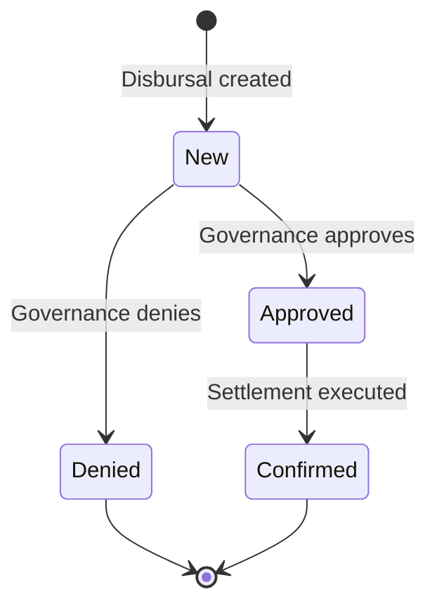

# Desembolso

Un desembolso representa una disposición de fondos de una línea de crédito activa hacia el cliente. Es el mecanismo mediante el cual el límite de crédito aprobado se convierte en préstamo efectivo. Cada desembolso registra el monto liberado, lo vincula a la línea de crédito y desencadena la creación de una obligación principal que el prestatario debe reembolsar.

Las líneas de crédito pueden configurarse para desembolsos únicos o múltiples. Una línea de desembolso único libera todo el límite de crédito en una sola transacción. Una línea de desembolsos múltiples permite al prestatario disponer de fondos de manera incremental a lo largo del tiempo, hasta el límite de la línea, lo cual puede ser útil para líneas de capital de trabajo donde las necesidades de efectivo del prestatario varían.

## Precondiciones y Validación

Antes de que se pueda iniciar un desembolso, el sistema aplica controles estrictos para garantizar que el evento de préstamo sea seguro y conforme:

- **La línea debe estar Activa**: No se pueden crear desembolsos para líneas que aún se encuentren en estado de propuesta, pendiente o completado. La línea debe haber superado tanto las compuertas de gobernanza como de garantía.
- **Antes del vencimiento**: La fecha del desembolso debe ser anterior a la fecha de vencimiento de la línea. No se pueden liberar nuevos fondos de una línea vencida.
- **Verificación del cliente**: Cuando los requisitos de verificación KYC están habilitados por política, el cliente debe tener un estado KYC verificado antes de que se puedan liberar los fondos.
- **Cumplimiento de la política de desembolso**: La política de desembolso de la línea (único vs. múltiple) debe permitir un nuevo desembolso. Si la línea está configurada para desembolso único y ya se ha confirmado uno, no se permiten desembolsos adicionales.
- **Suficiencia de garantía**: El CVL posterior al desembolso debe mantenerse en o por encima del umbral `margin_call_cvl`. Esta es una verificación crítica de seguridad — garantiza que liberar fondos adicionales no coloque a la línea en un estado de garantía insuficiente. El sistema calcula cuál sería el CVL después del desembolso y rechaza la solicitud si violaría el umbral.

Estos controles previenen que se creen eventos de préstamo con garantía insuficiente o fuera de política.

## Proceso de Aprobación de Desembolso

Cada desembolso pasa por su propio proceso de aprobación de gobernanza, independiente de la aprobación a nivel de la facilidad. Esto significa que aunque la facilidad de crédito general haya sido aprobada, cada retiro individual también debe ser autorizado de acuerdo con las políticas de aprobación del banco.

El proceso de aprobación funciona de manera idéntica a otras operaciones gobernadas en el sistema:

1. Cuando se crea un desembolso, el sistema crea automáticamente un proceso de aprobación vinculado a la política de aprobación de desembolsos configurada.
2. Los miembros del comité asignado pueden votar para aprobar o denegar el desembolso.
3. Si se alcanza el número requerido de aprobaciones, el desembolso pasa al estado Aprobado.
4. Si algún miembro del comité deniega el desembolso, este es rechazado inmediatamente.

Para facilidades con políticas de aprobación automática, este paso ocurre automáticamente sin intervención manual.

## Modelo de Estado y Resultado

Los operadores generalmente observan estas transiciones de estado:

- **Nuevo**: Desembolso inicializado y en espera de decisión de gobernanza. Los fondos no han sido liberados.
- **Aprobado**: Se alcanzó el umbral de aprobación de gobernanza. El sistema procede a liquidar el desembolso.
- **Confirmado**: Desembolso liquidado; fondos acreditados en la cuenta de depósito del cliente y se creó una obligación de principal. Este es el único estado que representa movimiento real de fondos.
- **Denegado**: La gobernanza rechazó el desembolso; no se liberan fondos y no se crea ninguna obligación.

## Qué Sucede en la Liquidación

Cuando un desembolso es confirmado (liquidado), ocurren varias cosas simultáneamente:

1. **Fondos acreditados**: El monto desembolsado se acredita en la cuenta de depósito del cliente mediante una transacción de libro mayor.
2. **Obligación de principal creada**: Se crea una nueva obligación de tipo Desembolso por el monto total desembolsado. Esta obligación entra en el estado Aún No Vencido y su fecha de vencimiento se establece según los términos de la facilidad.
3. **Comisión de estructuración cobrada**: Si los términos de la facilidad incluyen un `one_time_fee_rate`, se calcula la comisión correspondiente y se reconoce como ingreso por comisiones.
4. **Devengo de intereses actualizado**: El saldo de principal pendiente aumenta, lo que afecta los cálculos de intereses futuros. El trabajo de devengo de intereses diario ahora incluirá este monto de desembolso en sus cálculos.
5. **CVL recalculado**: El CVL de la facilidad se recalcula para reflejar la exposición incrementada.

## Relación con Obligaciones e Intereses

Un desembolso confirmado crea una obligación principal. Esa obligación luego participa en el ciclo de vida completo de obligaciones y el sistema de intereses:

- El principal pendiente del desembolso se incluye en los cálculos de acumulación diaria de intereses, lo que significa que los intereses comienzan a acumularse inmediatamente desde la fecha de liquidación.
- El procesamiento periódico de acumulación registra entradas de intereses contra el saldo pendiente.
- Al final de cada ciclo de acumulación, el interés consolidado se convierte en una obligación separada de tipo interés.
- Cuando el prestatario realiza pagos, el sistema de asignación distribuye los fondos entre las obligaciones de principal e intereses según las reglas de prioridad (ver [Pago](payment)).

Para los operadores, esto significa que la confirmación del desembolso es el punto de partida del seguimiento de pagos y riesgos a largo plazo, no el final del flujo de trabajo.

## Recorrido en Panel de Administración: Crear y aprobar un desembolso

Este flujo continúa desde una facilidad de crédito activa y muestra cómo crear y aprobar un desembolso.

**Paso 23.** Desde la página de la facilidad activa, haz clic en **Crear** y luego en **Desembolso**.

**Paso 24.** Ingresa el monto del desembolso.

**Paso 25.** Envía la solicitud de desembolso.

**Paso 26.** Confirma que eres redirigido a la página de detalle del desembolso.

**Paso 27.** Haz clic en **Aprobar** para ejecutar la aprobación de gobernanza.

**Paso 28.** Verifica que el estado cambie a **Confirmado**.

**Paso 29.** Confirma que el desembolso aparece en la lista de desembolsos.

## Qué Verificar Después del Paso 29

- El estado del desembolso es `Confirmed`.
- El desembolso es visible bajo la facilidad y cliente esperados.
- El historial de la facilidad refleja la actividad de ejecución/liquidación.
- Las vistas de repago muestran el impacto de la obligación para el nuevo principal.
