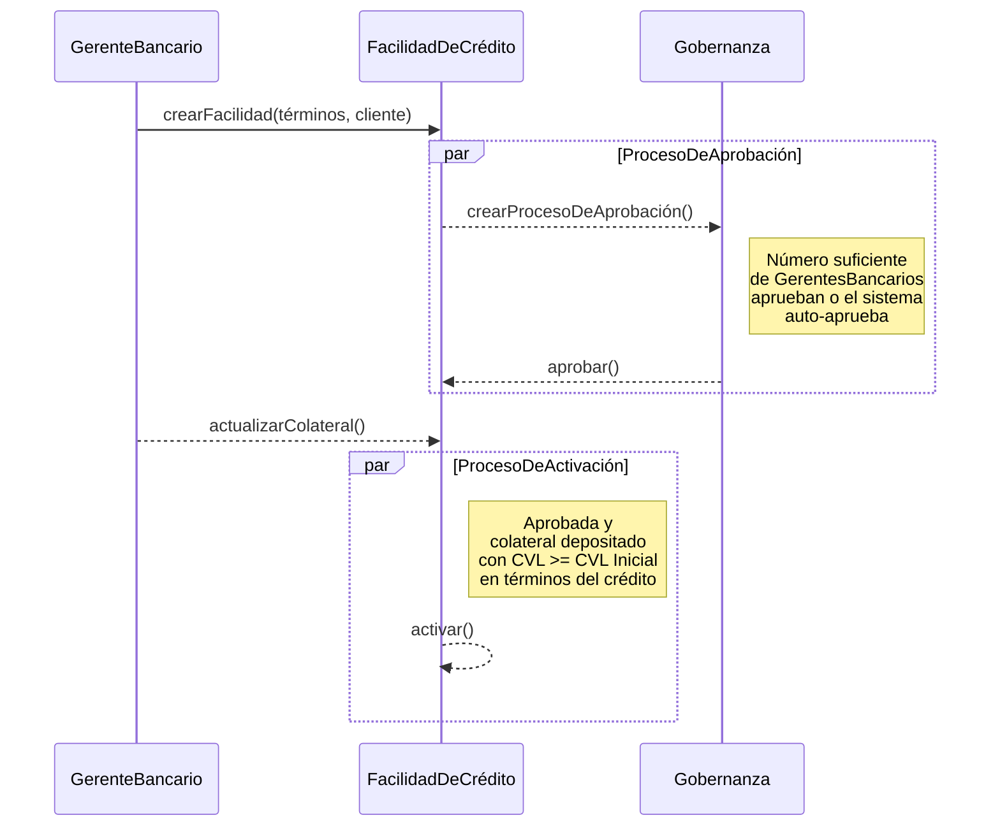

# Facilidad de Crédito

Una `FacilidadDeCrédito` es un acuerdo de préstamo legalmente vinculante entre un banco y un cliente que establece un límite de crédito máximo que el banco está dispuesto a extender.

Especifica:

1. **Límite de Crédito** - La cantidad *máxima* de crédito disponible para el cliente.
2. **Términos del Préstamo** - Detalles como tasas de interés, comisiones y parámetros de riesgo.
3. **Provisiones de Vencimiento** - Detalles de cuándo la facilidad de crédito vencerá o expirará.
4. **Cronograma de Pago** - El plazo y las condiciones bajo las cuales el cliente debe pagar el monto prestado y cualquier interés devengado.

En nuestro modelo de dominio, una `FacilidadDeCrédito` es la entidad central que gestiona el ciclo de vida del crédito, incluyendo desembolsos, obligaciones y pagos.
Tenemos `CicloDeDevengoDeIntereses` para gestionar el proceso de devengo de intereses, que es crucial para calcular el interés sobre los montos desembolsados.

## Aprobación y Activación de la Facilidad

Una `FacilidadDeCrédito` pasa por un proceso de aprobación donde es creada por un gerente bancario y luego enviada al módulo de gobernanza. El módulo de gobernanza define las reglas para la aprobación, que puede ser manual (requiriendo un cierto número de aprobaciones de usuarios bancarios) o automática (auto-aprobada por el sistema).

La activación de una `FacilidadDeCrédito` solo puede ocurrir después de que el `Colateral` para la Facilidad haya sido depositado y la `FacilidadDeCrédito` haya sido aprobada por el proceso de gobernanza.
El CVL del Colateral debe ser mayor que el CVL inicial definido en los términos de la `FacilidadDeCrédito` para que la facilidad se active.

Al activarse la facilidad, el `CicloDeDevengoDeIntereses` se inicializa para comenzar a devengar intereses sobre los montos desembolsados.

:::tip Guía del Panel de Administración
Para un recorrido paso a paso de cómo crear, aprobar y activar facilidades de crédito en el panel de administración, consulta la [Guía del Panel de Administración: Facilidades de Crédito](admin-guide.md).
:::
