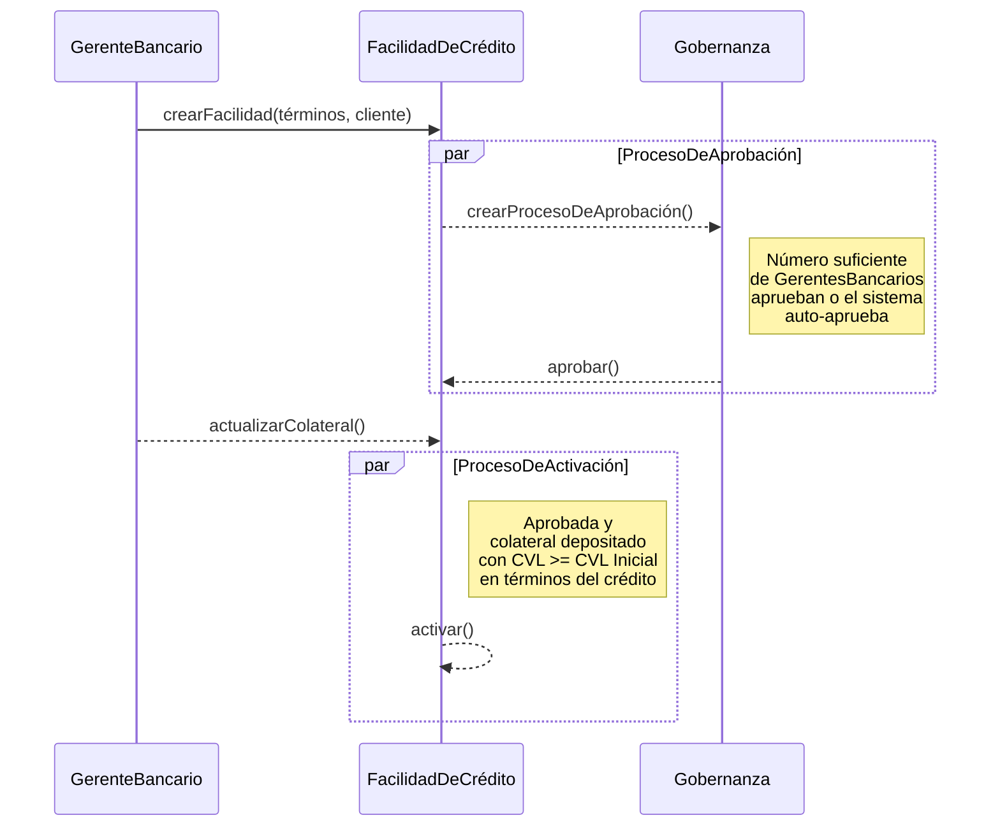

# Facilidad de Crédito

Una `FacilidadDeCrédito` es un acuerdo de préstamo legalmente vinculante entre un banco y un cliente que establece un límite de crédito máximo que el banco está dispuesto a extender.

Especifica:

1. **Límite de Crédito** - La cantidad *máxima* de crédito disponible para el cliente.
2. **Términos del Préstamo** - Detalles como tasas de interés, comisiones y parámetros de riesgo.
3. **Provisiones de Vencimiento** - Detalles de cuándo la facilidad de crédito vencerá o expirará.
4. **Cronograma de Pago** - El plazo y las condiciones bajo las cuales el cliente debe pagar el monto prestado y cualquier interés devengado.

En nuestro modelo de dominio, una `FacilidadDeCrédito` es la entidad central que gestiona el ciclo de vida del crédito, incluyendo desembolsos, obligaciones y pagos.
Tenemos `CicloDeDevengoDeIntereses` para gestionar el proceso de devengo de intereses, que es crucial para calcular el interés sobre los montos desembolsados.

## Aprobación y Activación de la Facilidad

Una `FacilidadDeCrédito` pasa por un proceso de aprobación donde es creada por un gerente bancario y luego enviada al módulo de gobernanza. El módulo de gobernanza define las reglas para la aprobación, que puede ser manual (requiriendo un cierto número de aprobaciones de usuarios bancarios) o automática (auto-aprobada por el sistema).

La activación de una `FacilidadDeCrédito` solo puede ocurrir después de que el `Colateral` para la Facilidad haya sido depositado y la `FacilidadDeCrédito` haya sido aprobada por el proceso de gobernanza.
El CVL del Colateral debe ser mayor que el CVL inicial definido en los términos de la `FacilidadDeCrédito` para que la facilidad se active.

Al activarse la facilidad, el `CicloDeDevengoDeIntereses` se inicializa para comenzar a devengar intereses sobre los montos desembolsados.

## Estados operativos y controles

En la operación diaria, la apertura de una facilidad está controlada por dos compuertas
independientes:

1. **Compuerta de gobernanza** - la propuesta debe cumplir la política de aprobación.
2. **Compuerta de colateral** - la garantía debe cumplir el `initial_cvl` configurado.

Ambas condiciones deben cumplirse antes de que la facilidad quede disponible para desembolsar.
Esto evita liberar fondos sin autorización interna y sin cobertura de riesgo suficiente.

### Progresión de estado esperada

- **Pendiente de Aprobación del Cliente**: propuesta creada, falta aceptación del cliente.
- **Pendiente de Aprobación**: cliente aceptó; espera decisiones de gobernanza.
- **Aprobado**: se alcanzó el umbral de aprobación; se crea la facilidad pendiente.
- **Pendiente de Colateralización**: existe la facilidad, pero aún no puede desembolsar.
- **Completado (facilidad pendiente)**: se cumplió la compuerta de colateral.
- **Activo (facilidad de crédito)**: puede desembolsar; inicia el ciclo de intereses.

### Verificaciones de operador antes de continuar

- Confirmar que la plantilla de términos seleccionada corresponde al producto correcto.
- Confirmar que el monto y contexto del cliente coinciden con la solicitud.
- Confirmar la política de aprobación aplicable (manual o automática).
- Confirmar que la garantía cargada refleja valor y escala correctos.
- Confirmar la transición final de estado antes de iniciar cualquier desembolso.

## Reglas de dominio críticas para operación

Los términos elegidos al crear la propuesta se copian en la facilidad y se usan en validaciones de
ejecución. Los umbrales más importantes son:

- `initial_cvl`: CVL mínimo para activar una facilidad pendiente.
- `margin_call_cvl`: CVL mínimo esperado al considerar un nuevo desembolso.
- `liquidation_cvl`: umbral de protección inferior que puede disparar liquidación.

En la práctica, esto implica que una propuesta aprobada puede seguir no operativa hasta que la
garantía cumpla política de monto y calidad.

### Interpretación práctica para operadores

- **Aprobado no significa desembolsable**. Solo `Activo` habilita otorgamiento de fondos.
- **Actualizar garantía es una acción de riesgo**. Impacta activación y seguridad continua.
- **La calidad de plantilla es clave**. Umbrales o intervalos incorrectos generan problemas
  operativos posteriores.

## Recorrido en Panel de Administración: De propuesta a facilidad activa

La siguiente secuencia sigue el flujo real para crear, aprobar y activar una facilidad en el panel de administración.

### 1) Crear la propuesta

**Paso 1.** Desde la página del cliente, haz clic en **Crear**.

**Paso 2.** Selecciona **Facilidad de Crédito** para abrir el formulario de propuesta.

**Paso 3.** Ingresa el monto de la facilidad y selecciona la plantilla de términos.

**Paso 4.** Envía la propuesta.

**Paso 5.** Confirma que la página de detalle muestra estado **Pendiente de Aprobación del Cliente**.

**Paso 6.** Verifica que la propuesta aparece en la lista de propuestas.

### 2) Aceptación del cliente y aprobación de gobernanza

Esta etapa separa el consentimiento del cliente de la autorización interna. Aunque un operador
cree la propuesta, no debe avanzar hasta cumplir ambas condiciones.

Operativamente, un cierre exitoso aquí debe producir una facilidad pendiente lista para validaciones
de colateral. Si la aprobación falla, la propuesta no continúa al flujo de otorgamiento.

**Paso 7.** Abre la página de detalle de la propuesta.

**Paso 8.** Haz clic en **El Cliente Acepta**.

**Paso 9.** Confirma la acción de aceptación del cliente.

**Paso 10.** Verifica que el estado cambia a **Pendiente de Aprobación**.

**Paso 11.** Inicia aprobación interna haciendo clic en **Aprobar**.

**Paso 12.** Confirma la aprobación en el diálogo.

**Paso 13.** Verifica que el estado de la propuesta sea **Aprobado**.

**Paso 14.** Haz clic en **Ver Facilidad Pendiente**.

### 3) Colateralización y activación

Después de aprobar, la facilidad sigue no operativa hasta cumplir requisitos de garantía. La
activación es el punto exacto en que puede comenzar el crédito y el devengo de intereses.

Cuando la activación es exitosa, úsalo como punto de handoff al flujo de desembolsos.

**Paso 15.** En la página de facilidad pendiente, confirma estado **Pendiente de Colateralización**.

**Paso 16.** Haz clic en **Actualizar Garantía**.

**Paso 17.** Ingresa el nuevo monto de garantía.

**Paso 18.** Confirma que la actualización de garantía se complete correctamente.

**Paso 19.** Verifica que el estado de la facilidad pendiente cambie a **Completado**.

**Paso 20.** Haz clic en **Ver Facilidad**.

**Paso 21.** Confirma que el estado de la facilidad de crédito sea **Activo**.

**Paso 22.** Verifica que la facilidad activa aparece en la lista de facilidades.

