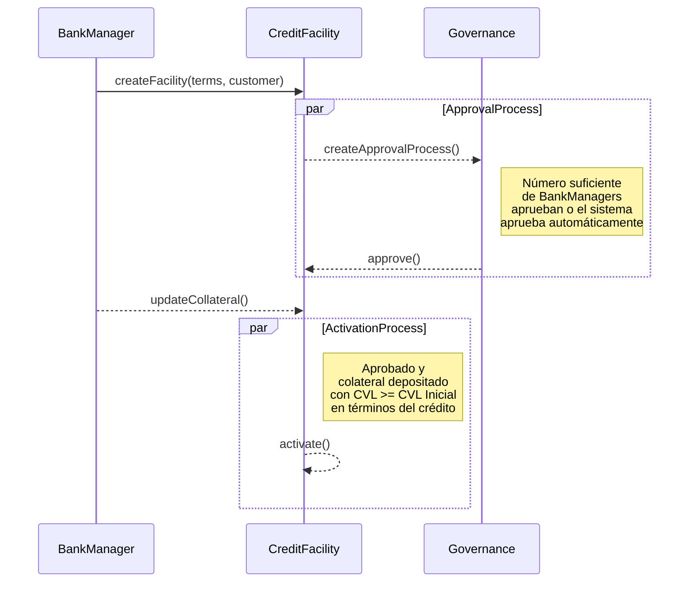

# Línea de Crédito

Una `CreditFacility` es un acuerdo de préstamo legalmente vinculante entre un banco y un cliente que establece un límite de crédito máximo que el banco está dispuesto a otorgar.

Especifica:

1. **Límite de Crédito** - El monto *máximo* de crédito disponible para el cliente.
2. **Condiciones del Préstamo** - Detalles como tasas de interés, comisiones y parámetros de riesgo.
3. **Disposiciones de Vencimiento** - Detalles sobre cuándo vencerá o expirará la línea de crédito.
4. **Calendario de Amortización** - El cronograma y las condiciones bajo las cuales el cliente debe reembolsar el monto prestado y cualquier interés acumulado.

En nuestro modelo de dominio, una `CreditFacility` es la entidad central que gestiona el ciclo de vida del crédito, incluyendo desembolsos, obligaciones y pagos.
Tenemos `InterestAccrualCycle` para gestionar el proceso de acumulación de intereses, que es crucial para calcular los intereses sobre los montos desembolsados.

## Aprobación y Activación de la Línea

```mermaid
sequenceDiagram
    participant BankManager
    participant CreditFacility
    participant Governance

    BankManager->>CreditFacility: createFacility(terms, customer)
    par ApprovalProcess
        CreditFacility-->>Governance: createApprovalProcess()
        Note right of Governance: Número suficiente <br />de BankManagers<br />aprueban o el sistema <br />aprueba automáticamente
        Governance-->>CreditFacility: approve()
    end

    BankManager-->>CreditFacility: updateCollateral()

    par ActivationProcess
        Note right of CreditFacility: Aprobado y<br />colateral depositado<br />con CVL >= CVL Inicial<br />en términos del crédito
        CreditFacility-->>CreditFacility: activate()
    end
```

Una `CreditFacility` pasa por un proceso de aprobación donde es creada por un gerente bancario y luego enviada al módulo de gobernanza. El módulo de gobernanza define las reglas para la aprobación, que pueden ser manuales (requiriendo un cierto número de aprobaciones de usuarios del banco) o automáticas (aprobación automática del sistema).

La activación de una `CreditFacility` solo puede ocurrir después de que se haya depositado el `Collateral` para la Línea y la `CreditFacility` haya sido aprobada por el proceso de gobernanza.
El CVL del Colateral debe ser mayor que el CVL inicial definido en los términos de la `CreditFacility` para que la línea se active.

Al activarse la línea, se inicializa `InterestAccrualCycle` para comenzar a acumular intereses sobre los montos desembolsados.

## Estados Operacionales y Controles

En las operaciones diarias, la configuración de la línea de crédito está controlada por dos compuertas independientes:

1. **Compuerta de gobernanza** - la propuesta debe satisfacer la política de aprobación.
2. **Compuerta de garantía** - la garantía depositada debe satisfacer el `initial_cvl` configurado.

Ambas compuertas deben estar satisfechas antes de que la línea de crédito pueda utilizarse para desembolsos. Esto previene
que los fondos se liberen antes de contar con la autorización de gobernanza y la cobertura de riesgo necesarias.

### Progresión de estados que debe esperar

- **Pendiente de Aprobación del Cliente**: propuesta creada, el cliente aún no ha aceptado.
- **Pendiente de Aprobación**: el cliente aceptó; la propuesta ahora espera las decisiones de gobernanza.
- **Aprobada**: umbral de gobernanza alcanzado; se crea la línea de crédito pendiente.
- **Pendiente de Garantía**: la línea de crédito existe pero aún no puede desembolsar.
- **Completada (línea de crédito pendiente)**: compuerta de garantía satisfecha.
- **Activa (línea de crédito)**: la línea de crédito puede emitir desembolsos; el ciclo de intereses está en marcha.

### Verificaciones del operador antes de continuar

- Confirme que la plantilla de términos seleccionada corresponde a la configuración de producto esperada.
- Confirme que el monto y el contexto de moneda de la propuesta coinciden con la solicitud del cliente.
- Confirme la política de aprobación (manual vs automática) para la configuración de gobernanza seleccionada.
- Confirme que la entrada de garantía refleja el valor de custodia actual y la escala de unidades.
- Confirme que la transición de estado final ocurrió antes de iniciar cualquier desembolso.

## Gestión de Garantías

La garantía en Bitcoin es el mecanismo principal de mitigación de riesgos para las líneas de crédito. Dado que BTC es volátil en relación al USD, el sistema monitorea continuamente la suficiencia de la garantía a lo largo del ciclo de vida de la línea de crédito.

### Depósito de Garantía

Después de que una propuesta es aprobada, la línea de crédito pendiente resultante entra en el estado **Pendiente de Garantía**. En este punto, el cliente debe depositar Bitcoin en la billetera de custodia asociada a la línea de crédito. Si la línea de crédito tiene un custodio asignado, Lana sincroniza el saldo de garantía desde ese backend de custodia, ya sea a través de webhooks del custodio alojado o mediante sondeo de esplora en autocustodia. El flujo de sondeo de autocustodia selecciona su backend de esplora desde la configuración de inicio, con URLs separadas para mainnet, testnet3, testnet4 y signet. En modo manual, un operador puede actualizar el monto de la garantía directamente a través del panel de administración.

### Monitoreo del CVL Durante la Vida Útil de la Facilidad

Una vez que una facilidad está activa, el sistema recalcula el CVL cuando:
- El tipo de cambio BTC/USD cambia (a través de actualizaciones del feed de precios)
- Se deposita o retira garantía
- El saldo pendiente del préstamo cambia (mediante desembolsos o pagos)

Los tres umbrales de CVL funcionan en conjunto para crear una respuesta de riesgo gradual:

1. **Por encima del CVL Inicial**: La facilidad está en buen estado. Los desembolsos están permitidos.
2. **Entre el CVL de Llamada de Margen y el CVL Inicial**: Las operaciones normales continúan, pero los nuevos desembolsos se bloquean si empujarían el CVL por debajo del umbral de llamada de margen.
3. **Por debajo del CVL de Llamada de Margen**: La facilidad entra en un estado de llamada de margen. Se notifica al prestatario para que deposite garantía adicional. Las obligaciones existentes continúan de forma normal.
4. **Por debajo del CVL de Liquidación**: El sistema inicia un proceso de liquidación, permitiendo al banco ejecutar la garantía para recuperar la deuda pendiente.

Un buffer de histéresis evita la oscilación rápida entre estados cuando el CVL se sitúa cerca del límite de un umbral.

### Proceso de Liquidación

Cuando el CVL cae por debajo del umbral de liquidación, se inicia un proceso de liquidación parcial. El sistema calcula la cantidad de garantía que debe venderse para restaurar el CVL por encima del umbral de llamada de margen. Esta es una liquidación parcial — solo se vende la garantía suficiente para devolver la facilidad a un rango seguro, no para cerrar toda la posición.

## Finalización de la Facilidad

Una facilidad de crédito se marca automáticamente como completada cuando cada obligación asociada con ella ha sido totalmente pagada. Esto incluye todas las obligaciones de principal provenientes de desembolsos y todas las obligaciones de interés de los ciclos de acumulación. Una vez completada, la facilidad deja de acumular intereses y su garantía puede ser liberada de vuelta al cliente.

Si una facilidad alcanza su fecha de vencimiento con obligaciones aún pendientes, cualquier interés acumulado pero aún no registrado se consolida inmediatamente en una obligación final. La facilidad no puede completarse hasta que estas obligaciones restantes sean satisfechas.

## Reglas de dominio que importan en operaciones

Los términos seleccionados al momento de la propuesta se copian en la facilidad y se convierten en el contrato utilizado por las verificaciones en tiempo de ejecución. Los umbrales operacionalmente más importantes son:

- `initial_cvl`: CVL mínimo necesario para activar una facilidad pendiente.
- `margin_call_cvl`: CVL mínimo esperado después de considerar un nuevo desembolso.
- `liquidation_cvl`: umbral de protección inferior que puede desencadenar el procesamiento de liquidación.

Estas verificaciones no son solo informativas en la interfaz de usuario; son parte de la validación de comandos en el dominio de crédito. En la práctica, esto significa que una propuesta puede ser aprobada pero aún así permanecer no operativa hasta que la calidad y cantidad del colateral satisfagan la política.

### Interpretación práctica para operadores

- **Propuesta aprobada ≠ prestable**. El préstamo comienza solo cuando el estado de la facilidad se vuelve `Activo`.
- **Las actualizaciones de colateral son acciones de riesgo**. Influyen directamente en la activación y la seguridad continua.
- **La calidad de la plantilla es crítica**. Umbrales o intervalos incorrectos en los términos producen un comportamiento incorrecto del ciclo de vida más adelante.
- **Los desembolsos reducen el margen de colateral**. Cada desembolso aumenta la exposición del préstamo y por lo tanto reduce el CVL, incluso si las cantidades de colateral permanecen constantes. Los operadores deben verificar el CVL posterior al desembolso antes de aprobar retiros grandes.

## Recorrido en Panel de Administración: De propuesta a facilidad activa

La siguiente secuencia sigue el flujo real para crear, aprobar y activar una facilidad en el panel de administración.

### 1) Crear la propuesta

**Paso 1.** Desde la página del cliente, haz clic en **Crear**.

**Paso 2.** Selecciona **Facilidad de Crédito** para abrir el formulario de propuesta.

**Paso 3.** Ingresa el monto de la facilidad y selecciona la plantilla de términos.

**Paso 4.** Envía la propuesta.

**Paso 5.** Confirma que la página de detalle muestra estado **Pendiente de Aprobación del Cliente**.

**Paso 6.** Verifica que la propuesta aparece en la lista de propuestas.

### 2) Aceptación del cliente y aprobación de gobernanza

Esta etapa separa el consentimiento del cliente de la autorización interna. Aunque un operador
cree la propuesta, no debe avanzar hasta cumplir ambas condiciones.

Operativamente, un cierre exitoso aquí debe producir una facilidad pendiente lista para validaciones
de colateral. Si la aprobación falla, la propuesta no continúa al flujo de otorgamiento.

**Paso 7.** Abre la página de detalle de la propuesta.

**Paso 8.** Haz clic en **El Cliente Acepta**.

**Paso 9.** Confirma la acción de aceptación del cliente.

**Paso 10.** Verifica que el estado cambia a **Pendiente de Aprobación**.

**Paso 11.** Inicia aprobación interna haciendo clic en **Aprobar**.

**Paso 12.** Confirma la aprobación en el diálogo.

**Paso 13.** Verifica que el estado de la propuesta sea **Aprobado**.

**Paso 14.** Haz clic en **Ver Facilidad Pendiente**.

### 3) Colateralización y activación

Después de aprobar, la facilidad sigue no operativa hasta cumplir requisitos de garantía. La
activación es el punto exacto en que puede comenzar el crédito y el devengo de intereses.

Cuando la activación es exitosa, úsalo como punto de handoff al flujo de desembolsos.

**Paso 15.** En la página de facilidad pendiente, confirma estado **Pendiente de Colateralización**.

**Paso 16.** Haz clic en **Actualizar Garantía**.

**Paso 17.** Ingresa el nuevo monto de garantía.

**Paso 18.** Confirma que la actualización de garantía se complete correctamente.

**Paso 19.** Verifica que el estado de la facilidad pendiente cambie a **Completado**.

**Paso 20.** Haz clic en **Ver Facilidad**.

**Paso 21.** Confirma que el estado de la facilidad de crédito sea **Activo**.

**Paso 22.** Verifica que la facilidad activa aparece en la lista de facilidades.

