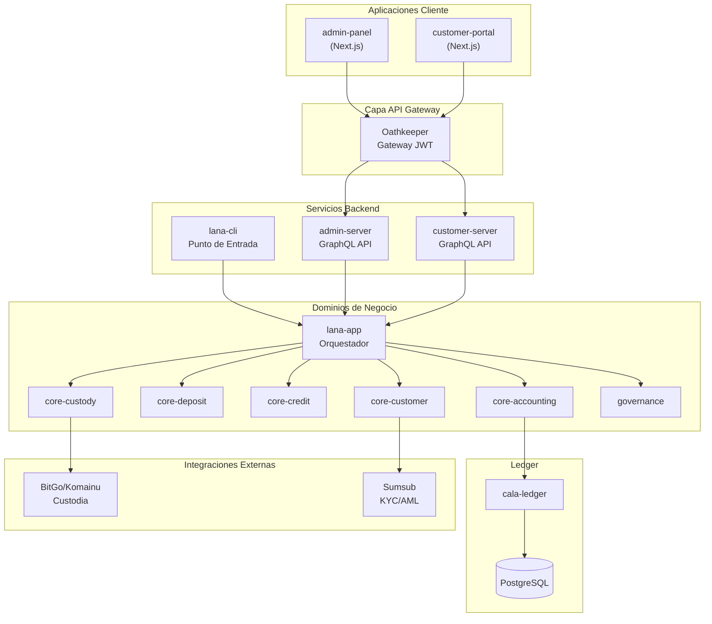
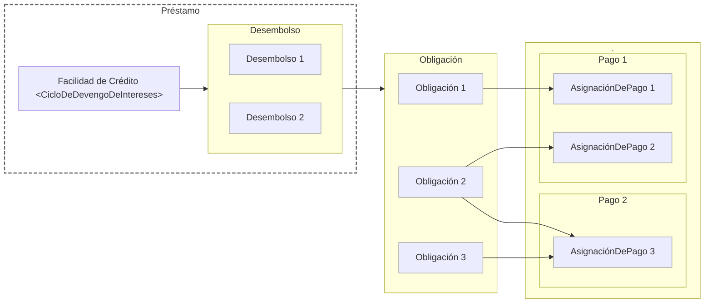

# Ciclo de Vida del Módulo de Crédito

> Una [`FacilidadDeCrédito`](./facility) adelanta fondos a un prestatario a través de uno o más [`Desembolsos`](./disbursal).
  Cada desembolso crea las correspondientes [`Obligaciones`](./obligation) (para *Principal* o cualquier *Interés Devengado*) que el prestatario debe pagar.
  Cuando el prestatario hace un [`Pago`](./payment), se asigna a obligaciones específicas a través de registros de [`AsignaciónDePago`](./payment#asignación-de-pago).
  Los [`Términos`](./terms) definen las tasas de interés, cronogramas y otras reglas que rigen la facilidad y sus obligaciones.
  Una vez que cada obligación está completamente satisfecha, la facilidad de crédito se cierra automáticamente.

## Páginas del Módulo

| Página | Descripción |
|------|-------------|
| [Facilidades de Crédito](./facility) | Creación de propuestas, flujo de aprobación, colateralización, activación y estados de la facilidad |
| [Desembolsos](./disbursal) | Disposición de fondos desde facilidades activas, flujo de aprobación y liquidación |
| [Obligaciones](./obligation) | Seguimiento de deuda, tipos de obligación, estados de ciclo de vida y parámetros de tiempo |
| [Pagos](./payment) | Procesamiento de pagos, reglas de prioridad de asignación e impacto contable |
| [Términos](./terms) | Tasas de interés, cronogramas de comisiones, intervalos de tiempo, umbrales CVL y plantillas de términos |
| [Procesamiento de Intereses](./interest-process) | Devengo diario, ciclos mensuales, creación de obligaciones y asientos contables |
| [Libro Mayor](./ledger.md) | Resumen de conjuntos de cuentas y plantillas de transacción |
