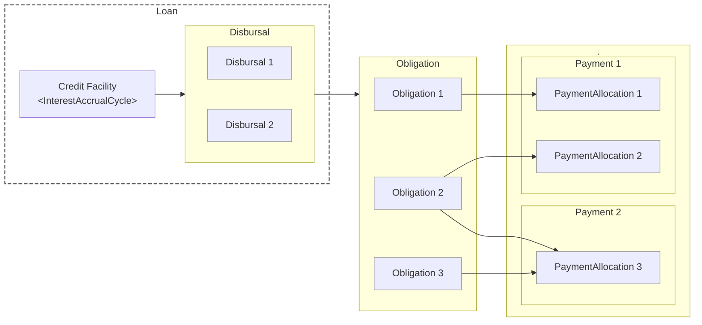
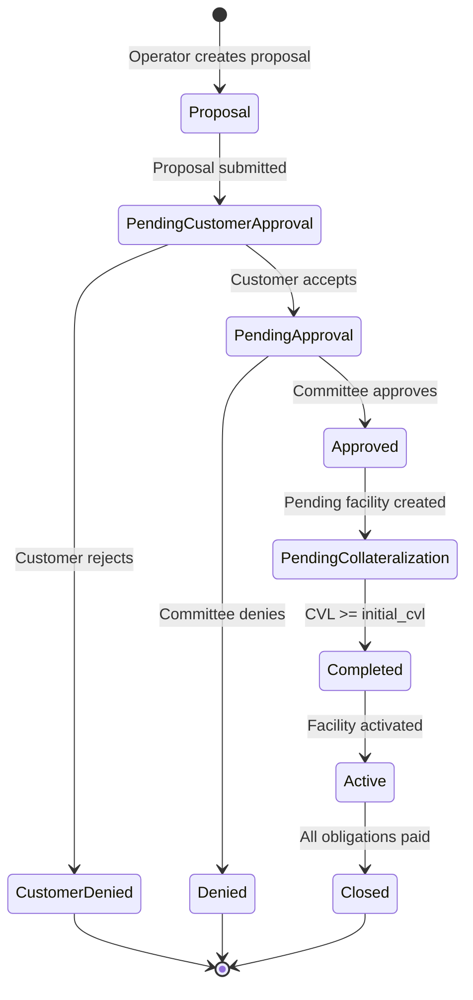

# Módulo de Crédito

El módulo de crédito gestiona el ciclo de vida completo de los préstamos respaldados por Bitcoin en Lana. Maneja todo desde la creación de la propuesta inicial hasta la colateralización, desembolso de fondos, devengo de intereses, seguimiento de pagos y cierre eventual de la facilidad. Todas las operaciones de crédito están garantizadas por colateral en Bitcoin, con monitoreo continuo de las ratios de colateral a valor del préstamo para proteger al banco contra el riesgo de mercado.

## Cómo Funciona el Crédito en Lana

Lana proporciona facilidades de crédito donde un cliente toma prestado USD respaldado por colateral en Bitcoin. El flujo fundamental es:

1. Un operador del banco crea una **propuesta** que define el monto del préstamo y los términos para un cliente específico.
2. El cliente acepta la propuesta, y esta pasa por **aprobación de gobernanza** (votación del comité o aprobación automática).
3. Una vez aprobada, el cliente debe **depositar colateral en Bitcoin** suficiente para cumplir con la ratio inicial de colateral a valor del préstamo (CVL).
4. Una vez que se cumplen los requisitos de colateral, la facilidad se **activa** y el cliente puede retirar fondos mediante **desembolsos**.
5. Los intereses se **devengan** diariamente sobre el principal pendiente y se consolidan en **obligaciones** pagaderas mensualmente.
6. El cliente realiza **pagos** que se asignan automáticamente a las obligaciones pendientes en orden de prioridad.
7. Cuando todas las obligaciones están completamente pagadas, la facilidad se **cierra** y el colateral puede ser devuelto.

A lo largo de este ciclo de vida, el sistema monitorea continuamente el tipo de cambio BTC/USD y recalcula el CVL. Si el valor del colateral cae por debajo de los umbrales de seguridad, el sistema puede activar llamadas de margen o iniciar procedimientos de liquidación.

## Relaciones entre Entidades

```mermaid
flowchart LR
    subgraph Loan["Loan"]
    direction LR
        n1["Credit Facility <br/>&lt;InterestAccrualCycle&gt;"]

        subgraph S_D["Disbursal"]
        direction LR
            d1["Disbursal 1"]:::small
            d2["Disbursal 2"]:::small
        end
    end

    subgraph S_O["Obligation"]
    direction LR
        o1["Obligation 1"]:::small
        o2["Obligation 2"]:::small
        o3["Obligation 3"]:::small
    end

    subgraph S_R["."]
    direction LR
        subgraph S_R1["Payment 1"]
        direction LR
            r1["PaymentAllocation 1"]:::small
            r2["PaymentAllocation 2"]:::small
        end
        subgraph S_R2["Payment 2"]
        direction LR
            r3["PaymentAllocation 3"]:::small
        end
        r3["PaymentAllocation 3"]:::small
    end

    n1 --> S_D --> S_O

    o1 --> r1
    o2 --> r2
    o2 --> r3
    o3 --> r3

    classDef small stroke:#999,stroke-width:1px;
    style Loan stroke:#666,stroke-width:2px,stroke-dasharray:6 3,fill:none;
```

El módulo de crédito se construye alrededor de cinco entidades principales:

- Una [**Facilidad de Crédito**](./facility) es el acuerdo de préstamo que define el límite de crédito, los términos y los requisitos de colateral. Adelanta fondos a un prestatario mediante uno o más desembolsos.
- Un [**Desembolso**](./disbursal) representa un retiro específico de fondos de la facilidad hacia el cliente. Cada desembolso pasa por su propio proceso de aprobación y, cuando se confirma, crea una obligación de principal.
- Una [**Obligación**](./obligation) rastrea un monto individual adeudado por el prestatario, ya sea por principal (de un desembolso) o intereses (de un ciclo de devengo). Las obligaciones siguen un ciclo de vida temporal desde no vencido, pasando por vencido, moroso y potencialmente en default.
- Un [**Pago**](./payment) captura los fondos remitidos por el prestatario. Cada pago se desglosa automáticamente en asignaciones de pago que liquidan obligaciones específicas en orden de prioridad.
- Los [**Términos**](./terms) definen las tasas de interés, cronogramas de tarifas, intervalos de tiempo y umbrales de colateral que rigen la facilidad. Los términos se establecen al momento de la propuesta y permanecen fijos durante la vida de la facilidad.

## Garantía y Gestión de Riesgos

Dado que Lana emite préstamos en USD respaldados por Bitcoin, la relación entre el valor de la garantía y la exposición del préstamo es fundamental para la gestión de riesgos. El sistema rastrea tres umbrales de CVL (Valor de Garantía a Préstamo) definidos en los términos de la facilidad:

| Umbral | Propósito |
|-----------|---------|
| **CVL Inicial** | El ratio mínimo de garantía requerido para activar la facilidad. El cliente debe depositar suficiente BTC para que su valor en USD exceda este ratio en relación con el monto de la facilidad. |
| **CVL de Llamada de Margen** | Un margen de seguridad por debajo del umbral inicial. Si el CVL cae por debajo de este nivel debido a caídas en el precio del BTC, el sistema marca la facilidad para una llamada de margen, alertando a los operadores y al prestatario de que puede necesitarse garantía adicional. Los nuevos desembolsos también se bloquean si empujarían el CVL por debajo de este nivel. |
| **CVL de Liquidación** | El piso crítico. Si el CVL cae por debajo de este umbral, el sistema inicia un proceso de liquidación donde el banco puede vender la garantía para recuperar la deuda pendiente. |

Estos umbrales deben mantener una jerarquía estricta: CVL Inicial > CVL de Llamada de Margen > CVL de Liquidación. El sistema aplica esto en el momento de creación de la propuesta.

El CVL se recalcula continuamente a medida que cambia el precio BTC/USD, se deposita o retira garantía, y cambia el saldo pendiente del préstamo a través de desembolsos y pagos. Un búfer de histéresis previene la oscilación rápida entre estados cuando el CVL fluctúa cerca del límite de un umbral.

## Visión General del Ciclo de Vida de la Facilidad

```mermaid
stateDiagram-v2
    [*] --> Proposal: Operator creates proposal
    Proposal --> PendingCustomerApproval: Proposal submitted
    PendingCustomerApproval --> PendingApproval: Customer accepts
    PendingCustomerApproval --> CustomerDenied: Customer rejects
    PendingApproval --> Approved: Committee approves
    PendingApproval --> Denied: Committee denies
    Approved --> PendingCollateralization: Pending facility created
    PendingCollateralization --> Completed: CVL >= initial_cvl
    Completed --> Active: Facility activated
    Active --> Closed: All obligations paid
    CustomerDenied --> [*]
    Denied --> [*]
    Closed --> [*]
```

Para información detallada sobre cada etapa, consulte [Facilidades de Crédito](./facility).

## Ciclo de Vida de los Intereses

La acumulación de intereses utiliza un sistema de cronometraje de dos niveles. Los trabajos de acumulación diaria registran los intereses en el libro mayor a medida que se devengan. Los trabajos de ciclo mensual consolidan esas acumulaciones en obligaciones de interés a pagar. Este diseño satisface tanto los requisitos contables (ingresos reconocidos a medida que se devengan) como la experiencia del prestatario (facturación mensual predecible).

Para conocer la mecánica completa, consulte [Procesamiento de Intereses](./interest-process).

## Páginas del Módulo

| Página | Descripción |
|------|-------------|
| [Facilidades de Crédito](./facility) | Creación de propuestas, proceso de aprobación, garantías, activación y estados de facilidades |
| [Desembolsos](./disbursal) | Retiro de fondos de facilidades activas, flujo de aprobación y liquidación |
| [Obligaciones](./obligation) | Seguimiento de deuda, tipos de obligaciones, estados del ciclo de vida y parámetros de tiempo |
| [Pagos](./payment) | Procesamiento de pagos, reglas de prioridad de asignación e impacto contable |
| [Términos](./terms) | Tasas de interés, calendarios de comisiones, intervalos de tiempo, umbrales CVL y plantillas de términos |
| [Procesamiento de Intereses](./interest-process) | Acumulación diaria, ciclos mensuales, creación de obligaciones y asientos contables |
| [Libro Mayor](./ledger.md) | Descripción general de conjuntos de cuentas y plantillas de transacciones |
