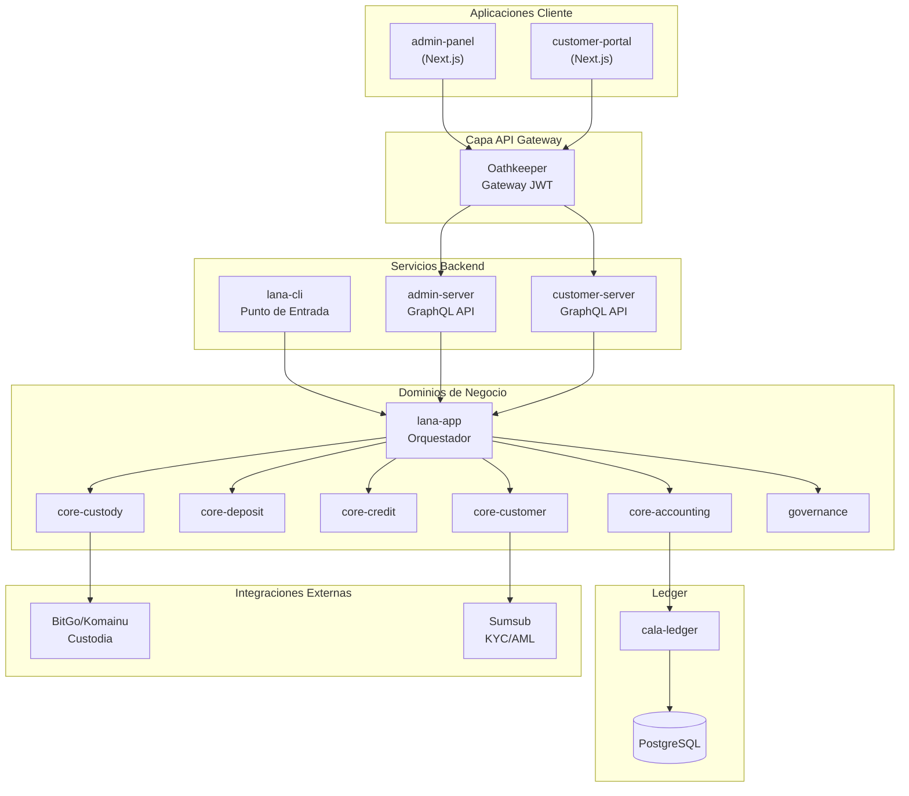
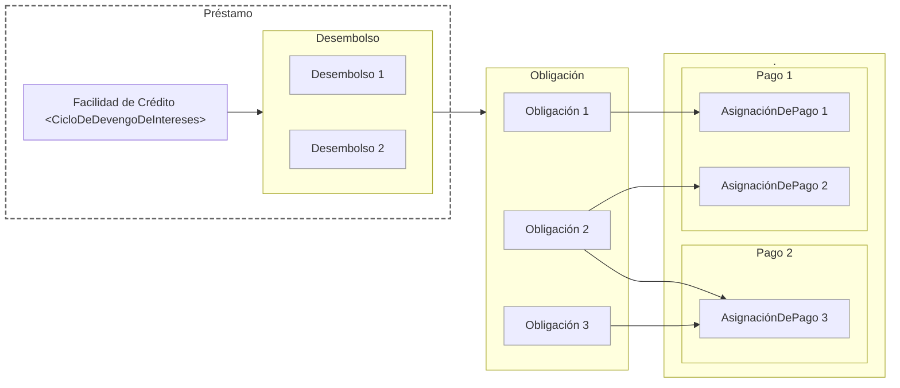
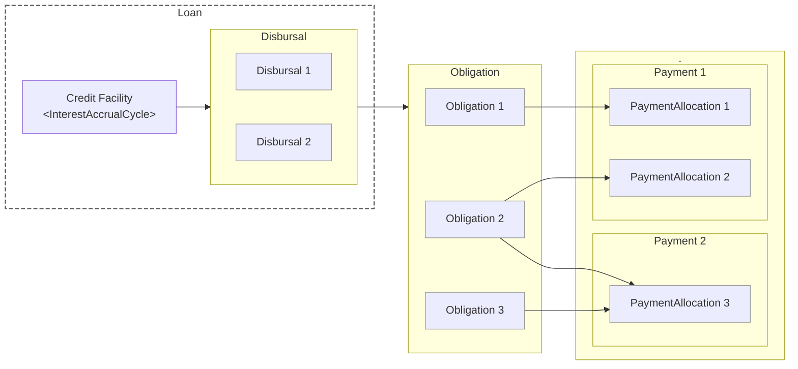
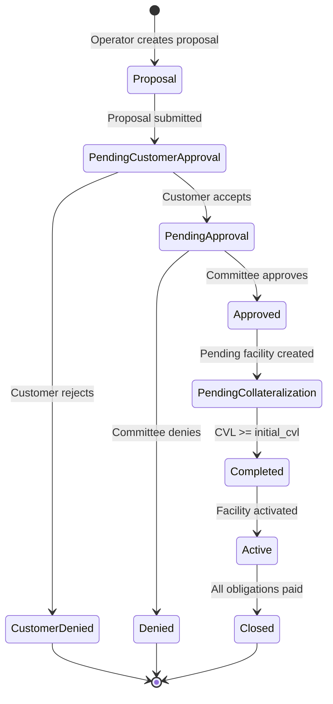

# Ciclo de Vida del Módulo de Crédito

```mermaid
graph TD
    subgraph Clients["Aplicaciones Cliente"]
        ADMIN["admin-panel<br/>(Next.js)"]
        CUST["customer-portal<br/>(Next.js)"]
    end

    subgraph Backend["Servicios Backend"]
        LANACLI["lana-cli<br/>Punto de Entrada"]
        CS_API["customer-server<br/>GraphQL API"]
        AS_API["admin-server<br/>GraphQL API"]
    end

    subgraph GW["Capa API Gateway"]
        OAT["Oathkeeper<br/>Gateway JWT"]
    end

    subgraph Core["Dominios de Negocio"]
        LA["lana-app<br/>Orquestador"]
        CCUS["core-custody"]
        CDEP["core-deposit"]
        CCRED["core-credit"]
        CCUST["core-customer"]
        CACCT["core-accounting"]
        GOV["governance"]
    end

    subgraph Ledger
        CALA["cala-ledger"]
        PG[("PostgreSQL")]
    end

    subgraph External["Integraciones Externas"]
        BITGO["BitGo/Komainu<br/>Custodia"]
        SUMSUB["Sumsub<br/>KYC/AML"]
    end

    ADMIN --> OAT
    CUST --> OAT
    OAT --> AS_API
    OAT --> CS_API
    LANACLI --> LA
    AS_API --> LA
    CS_API --> LA
    LA --> CCUS
    LA --> CDEP
    LA --> CCRED
    LA --> CCUST
    LA --> CACCT
    LA --> GOV
    CACCT --> CALA
    CALA --> PG
    CCUS --> BITGO
    CCUST --> SUMSUB
```

```mermaid
flowchart LR
    %% Préstamo = Facilidad de Crédito (n1) + Desembolso (S_D)
    subgraph Prestamo["Préstamo"]
    direction LR
        n1["Facilidad de Crédito <br/>&lt;CicloDeDevengoDeIntereses&gt;"]

        subgraph S_D["Desembolso"]
        direction LR
            d1["Desembolso 1"]:::small
            d2["Desembolso 2"]:::small
        end
    end

    subgraph S_O["Obligación"]
    direction LR
        o1["Obligación 1"]:::small
        o2["Obligación 2"]:::small
        o3["Obligación 3"]:::small
    end

    subgraph S_R["."]
    direction LR
        subgraph S_R1["Pago 1"]
        direction LR
            r1["AsignaciónDePago 1"]:::small
            r2["AsignaciónDePago 2"]:::small
        end
        subgraph S_R2["Pago 2"]
        direction LR
            r3["AsignaciónDePago 3"]:::small
        end
        r3["AsignaciónDePago 3"]:::small
    end

    n1 --> S_D --> S_O

    o1 --> r1
    o2 --> r2
    o2 --> r3
    o3 --> r3

    classDef small stroke:#999,stroke-width:1px;
    style Prestamo stroke:#666,stroke-width:2px,stroke-dasharray:6 3,fill:none;
```

> Una [`FacilidadDeCrédito`](./facility) adelanta fondos a un prestatario a través de uno o más [`Desembolsos`](./disbursal).
  Cada desembolso crea las correspondientes [`Obligaciones`](./obligation) (para *Principal* o cualquier *Interés Devengado*) que el prestatario debe pagar.
  Cuando el prestatario hace un [`Pago`](./payment), se asigna a obligaciones específicas a través de registros de [`AsignaciónDePago`](./payment#asignación-de-pago).
  Los [`Términos`](./terms) definen las tasas de interés, cronogramas y otras reglas que rigen la facilidad y sus obligaciones.
  Una vez que cada obligación está completamente satisfecha, la facilidad de crédito se cierra automáticamente.

## Páginas del Módulo

| Página | Descripción |
|------|-------------|
| [Líneas de Crédito](./facility) | Creación de propuestas, flujo de aprobación, colateralización, activación y estados de la línea |
| [Desembolsos](./disbursal) | Disposición de fondos desde líneas activas, flujo de aprobación y liquidación |
| [Obligaciones](./obligation) | Seguimiento de deuda, tipos de obligación, estados de ciclo de vida y parámetros de tiempo |
| [Pagos](./payment) | Procesamiento de pagos, reglas de prioridad de asignación e impacto contable |
| [Términos](./terms) | Tasas de interés, cronogramas de comisiones, intervalos de tiempo, umbrales CVL y plantillas de términos |
| [Procesamiento de Intereses](./interest-process) | Devengo diario, ciclos mensuales, creación de obligaciones y asientos contables |
| [Libro Mayor](./ledger.md) | Resumen de conjuntos de cuentas y plantillas de transacción |

## Relaciones entre entidades

```mermaid
flowchart LR
    subgraph Loan["Loan"]
    direction LR
        n1["Credit Facility <br/>&lt;InterestAccrualCycle&gt;"]

        subgraph S_D["Disbursal"]
        direction LR
            d1["Disbursal 1"]:::small
            d2["Disbursal 2"]:::small
        end
    end

    subgraph S_O["Obligation"]
    direction LR
        o1["Obligation 1"]:::small
        o2["Obligation 2"]:::small
        o3["Obligation 3"]:::small
    end

    subgraph S_R["."]
    direction LR
        subgraph S_R1["Payment 1"]
        direction LR
            r1["PaymentAllocation 1"]:::small
            r2["PaymentAllocation 2"]:::small
        end
        subgraph S_R2["Payment 2"]
        direction LR
            r3["PaymentAllocation 3"]:::small
        end
        r3["PaymentAllocation 3"]:::small
    end

    n1 --> S_D --> S_O

    o1 --> r1
    o2 --> r2
    o2 --> r3
    o3 --> r3

    classDef small stroke:#999,stroke-width:1px;
    style Loan stroke:#666,stroke-width:2px,stroke-dasharray:6 3,fill:none;
```

El módulo de crédito se construye alrededor de cinco entidades principales:

- Una [**línea de crédito**](./facility) es el acuerdo de préstamo que define el límite de crédito, los términos y los requisitos de garantía. Adelanta fondos a un prestatario a través de uno o más desembolsos.
- Un [**desembolso**](./disbursal) representa una disposición específica de fondos de la línea de crédito al cliente. Cada desembolso pasa por su propio proceso de aprobación y, cuando se confirma, crea una obligación de principal.
- Una [**obligación**](./obligation) rastrea un monto individual adeudado por el prestatario, ya sea por principal (de un desembolso) o intereses (de un ciclo de devengo). Las obligaciones siguen un ciclo de vida temporal desde no vencido hasta vencido, moroso y potencialmente en incumplimiento.
- Un [**pago**](./payment) captura los fondos remitidos por el prestatario. Cada pago se desglosa automáticamente en asignaciones de pago que liquidan obligaciones específicas en orden de prioridad.
- Los [**términos**](./terms) definen las tasas de interés, los calendarios de comisiones, los intervalos de tiempo y los umbrales de garantía que rigen la línea de crédito. Los términos se establecen en el momento de la propuesta y permanecen fijos durante la vida de la línea de crédito.

## Garantía y gestión de riesgos

Dado que Lana emite préstamos en USD respaldados por Bitcoin, la relación entre el valor de la garantía y la exposición del préstamo es fundamental para la gestión de riesgos. El sistema rastrea tres umbrales CVL (relación entre valor de garantía y préstamo) definidos en los términos de la línea de crédito:

| Umbral | Propósito |
|-----------|---------|
| **CVL inicial** | La relación de garantía mínima requerida para activar la línea de crédito. El cliente debe depositar suficiente BTC para que su valor en USD supere esta relación con respecto al monto de la línea de crédito. |
| **CVL de llamada de margen** | Un margen de seguridad por debajo del umbral inicial. Si el CVL cae por debajo de este nivel debido a caídas en el precio del BTC, el sistema marca la línea de crédito para una llamada de margen, alertando a los operadores y al prestatario de que puede ser necesaria garantía adicional. Los nuevos desembolsos también se bloquean si llevarían el CVL por debajo de este nivel. |
| **CVL de liquidación** | El piso crítico. Si el CVL cae por debajo de este umbral, el sistema inicia un proceso de liquidación donde el banco puede vender la garantía para recuperar la deuda pendiente. |

Estos umbrales deben mantener una jerarquía estricta: CVL inicial > CVL de llamada de margen > CVL de liquidación. El sistema aplica esto en el momento de la creación de la propuesta.

El CVL se recalcula continuamente a medida que cambia el precio BTC/USD, a medida que se deposita o retira garantía, y a medida que cambia el saldo pendiente del préstamo a través de desembolsos y pagos. Un búfer de histéresis evita la oscilación rápida entre estados cuando el CVL se encuentra cerca del límite de un umbral.

## Descripción general del ciclo de vida de la facilidad

```mermaid
stateDiagram-v2
    [*] --> Proposal: Operator creates proposal
    Proposal --> PendingCustomerApproval: Proposal submitted
    PendingCustomerApproval --> PendingApproval: Customer accepts
    PendingCustomerApproval --> CustomerDenied: Customer rejects
    PendingApproval --> Approved: Committee approves
    PendingApproval --> Denied: Committee denies
    Approved --> PendingCollateralization: Pending facility created
    PendingCollateralization --> Completed: CVL >= initial_cvl
    Completed --> Active: Facility activated
    Active --> Closed: All obligations paid
    CustomerDenied --> [*]
    Denied --> [*]
    Closed --> [*]
```

Para obtener información detallada sobre cada etapa, consulta [Facilidades de crédito](./facility).

## Ciclo de vida de los intereses

El devengo de intereses utiliza un sistema de temporización de dos niveles. Los trabajos de devengo diario registran los intereses en el libro mayor a medida que se generan. Los trabajos de ciclo mensual consolidan esos devengos en obligaciones de intereses por pagar. Este diseño satisface tanto los requisitos contables (ingresos reconocidos a medida que se generan) como la experiencia del prestatario (facturación mensual predecible).

Para conocer la mecánica completa, consulta [Procesamiento de intereses](./interest-process).

## Páginas del módulo

| Página | Descripción |
|------|-------------|
| [Facilidades de crédito](./facility) | Creación de propuestas, proceso de aprobación, colateralización, activación y estados de la facilidad |
| [Desembolsos](./disbursal) | Retiro de fondos de facilidades activas, flujo de aprobación y liquidación |
| [Obligaciones](./obligation) | Seguimiento de deuda, tipos de obligaciones, estados del ciclo de vida y parámetros de temporización |
| [Pagos](./payment) | Procesamiento de pagos, reglas de prioridad de asignación e impacto contable |
| [Términos](./terms) | Tasas de interés, calendarios de comisiones, intervalos de temporización, umbrales de CVL y plantillas de términos |
| [Procesamiento de intereses](./interest-process) | Devengo diario, ciclos mensuales, creación de obligaciones y asientos contables |
| [Libro mayor](./ledger.md) | Descripción general de conjuntos de cuentas y plantillas de transacciones |
