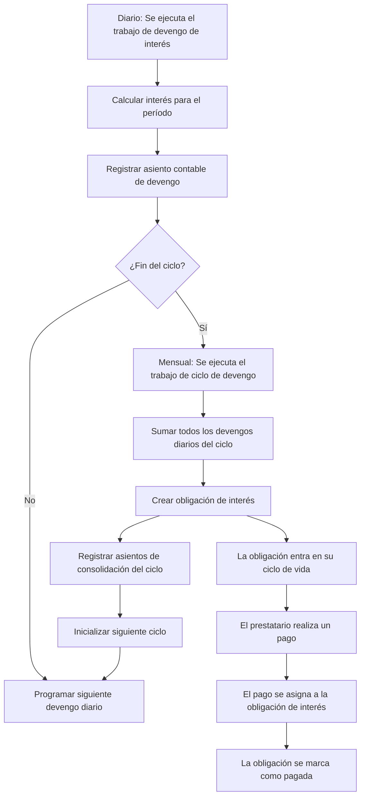

# Proceso de Intereses

El interés en una facilidad de crédito se devenga periódicamente y se captura como nuevas obligaciones.
El proceso es orquestado por un par de trabajos:

1. **Trabajo de Devengo de Intereses (`interest-accrual`)** – confirma el interés devengado para el período actual.
   Registra una entrada en el libro mayor para el monto devengado y se reprograma para el siguiente
   período de devengo. Después del período final en un ciclo, genera el trabajo del ciclo.

2. **Trabajo del Ciclo de Devengo de Intereses (`interest-accrual-cycle`)** – registra los devengos
   confirmados para el ciclo completado. Este trabajo crea una `Obligación` de tipo
   *Interés* y programa el primer devengo del siguiente ciclo.

Cada obligación de interés está vinculada de vuelta a la facilidad para que cuando un prestatario hace un
`Pago`, los registros de `AsignaciónDePago` puedan reducir el saldo de intereses pendiente.

## Sistema de temporización de dos niveles

El proceso de interés se rige por dos intervalos de tiempo distintos, ambos definidos en los [Términos](terms) de la facilidad:

### Intervalo de devengo

El `accrual_interval` controla la frecuencia con la que se calcula y registra el interés en el libro mayor. Normalmente se establece en diario (fin del día). En cada intervalo de devengo, el sistema calcula el interés adeudado para ese período basándose en el saldo de capital pendiente y la tasa anual, luego registra un asiento contable para reconocer ese interés como ingreso devengado.

Durante esta fase, el interés se reconoce en los libros del banco pero aún no es una deuda pagadera para el prestatario. Aparece como interés devengado por cobrar en el balance general.

### Intervalo de ciclo de devengo

El `accrual_cycle_interval` controla la frecuencia con la que el interés devengado se consolida en una obligación pagadera. Normalmente se establece en mensual (fin de mes). Al final de cada ciclo, el sistema suma todos los devengos diarios de ese período y crea una [Obligación](obligation) de interés por el monto total.

Una vez creada la obligación, el prestatario debe ese monto y entra en el ciclo de vida estándar de la obligación (Aún no vencida, Vencida, Atrasada, etc.).

### ¿Por qué dos niveles?

El sistema de dos niveles sirve a diferentes necesidades simultáneamente:

- **Precisión contable**: los devengos diarios aseguran que el libro mayor refleje los ingresos por intereses a medida que se devengan, cumpliendo con los principios de contabilidad basada en el devengo. Los estados financieros en cualquier momento muestran el monto correcto de interés devengado pero aún no facturado.
- **Experiencia del prestatario**: la creación mensual de obligaciones brinda a los prestatarios un ciclo de facturación predecible en lugar de micro-obligaciones diarias. El prestatario ve un pago de interés vencido por mes en lugar de 30 cargos diarios individuales.
- **Claridad operativa**: los operadores pueden ver tanto el interés devengado en tiempo real (para evaluación de riesgo) como las obligaciones formales (para gestión de cobranza).

## Cálculo de intereses

El interés para cada período de devengo se calcula convirtiendo la tasa anual en una tasa diaria y aplicándola al saldo de capital pendiente:

1. El sistema determina el número de días en el período de devengo actual.
2. La tasa anual se prorratea para esos días (tasa anual dividida por días en el año, multiplicada por días del período).
3. El monto resultante se aplica al capital desembolsado pendiente, que incluye todos los desembolsos liquidados menos cualquier pago de capital ya recibido.

El interés se calcula en centavos de USD para evitar problemas de precisión de punto flotante. El cálculo utiliza el número real de días en cada período, teniendo en cuenta meses de longitudes variables.

## Trabajo de devengo de intereses

El trabajo de devengo de intereses es un trabajo en segundo plano recurrente que se ejecuta en cada intervalo de devengo (típicamente diario). Para cada facilidad de crédito activa con capital pendiente:

1. **Calcular interés del período**: calcula el monto de interés para el período actual basándose en el capital pendiente y la tasa anual.
2. **Registrar entrada en el libro mayor**: registra una transacción contable que debita la cuenta de intereses por cobrar y acredita la cuenta de ingresos por intereses. Esto reconoce el interés como ingreso devengado.
3. **Reprogramar**: el trabajo se programa automáticamente para ejecutarse nuevamente en el siguiente intervalo de devengo.

Si el período de devengo actual es el último en el ciclo actual, el trabajo también activa el trabajo del ciclo de devengo para consolidar el interés del ciclo en una obligación.

## Trabajo del ciclo de devengo de intereses

El trabajo del ciclo de devengo de intereses se ejecuta al final de cada ciclo de devengo (típicamente mensual). Realiza el paso de consolidación que convierte el interés devengado en una deuda pagadera:

1. **Totalizar los devengos del ciclo**: suma todos los montos de devengo individuales registrados durante el ciclo.
2. **Crear una obligación de intereses**: si el total es distinto de cero, crea una nueva obligación de tipo interés con el monto consolidado. La fecha de vencimiento de la obligación se calcula basándose en el parámetro de término `interest_due_duration_from_accrual`.
3. **Registrar entradas del ciclo en el libro mayor**: registra transacciones contables que reclasifican el interés de devengado (pendiente) a registrado (liquidado). Esto mueve los montos de la capa de cuentas por cobrar pendientes a la capa de cuentas por cobrar liquidadas en el libro mayor.
4. **Inicializar el siguiente ciclo**: crea la siguiente entidad de ciclo de devengo y programa el primer trabajo de devengo para el nuevo ciclo.

## Ciclo de vida del interés a través del sistema

El recorrido completo del interés desde el cálculo hasta el pago sigue estos pasos:

1. **Día 1-30**: El interés se devenga diariamente. Cada día, el trabajo de devengo registra un pequeño asiento contable. El prestatario no ve los cargos diarios individuales.
2. **Fin de mes**: El trabajo de ciclo consolida 30 días de devengos en una única obligación de interés. El prestatario ahora debe este importe.
3. **Fecha de vencimiento**: Según los términos, la obligación vence después del período configurado de `interest_due_duration_from_accrual`.
4. **Pago**: Cuando el prestatario realiza un pago, el sistema de asignación distribuye los fondos a la obligación de interés (que tiene prioridad sobre el principal dentro del mismo nivel de estado).

## Interés al vencimiento de la facilidad

Cuando una facilidad de crédito alcanza su fecha de vencimiento, cualquier interés que se haya devengado pero que aún no se haya consolidado en una obligación se registra inmediatamente. El ciclo de devengo final se cierra independientemente de si ha transcurrido un período de ciclo completo, asegurando que todo el interés ganado se capture como una obligación pagadera antes de que la facilidad se complete.

## Comisión de estructuración única

Además de los intereses periódicos, cada desembolso puede incurrir en una comisión de estructuración única basada en el `one_time_fee_rate` definido en los términos de la facilidad. Esta comisión se calcula como un porcentaje del monto desembolsado y se reconoce como ingreso por comisiones en el momento del desembolso. A diferencia de los intereses periódicos, la comisión de estructuración se cobra una vez por desembolso en lugar de acumularse con el tiempo.

## Asientos contables

El proceso de intereses crea dos tipos de asientos en el libro mayor:

### Asiento de acumulación diaria

- **Débito**: cuenta de intereses por cobrar (activo, capa pendiente) — reconoce el derecho del banco a recibir intereses
- **Crédito**: cuenta de ingresos por intereses (ingresos) — reconoce los intereses como ingresos devengados

### Asiento de consolidación del ciclo

- **Débito**: cuenta de intereses por cobrar (capa liquidada) — reclasifica el monto por cobrar como una obligación formal
- **Crédito**: cuenta de intereses por cobrar (capa pendiente) — elimina las acumulaciones pendientes ahora que han sido consolidadas

Este enfoque de dos pasos mantiene el libro mayor preciso en todo momento: los libros del banco muestran los ingresos por intereses a medida que se devengan diariamente, mientras que la clasificación de cuentas por cobrar distingue correctamente entre los intereses que han sido facturados (obligación creada) y los intereses que aún se están acumulando.
