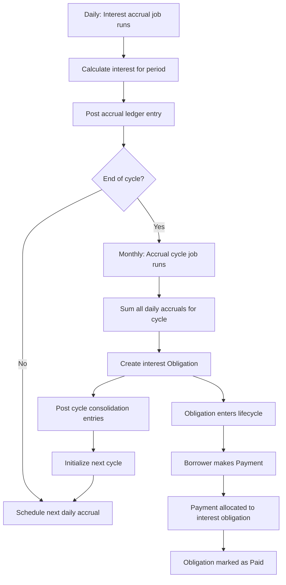

# Proceso de Intereses

Los intereses sobre una línea de crédito se acumulan periódicamente en función del capital pendiente y la tasa anual definida en los términos de la línea. El proceso de intereses utiliza un sistema de temporización de dos niveles: las acumulaciones frecuentes registran los intereses a medida que se acumulan, mientras que los ciclos periódicos convierten esos intereses acumulados en obligaciones de pago. Esta separación permite que el libro mayor refleje los intereses a medida que se devengan (para precisión contable) al mismo tiempo que proporciona a los prestatarios un calendario de pagos predecible (para simplicidad operativa).

## Sistema de Temporización de Dos Niveles

El proceso de intereses se rige por dos intervalos de tiempo distintos, ambos definidos en los [Términos](terms) de la línea:

### Intervalo de Acumulación

El `accrual_interval` controla la frecuencia con la que se calculan y registran los intereses en el libro mayor. Esto normalmente se establece en diario (fin del día). En cada intervalo de acumulación, el sistema calcula los intereses adeudados para ese período en función del saldo de capital pendiente y la tasa anual, y luego registra un asiento contable para reconocer esos intereses como ingresos devengados.

Durante esta fase, los intereses se reconocen en los libros del banco pero aún no constituyen una deuda pagadera para el prestatario. Aparecen como intereses acumulados por cobrar en el balance general.

### Intervalo de Ciclo de Acumulación

El `accrual_cycle_interval` controla la frecuencia con la que los intereses acumulados se consolidan en una obligación de pago. Esto normalmente se establece en mensual (fin de mes). Al final de cada ciclo, el sistema totaliza todas las acumulaciones diarias de ese período y crea una [Obligación](obligation) de intereses por el monto total.

Una vez creada la obligación, el prestatario debe ese monto y este entra en el ciclo de vida estándar de las obligaciones (Aún No Vencido, Vencido, En Mora, etc.).

### ¿Por qué dos niveles?

El sistema de dos niveles satisface diferentes necesidades simultáneamente:

- **Precisión contable**: Los devengos diarios garantizan que el libro mayor refleje los ingresos por intereses a medida que se generan, cumpliendo con los principios de contabilidad de devengo. Los estados financieros en cualquier momento muestran la cantidad correcta de intereses devengados pero aún no facturados.
- **Experiencia del prestatario**: La creación mensual de obligaciones proporciona a los prestatarios un ciclo de facturación predecible en lugar de micro-obligaciones diarias. El prestatario ve un pago de intereses debido por mes en lugar de 30 cargos individuales diarios.
- **Claridad operativa**: Los operadores pueden ver tanto los intereses devengados en tiempo real (para la evaluación de riesgos) como las obligaciones formales (para la gestión de cobros).

## Cálculo de intereses

Los intereses para cada período de devengo se calculan convirtiendo la tasa anual en una tasa diaria y aplicándola al saldo de capital pendiente:

1. El sistema determina el número de días en el período de devengo actual.
2. La tasa anual se prorratea para esos días (tasa anual dividida por días del año, multiplicada por días del período).
3. El monto resultante se aplica al capital desembolsado pendiente, que incluye todos los desembolsos liquidados menos cualquier pago de capital ya recibido.

Los intereses se calculan en centavos de USD para evitar problemas de precisión de punto flotante. El cálculo utiliza el número real de días en cada período, considerando los meses de longitud variable.

## Trabajo de devengo de intereses

El trabajo de devengo de intereses es un trabajo en segundo plano recurrente que se ejecuta en cada intervalo de devengo (típicamente diario). Para cada línea de crédito activa con capital pendiente:

1. **Calcular intereses del período**: Calcula el monto de intereses para el período actual basándose en el capital pendiente y la tasa anual.
2. **Registrar entrada contable**: Registra una transacción contable que carga la cuenta de intereses por cobrar y acredita la cuenta de ingresos por intereses. Esto reconoce los intereses como ingresos devengados.
3. **Reprogramar**: El trabajo se programa automáticamente para ejecutarse nuevamente en el siguiente intervalo de devengo.

Si el período de devengo actual es el último del ciclo actual, el trabajo también activa el trabajo de ciclo de devengo para consolidar los intereses del ciclo en una obligación.

## Trabajo de Ciclo de Devengo de Intereses

El trabajo de ciclo de devengo de intereses se ejecuta al final de cada ciclo de devengo (típicamente mensual). Realiza el paso de consolidación que convierte los intereses devengados en una deuda pagadera:

1. **Totalizar los devengos del ciclo**: Suma todos los montos de devengo individuales registrados durante el ciclo.
2. **Crear una obligación de intereses**: Si el total es diferente de cero, crea una nueva Obligación de tipo Interés con el monto consolidado. La fecha de vencimiento de la obligación se calcula en base al parámetro de término `interest_due_duration_from_accrual`.
3. **Registrar asientos contables del ciclo**: Registra transacciones contables que reclasifican los intereses de devengados (pendientes) a contabilizados (liquidados). Esto traslada los montos desde la capa de cuentas por cobrar pendientes a la capa de cuentas por cobrar liquidadas en el libro mayor.
4. **Inicializar el siguiente ciclo**: Crea la siguiente entidad de ciclo de devengo y programa el primer trabajo de devengo para el nuevo ciclo.

## Ciclo de Vida de los Intereses a Través del Sistema

El recorrido completo de los intereses desde el cálculo hasta el pago sigue estos pasos:

1. **Días 1-30**: Los intereses se devengan diariamente. Cada día, el trabajo de devengo registra un pequeño asiento contable. El prestatario no ve los cargos diarios individuales.
2. **Fin de Mes**: El trabajo de ciclo consolida 30 días de devengos en una sola obligación de intereses. El prestatario ahora debe este monto.
3. **Fecha de Vencimiento**: Según los términos, la obligación vence después del período configurado de `interest_due_duration_from_accrual`.
4. **Pago**: Cuando el prestatario realiza un pago, el sistema de asignación distribuye los fondos a la obligación de intereses (que tiene prioridad sobre el capital dentro del mismo nivel de estado).

## Interés al Vencimiento de la Facilidad

Cuando una facilidad de crédito alcanza su fecha de vencimiento, cualquier interés que se haya devengado pero que aún no se haya consolidado en una obligación se registra inmediatamente. El ciclo final de devengo se cierra independientemente de si ha transcurrido un período de ciclo completo, garantizando que todos los intereses devengados se capturen como una obligación por pagar antes de que la facilidad se complete.

## Comisión de Estructuración Única

Además del interés periódico, cada desembolso puede incurrir en una comisión de estructuración única basada en la `one_time_fee_rate` definida en los términos de la facilidad. Esta comisión se calcula como un porcentaje del monto desembolsado y se reconoce como ingreso por comisiones en el momento del desembolso. A diferencia del interés periódico, la comisión de estructuración se cobra una vez por desembolso en lugar de devengarse a lo largo del tiempo.

## Asientos Contables

El proceso de interés crea dos tipos de asientos en el libro mayor:

### Asiento de Devengo Diario

- **Débito**: Cuenta de intereses por cobrar (activo, capa pendiente) — reconoce el derecho del banco a recibir intereses
- **Crédito**: Cuenta de ingresos por intereses (ingreso) — reconoce el interés como ingreso devengado

### Asiento de Consolidación de Ciclo

- **Débito**: Cuenta de intereses por cobrar (capa liquidada) — reclasifica el activo por cobrar como una obligación formal
- **Crédito**: Cuenta de intereses por cobrar (capa pendiente) — elimina los devengos pendientes ahora que han sido consolidados

Este enfoque de dos pasos mantiene el libro mayor preciso en todo momento: los libros del banco muestran los ingresos por intereses a medida que se devengan diariamente, mientras que la clasificación del activo por cobrar distingue correctamente entre el interés que ha sido facturado (obligación creada) y el interés que aún se está devengando.
