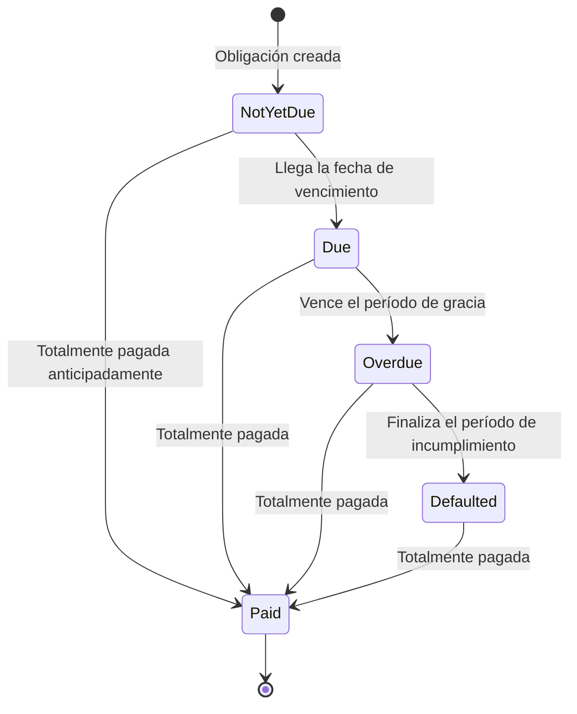

# Obligación

Rastrea los montos que el prestatario debe a la facilidad.
Las obligaciones se crean a partir de desembolsos y devengan intereses hasta que son satisfechas por pagos o liquidación.
Registran saldos, fechas de vencimiento y estado, proporcionando la base para los cronogramas de pago.

## Cómo se crean las obligaciones

Las obligaciones se crean automáticamente por el sistema en respuesta a dos tipos de eventos:

### Obligaciones principales (de desembolsos)

Cuando un desembolso se aprueba y liquida, el sistema crea una obligación principal por el monto desembolsado. Esta obligación representa la deuda principal que el prestatario debe reembolsar. Si una línea de crédito permite múltiples desembolsos, cada liquidación genera su propia obligación separada, lo que permite rastrear el reembolso de cada disposición individual.

### Obligaciones de intereses (de ciclos de devengo)

Al final de cada ciclo de devengo de intereses (normalmente mensual), el sistema consolida todos los devengos de intereses diarios de ese período y crea una obligación de intereses por el monto total. Esto convierte los intereses devengados de un reconocimiento contable en una deuda real por pagar. Consulta [Procesamiento de intereses](interest-process) para obtener detalles sobre cómo se devengan los intereses y se convierten en obligaciones.

### Obligaciones de comisiones únicas

Cuando se ejecuta un desembolso, puede cobrarse una comisión de estructuración basada en el `one_time_fee_rate` definido en los términos de la línea. Esta comisión se reconoce en el momento del desembolso.

## Datos de la obligación

Cada obligación rastrea:

| Campo | Descripción |
|-------|-------------|
| **Tipo** | Ya sea `Disbursal` (principal) o `Interest` |
| **Monto inicial** | El monto original de la obligación cuando se creó |
| **Saldo pendiente** | El monto impago restante (monto inicial menos todas las asignaciones de pago recibidas) |
| **Fecha de vencimiento** | La fecha en que se espera el pago |
| **Fecha de mora** | La fecha en que la obligación pasa a mora si no se paga |
| **Fecha de incumplimiento** | La fecha en que la obligación se clasifica como en incumplimiento |
| **Fecha de liquidación** | La fecha en que la obligación se vuelve elegible para procedimientos de liquidación |
| **Estado** | El estado actual del ciclo de vida (ver abajo) |

## Ciclo de vida de la obligación

Cada obligación sigue una máquina de estados impulsada por el tiempo. Las transiciones ocurren automáticamente mediante un procesamiento por lotes al final del día que evalúa todas las obligaciones frente a la fecha actual y provoca los cambios de estado.

### Aún no vencida

El estado inicial para cada nueva obligación. El prestatario está al tanto del próximo pago, pero aún no está obligado a pagar. Las obligaciones de intereses entran en este estado cuando el ciclo de acumulación se cierra y se crea la obligación. Las obligaciones de principal entran en este estado cuando se liquida un desembolso.

### Vencida

Ha llegado la fecha de vencimiento de la obligación. Ahora se espera que el prestatario realice el pago. El sistema transiciona automáticamente las obligaciones de 'Aún no vencida' a 'Vencida' cuando se alcanza la fecha de vencimiento durante el procesamiento al final del día.

### Atrasada

El prestatario no ha realizado el pago dentro del período de gracia después de la fecha de vencimiento. El período de gracia está controlado por el parámetro de términos `obligation_overdue_duration_from_due`. Por ejemplo, si este se establece en 7 días, una obligación que vencía el 1 de enero pasa a estar atrasada el 8 de enero.

Las obligaciones atrasadas indican un riesgo crediticio creciente y pueden activar alertas operativas o requisitos de reporte.

### En mora

La obligación ha permanecido impaga mucho más allá de su fecha de vencimiento. El período de incumplimiento está controlado por el parámetro de términos `obligation_liquidation_duration_from_due`. Esto representa un estado de morosidad más grave y puede desencadenar procedimientos de liquidación sobre la garantía de la facilidad.

### Pagada

La obligación ha sido completamente satisfecha mediante asignaciones de pago. Una obligación pasa al estado Pagada tan pronto como su saldo pendiente llega a cero, independientemente del estado en el que se encontraba antes. Esto significa que las obligaciones pueden pagarse en cualquier momento de su ciclo de vida, desde Aún no vencida hasta En mora.

## Parámetros de temporización

La temporización de las transiciones de estado de las obligaciones se rige por parámetros definidos en los [Términos](terms) de la facilidad:

| Parámetro | Controla |
|-----------|----------|
| `interest_due_duration_from_accrual` | Cuánto tiempo después de que se devenga el interés hasta que la obligación de interés vence |
| `obligation_overdue_duration_from_due` | Período de gracia después de la fecha de vencimiento antes de que la obligación se vuelva vencida |
| `obligation_liquidation_duration_from_due` | Período después de la fecha de vencimiento antes de que una obligación en mora sea elegible para liquidación |

Estos parámetros permiten al banco configurar diferentes cronogramas de escalamiento de severidad para diferentes tipos de productos crediticios. Una facilidad de capital de trabajo a corto plazo podría tener cronogramas más ajustados que un préstamo a largo plazo tipo hipotecario.

## Obligaciones y el plan de pago

El conjunto de todas las obligaciones de una facilidad crediticia forma el plan de pago de la facilidad. El plan de pago proporciona una vista consolidada que muestra el tipo, monto, fecha de vencimiento, saldo pendiente y estado actual de cada obligación.

A medida que ocurren eventos (se crean nuevas obligaciones, se asignan pagos, transiciones de estado), el plan de pago se actualiza automáticamente para reflejar el estado actual. Esto proporciona a los operadores y prestatarios una vista en tiempo real de lo que se ha pagado, lo que está actualmente vencido y lo que está próximo.

## Relación con otras entidades

- **Facilidad crediticia**: cada obligación pertenece exactamente a una facilidad crediticia. Los términos de la facilidad rigen los parámetros de temporización y las reglas del ciclo de vida de la obligación.
- **Desembolsos**: cada liquidación de desembolso crea una obligación de principal.
- **Ciclos de devengo de intereses**: cada ciclo completado crea una obligación de interés.
- **Pagos**: los pagos se asignan a las obligaciones mediante [Asignaciones de pago](payment), reduciendo su saldo pendiente.
- **Colateralización**: el total de obligaciones pendientes en todas las facilidades activas de un cliente se tiene en cuenta en los cálculos de la relación colateral-valor del préstamo (CVL).
