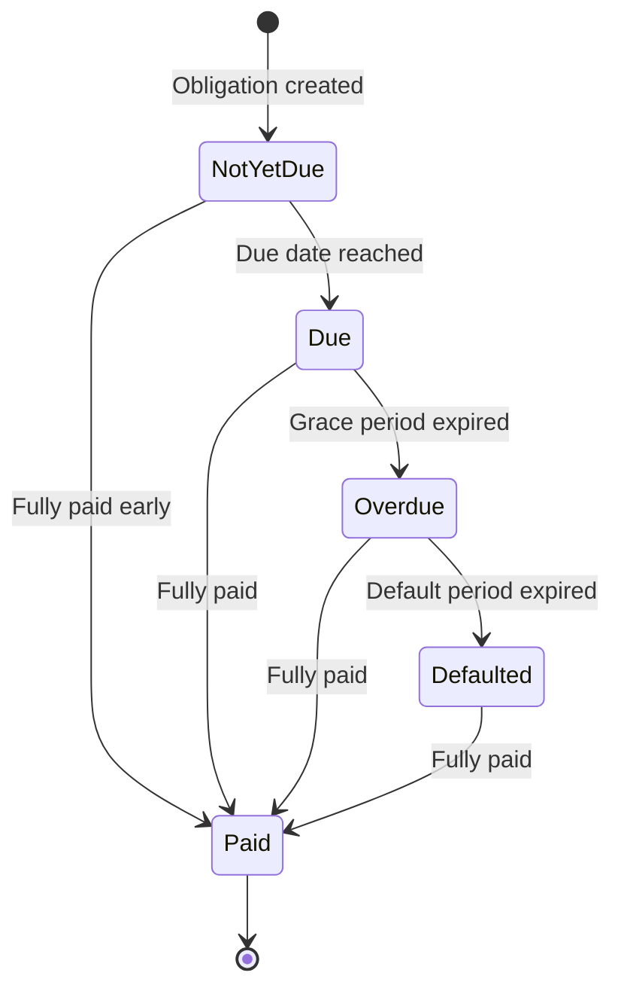

# Obligación

Una obligación representa un monto específico que el prestatario debe al banco bajo una línea de crédito. Las obligaciones son las unidades fundamentales del seguimiento de deuda en el sistema de crédito. Cada dólar que debe un prestatario se registra como una obligación con un tipo, monto, fecha de vencimiento y estado de ciclo de vida definidos.

## Cómo se Crean las Obligaciones

Las obligaciones se crean automáticamente por el sistema en respuesta a dos tipos de eventos:

### Obligaciones de Principal (de Desembolsos)

Cuando un desembolso es aprobado y liquidado, el sistema crea una obligación de principal por el monto desembolsado. Esta obligación representa la deuda principal que el prestatario debe reembolsar. Si una línea de crédito permite múltiples desembolsos, cada liquidación genera su propia obligación separada, permitiendo rastrear el reembolso contra cada disposición individual.

### Obligaciones de Interés (de Ciclos de Acumulación)

Al finalizar cada ciclo de acumulación de intereses (típicamente mensual), el sistema consolida todas las acumulaciones diarias de intereses para ese período y crea una obligación de interés por el monto total. Esto convierte el interés acumulado de un reconocimiento contable en una deuda pagadera real. Consulte [Procesamiento de Intereses](interest-process) para obtener detalles sobre cómo se acumulan los intereses y se convierten en obligaciones.

### Obligaciones de Comisiones Únicas

Cuando se ejecuta un desembolso, se puede cobrar una comisión de estructuración basada en el `one_time_fee_rate` definido en los términos de la línea de crédito. Esta comisión se reconoce en el momento del desembolso.

## Datos de la Obligación

Cada obligación rastrea:

| Campo | Descripción |
|-------|-------------|
| **Tipo** | Ya sea `Disbursal` (principal) o `Interest` |
| **Monto Inicial** | El monto original de la obligación cuando fue creada |
| **Saldo Pendiente** | El monto impago restante (monto inicial menos todas las asignaciones de pago recibidas) |
| **Fecha de Vencimiento** | La fecha cuando se espera el pago |
| **Fecha de Mora** | La fecha cuando la obligación pasa a mora si no se paga |
| **Fecha de Incumplimiento** | La fecha cuando la obligación se clasifica como incumplida |
| **Fecha de Liquidación** | La fecha cuando la obligación se vuelve elegible para procedimientos de liquidación |
| **Estado** | El estado actual del ciclo de vida (ver abajo) |

## Ciclo de Vida de la Obligación

Cada obligación sigue una máquina de estados impulsada por el tiempo. Las transiciones ocurren automáticamente a través del procesamiento por lotes de fin de día que evalúa todas las obligaciones contra la fecha actual y activa los cambios de estado.

### Aún No Vencida

El estado inicial para cada nueva obligación. El prestatario está al tanto del próximo pago pero aún no está obligado a pagar. Las obligaciones de intereses entran en este estado cuando el ciclo de acumulación se cierra y se crea la obligación. Las obligaciones de principal entran en este estado cuando un desembolso se liquida.

### Vencida

La fecha de vencimiento de la obligación ha llegado. Ahora se espera que el prestatario realice el pago. El sistema transfiere las obligaciones de Aún No Vencida a Vencida automáticamente cuando se alcanza la fecha de vencimiento durante el procesamiento de fin de día.

### Atrasada

El prestatario no ha realizado el pago dentro del período de gracia después de la fecha de vencimiento. El período de gracia está controlado por el parámetro de término `obligation_overdue_duration_from_due`. Por ejemplo, si este se establece en 7 días, una obligación que vencía el 1 de enero se vuelve atrasada el 8 de enero.

Las obligaciones atrasadas señalan un riesgo crediticio creciente y pueden activar alertas operativas o requisitos de reporte.

### En Mora

La obligación ha permanecido impaga mucho más allá de su fecha de vencimiento. El período de mora está controlado por el parámetro de término `obligation_liquidation_duration_from_due`. Esto representa un estado de morosidad más grave y puede activar procedimientos de liquidación contra la garantía del crédito.

### Pagado

La obligación ha sido completamente satisfecha mediante asignaciones de pago. Una obligación pasa al estado Pagado tan pronto como su saldo pendiente llega a cero, independientemente del estado en el que se encontrara anteriormente. Esto significa que las obligaciones pueden pagarse en cualquier momento de su ciclo de vida, desde No Vencido hasta En Incumplimiento.

## Parámetros de Temporización

La temporización de las transiciones de estado de las obligaciones se rige por parámetros definidos en los [Términos](terms) de la línea de crédito:

| Parámetro | Controla |
|-----------|----------|
| `interest_due_duration_from_accrual` | Cuánto tiempo después de que se devenguen los intereses hasta que la obligación de intereses se vuelva exigible |
| `obligation_overdue_duration_from_due` | Período de gracia después de la fecha de vencimiento antes de que la obligación se vuelva vencida |
| `obligation_liquidation_duration_from_due` | Período después de la fecha de vencimiento antes de que una obligación en incumplimiento sea elegible para liquidación |

Estos parámetros permiten al banco configurar diferentes cronogramas de escalamiento de severidad para diferentes tipos de productos crediticios. Una línea de capital de trabajo a corto plazo podría tener cronogramas más ajustados que un préstamo hipotecario a largo plazo.

## Obligaciones y el Plan de Reembolso

El conjunto de todas las obligaciones de una línea de crédito forma el plan de reembolso de la línea. El plan de reembolso proporciona una vista consolidada que muestra el tipo, monto, fecha de vencimiento, saldo pendiente y estado actual de cada obligación.

A medida que ocurren eventos (se crean nuevas obligaciones, se asignan pagos, ocurren transiciones de estado), el plan de reembolso se actualiza automáticamente para reflejar el estado actual. Esto brinda a los operadores y prestatarios una vista en tiempo real de lo que se ha pagado, lo que está actualmente vencido y lo que está próximo.

## Relación con Otras Entidades

- **Línea de Crédito**: Cada obligación pertenece exactamente a una línea de crédito. Los términos de la línea rigen los parámetros de temporización y las reglas del ciclo de vida de la obligación.
- **Desembolsos**: Cada liquidación de desembolso crea una obligación de capital.
- **Ciclos de Devengo de Intereses**: Cada ciclo completado crea una obligación de intereses.
- **Pagos**: Los pagos se asignan a las obligaciones mediante [Asignaciones de Pago](payment), reduciendo su saldo pendiente.
- **Colateralización**: El total de obligaciones pendientes en todas las líneas activas de un cliente influye en los cálculos de la relación colateral-valor del préstamo (CVL).
