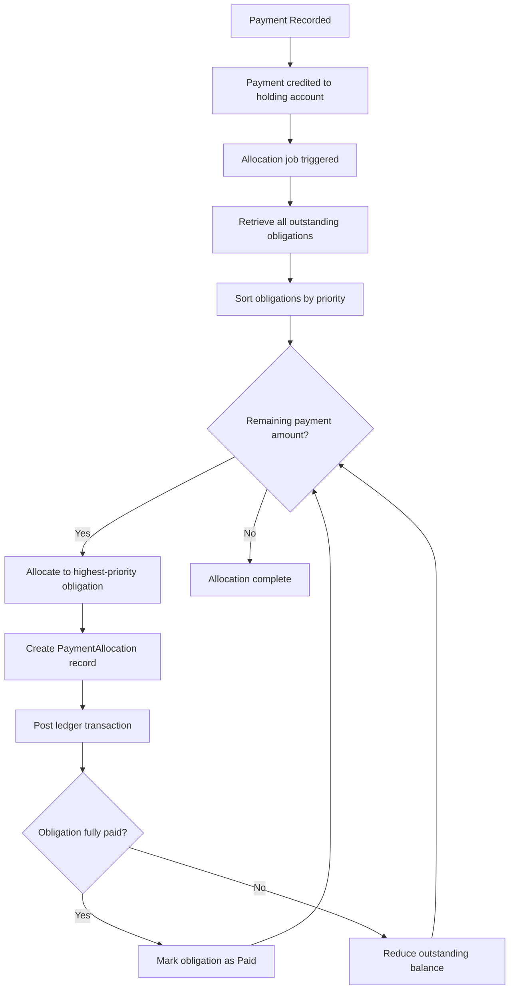

# Pago

Un pago representa los fondos remitidos por el prestatario hacia una línea de crédito. Cuando un prestatario realiza un pago, el sistema lo desglosa automáticamente en asignaciones individuales que liquidan obligaciones específicas según un orden de prioridad definido. Esto garantiza que las deudas más críticas se atiendan primero y que el plan de pagos se mantenga al día.

## Flujo de Procesamiento de Pagos

Cuando se registra un pago contra una línea de crédito, ocurre la siguiente secuencia:

1. **Registro del Pago**: El monto del pago se registra y se acredita a una cuenta de retención de pagos en el libro mayor. Esta cuenta de retención actúa como un área de preparación temporal antes de que los fondos se distribuyan a las obligaciones individuales.

2. **Activación del Trabajo de Asignación**: El evento de registro del pago activa el trabajo de asignación en segundo plano, que maneja la distribución de fondos entre las obligaciones pendientes.

3. **Recuperación y Ordenación de Obligaciones**: El sistema recupera todas las obligaciones pendientes de la línea de crédito y las ordena según las reglas de prioridad descritas a continuación.

4. **Asignación Secuencial**: El sistema recorre la lista ordenada de obligaciones, asignando la mayor cantidad posible del pago a cada una. Para cada asignación, una transacción del libro mayor traslada fondos desde la cuenta de retención a la cuenta por cobrar correspondiente.

5. **Verificación de Finalización**: Después de cada asignación, el sistema verifica si la obligación está completamente satisfecha. Si el saldo pendiente llega a cero, la obligación se marca como Pagada.

## Prioridad de Asignación

El algoritmo de asignación distribuye los fondos de pago en un orden de prioridad estricto. Este ordenamiento garantiza que las obligaciones más morosas y de mayor riesgo se liquiden primero:

| Prioridad | Criterio | Justificación |
|-----------|----------|---------------|
| 1 | Obligaciones en **incumplimiento** (de más antigua a más reciente) | Morosidad más grave, mayor riesgo |
| 2 | Obligaciones **vencidas** (de más antigua a más reciente) | Morosidad activa que requiere resolución |
| 3 | Obligaciones **pendientes** (de más antigua a más reciente) | Pagos actualmente esperados |
| 4 | **Intereses** antes que **capital** (dentro del mismo estado) | Las obligaciones de interés se priorizan sobre el capital al mismo nivel de morosidad |
| 5 | Obligaciones **aún no vencidas** (de más antigua a más reciente) | Pagos anticipados aplicados a obligaciones futuras |

Dentro de cada categoría de estado, las obligaciones se procesan de la más antigua a la más reciente. Esto garantiza un enfoque de primero en entrar, primero en salir, donde las deudas más antiguas se liquidan antes que las más recientes.

La regla de interés antes que capital dentro del mismo nivel de estado refleja la práctica estándar de préstamos: los intereses acumulados deben liquidarse antes de que se reduzca el capital, ya que los intereses continúan acumulándose sobre el capital pendiente.

## Pagos Parciales

El sistema maneja los pagos parciales de manera eficiente. Si un pago no es lo suficientemente grande como para cubrir todas las obligaciones pendientes:

- El pago se asigna a las obligaciones en orden de prioridad hasta que se agota el monto del pago.
- Las obligaciones que reciben asignación parcial ven reducido su saldo pendiente por el monto asignado, pero permanecen en su estado actual.
- El siguiente pago recibido continuará la asignación desde donde se quedó el anterior, comenzando nuevamente desde la obligación restante de mayor prioridad.

Por ejemplo, si un prestatario debe $1,000 entre tres obligaciones y realiza un pago de $400, el sistema pagará completamente la primera obligación (si es de $400 o menos) y pagará parcialmente la siguiente. El plan de pago del prestatario se actualizará para mostrar los saldos reducidos.

## Registros de Asignación de Pagos

Cada asignación crea un registro PaymentAllocation que vincula permanentemente una porción de un pago a una obligación específica. Estos registros sirven como pista de auditoría y proporcionan transparencia sobre cómo se distribuyeron los fondos.

Un PaymentAllocation contiene:

| Campo | Descripción |
|-------|-------------|
| **ID de Pago** | El pago del cual se están asignando fondos |
| **ID de Obligación** | La obligación que recibe la asignación |
| **Monto** | El importe en dólares asignado de este pago a esta obligación |
| **Índice de Asignación** | Un índice secuencial que rastrea el orden de las asignaciones para una obligación determinada |

Un único pago puede generar múltiples registros de asignación (uno por cada obligación que afecta), y una única obligación puede recibir asignaciones de múltiples pagos a lo largo del tiempo.

## Impacto Contable

Cada asignación de pago genera una transacción contable que:

- **Debita** la cuenta de retención de pagos (reduciendo el saldo del pago no asignado)
- **Acredita** la cuenta por cobrar correspondiente a la obligación (reduciendo el monto adeudado)

Para obligaciones de intereses, el crédito va a la cuenta de intereses por cobrar. Para obligaciones de capital, el crédito va a la cuenta de cuentas por cobrar desembolsadas. Esto garantiza que el libro mayor refleje con precisión la reducción de las cuentas por cobrar pendientes a medida que se procesan los pagos.

## Finalización de Obligaciones

Cuando la suma de todas las asignaciones de pago contra una obligación iguala su monto inicial, el saldo pendiente de la obligación llega a cero y transita al estado Pagado. Esta transición es automática e inmediata. Una vez pagada, una obligación no requiere ninguna acción adicional por parte del prestatario o del operador.

Cuando todas las obligaciones bajo una línea de crédito están pagadas, la línea misma se marca automáticamente como completada. Consulte [Líneas de Crédito](facility) para obtener detalles sobre la finalización de líneas.

## Manejo de Sobrepagos

Si un prestatario realiza un pago mayor que el total de las obligaciones pendientes, el sistema asigna los fondos a todas las obligaciones (incluyendo aquellas que aún no han vencido) hasta que el pago se distribuya completamente o se satisfagan todas las obligaciones.
