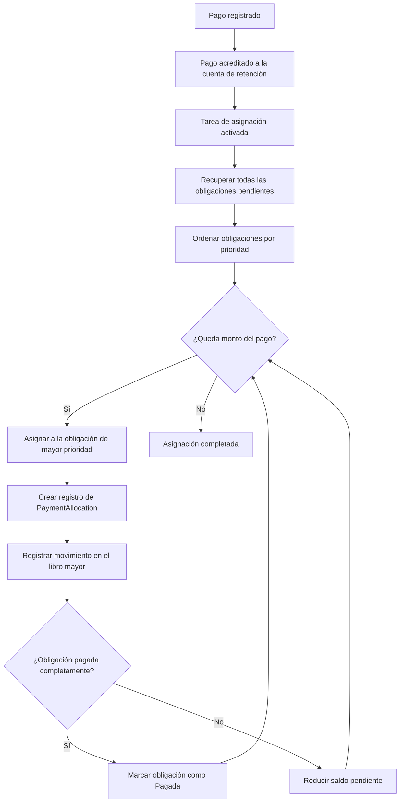

# Pago

Captura los fondos remitidos por el prestatario hacia una facilidad.
Cada pago se desglosa en una o más asignaciones que liquidan obligaciones específicas en orden de prioridad.
Los eventos emitidos desde los pagos actualizan los planes de pago, saldos y cierran obligaciones una vez que están completamente cubiertas.

## Asignación de Pago

Cuando se registra un pago en una línea de crédito, ocurre la siguiente secuencia:

1. **Registro de Pago**: El monto del pago se registra y acredita en una cuenta de retención en el libro mayor. Esta cuenta de retención actúa como una etapa temporal antes de distribuir los fondos a las obligaciones individuales. El sistema valida que la fecha efectiva del pago no sea anterior a la fecha de activación de la línea: los pagos anteriores a la activación son rechazados.

2. **Activación de la tarea de asignación**: El evento de registro del pago activa un proceso en segundo plano que gestiona la distribución de los fondos entre las obligaciones pendientes.

3. **Recuperación y ordenación de obligaciones**: El sistema recupera todas las obligaciones pendientes de la línea de crédito y las ordena conforme a las reglas de prioridad.

4. **Asignación secuencial**: El sistema recorre la lista ordenada de obligaciones, asignando tanto del pago como sea posible a cada una. Por cada asignación, una transacción del libro mayor transfiere los fondos de la cuenta de retención a la cuenta por cobrar correspondiente.

5. **Verificación de finalización**: Tras cada asignación, el sistema comprueba si la obligación ha sido totalmente cubierta. Si el saldo pendiente llega a cero, la obligación se marca como Pagada.

## Prioridad de asignación

El algoritmo de asignación distribuye los fondos de pago en un orden de prioridad estricto. Este ordenamiento garantiza que las obligaciones más morosas y relevantes para el riesgo se liquiden primero:

| Prioridad | Criterios | Justificación |
|----------|----------|-----------|
| 1 | Obligaciones en **incumplimiento** (las más antiguas primero) | Morosidad más grave, mayor riesgo |
| 2 | Obligaciones **vencidas** (las más antiguas primero) | Morosidad activa que requiere resolución |
| 3 | Obligaciones **a vencer** (las más antiguas primero) | Pagos actualmente esperados |
| 4 | **Intereses** antes que **capital** (dentro del mismo estado) | Las obligaciones de intereses se priorizan sobre el capital al mismo nivel de morosidad |
| 5 | Obligaciones **aún no vencidas** (las más antiguas primero) | Pagos anticipados aplicados a obligaciones futuras |

Dentro de cada categoría de estado, las obligaciones se procesan de la más antigua a la más reciente. Esto garantiza un enfoque de primero en entrar, primero en salir donde las deudas anteriores se liquidan antes que las más recientes.

La regla de intereses antes que capital dentro del mismo nivel de estado refleja la práctica crediticia estándar: los intereses acumulados deben liquidarse antes de reducir el capital, ya que los intereses continúan acumulándose sobre el capital pendiente.

## Pagos parciales

El sistema maneja los pagos parciales de manera eficiente. Si un pago no es lo suficientemente grande como para cubrir todas las obligaciones pendientes:

- El pago se asigna a las obligaciones en orden de prioridad hasta que se agota el monto del pago.
- Las obligaciones que reciben asignación parcial tienen su saldo pendiente reducido por el monto asignado, pero permanecen en su estado actual.
- El siguiente pago recibido continuará la asignación desde donde se quedó el anterior, comenzando nuevamente desde la obligación restante de mayor prioridad.

Por ejemplo, si un prestatario debe $1,000 en tres obligaciones y realiza un pago de $400, el sistema pagará completamente la primera obligación (si es de $400 o menos) y pagará parcialmente la siguiente. El plan de pago del prestatario se actualizará para mostrar los saldos reducidos.

## Registros de asignación de pagos

Cada asignación crea un registro PaymentAllocation que vincula permanentemente una parte de un pago a una obligación específica. Estos registros sirven como pista de auditoría y proporcionan transparencia sobre cómo se distribuyeron los fondos.

Un PaymentAllocation contiene:

| Campo | Descripción |
|-------|-------------|
| **ID de pago** | El pago del cual se están asignando fondos |
| **ID de obligación** | La obligación que recibe la asignación |
| **Monto** | El monto en dólares asignado de este pago a esta obligación |
| **Índice de asignación** | Un índice secuencial que rastrea el orden de las asignaciones para una obligación determinada |

Un solo pago puede generar múltiples registros de asignación (uno por cada obligación que toca), y una sola obligación puede recibir asignaciones de múltiples pagos a lo largo del tiempo.

## Impacto contable

Cada asignación de pago genera una transacción de libro mayor que:

- **Debita** la cuenta de retención de pagos (reduciendo el saldo de pago no asignado)
- **Acredita** la cuenta por cobrar apropiada para la obligación (reduciendo el monto adeudado)

Para obligaciones de intereses, el crédito va a la cuenta de intereses por cobrar. Para obligaciones de principal, el crédito va a la cuenta de cuentas por cobrar desembolsadas. Esto garantiza que el libro mayor refleje con precisión la reducción en las cuentas por cobrar pendientes a medida que se procesan los pagos.

## Finalización de obligación

Cuando la suma de todas las asignaciones de pago contra una obligación iguala su monto inicial, el saldo pendiente de la obligación llega a cero y pasa al estado Pagado. Esta transición es automática e inmediata. Una vez pagada, una obligación no requiere ninguna acción adicional por parte del prestatario o del operador.

Cuando todas las obligaciones bajo una línea de crédito están pagadas, la línea en sí se marca automáticamente como completa. Consulta [Líneas de crédito](facility) para obtener detalles sobre la finalización de líneas.

## Gestión de sobrepagos

Si un prestatario realiza un pago mayor que el total de las obligaciones pendientes, el sistema asigna los fondos a todas las obligaciones (incluidas aquellas que aún no han vencido) hasta que el pago se distribuya completamente o se satisfagan todas las obligaciones.
