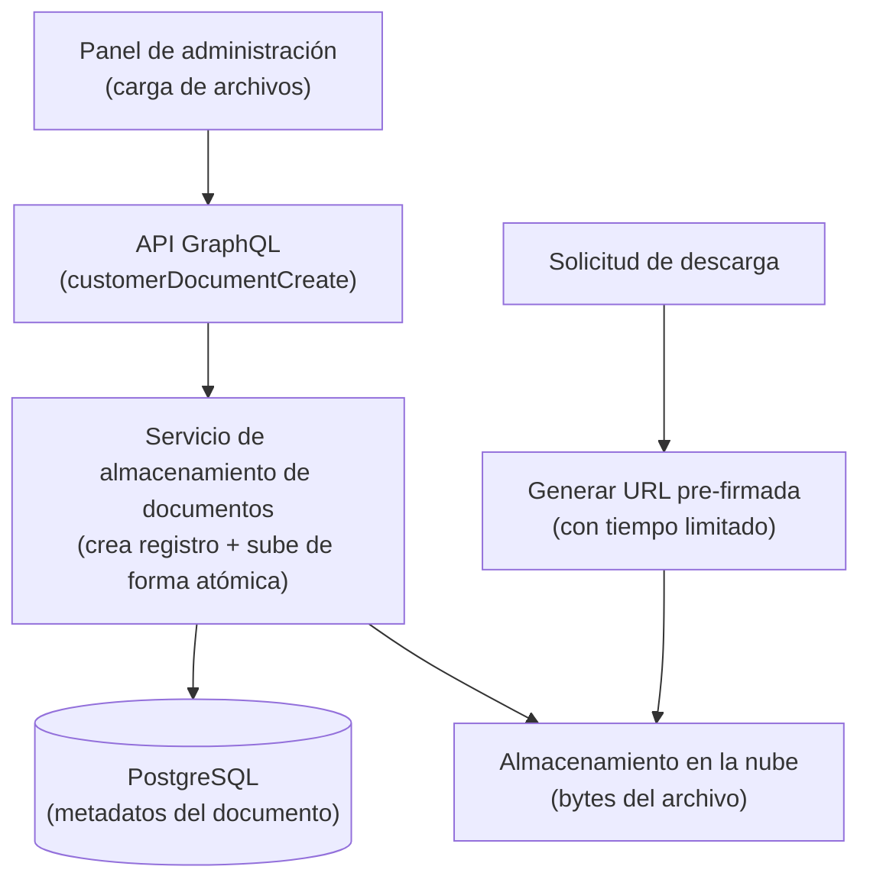

# Gestión de Documentos del Cliente

Este documento describe el sistema de gestión de documentos para clientes, incluyendo carga, almacenamiento y recuperación de documentos.

## Tipos de Documentos



Los documentos se almacenan utilizando un enfoque en dos partes: los metadatos del archivo (ID, nombre del archivo, tipo de contenido, estado, referencia al cliente propietario) se guardan como una entidad basada en eventos en PostgreSQL, mientras que los bytes reales del archivo se suben al almacenamiento en la nube. La ruta de almacenamiento sigue el patrón `documents/customer_document/{document_id}{extension}`.

Cuando un usuario solicita una descarga, el sistema genera una URL pre-firmada con vencimiento limitado en el tiempo, lo que permite la descarga directa desde la nube al navegador sin pasar el archivo por el servidor de la aplicación.

| Tipo | Descripción | Requerido para KYC |
|------|-------------|--------------------|
| Identificación oficial | DNI, pasaporte, licencia | Sí |
| Selfie | Foto del cliente | Sí |
| Comprobante de domicilio | Recibo de servicios | Según configuración |

### Documentos Corporativos

| Tipo | Descripción | Aplica a |
|------|-------------|----------|
| Escritura constitutiva | Documento de incorporación | Empresas |
| Poder notarial | Representación legal | Empresas |
| Estados financieros | Información financiera | Empresas |

## Arquitectura de Almacenamiento

```
┌─────────────────────────────────────────────────────────────────┐
│                    Panel de Administración                      │
│                    (Carga de documentos)                        │
└─────────────────────────────────────────────────────────────────┘
                              │
                              ▼
┌─────────────────────────────────────────────────────────────────┐
│                    API GraphQL                                  │
│               (Mutation: uploadDocument)                        │
└─────────────────────────────────────────────────────────────────┘
                              │
                              ▼
┌─────────────────────────────────────────────────────────────────┐
│                 document-storage                                │
│           (Servicio de almacenamiento)                          │
└─────────────────────────────────────────────────────────────────┘
                              │
                              ▼
┌─────────────────────────────────────────────────────────────────┐
│              Google Cloud Storage / S3                          │
│            (Almacenamiento de archivos)                         │
└─────────────────────────────────────────────────────────────────┘
```

## Operaciones de Documentos

### Subir Documento

1. Navegar al detalle del cliente
2. Seleccionar **Documentos** > **Subir**
3. Seleccionar tipo de documento
4. Arrastrar o seleccionar archivo
5. Confirmar carga

### Formatos Soportados

| Formato | Extensión | Tamaño Máximo |
|---------|-----------|---------------|
| PDF | .pdf | 10 MB |
| Imagen | .jpg, .png | 5 MB |
| Documento | .doc, .docx | 10 MB |

### Via API GraphQL

```graphql
mutation UploadDocument($input: DocumentUploadInput!) {
  documentUpload(input: $input) {
    document {
      id
      filename
      status
      createdAt
    }
  }
}
```

El input incluye:
- `customerId`: ID del cliente
- `documentType`: Tipo de documento
- `file`: Archivo (multipart upload)

## Estados del Documento

| Estado | Descripción |
|--------|-------------|
| PENDING | Cargado, pendiente de revisión |
| APPROVED | Documento validado |
| REJECTED | Documento rechazado |
| EXPIRED | Documento vencido |

## Flujo de Aprobación de Documentos

- **URLs pre-firmadas**: Los enlaces de descarga tienen un tiempo limitado y están firmados por el proveedor de almacenamiento en la nube. Expiran después de un periodo configurado, evitando el acceso indefinido por enlaces compartidos o filtrados.
- **Transmisión cifrada**: Todas las subidas y descargas utilizan TLS.
- **Cifrado en reposo**: Los archivos en el almacenamiento en la nube están cifrados mediante el cifrado del lado del servidor del proveedor.
- **Autorización**: Cada operación sobre un documento requiere el permiso correspondiente, que se aplica mediante el sistema RBAC. Todas las operaciones se registran en el log de auditoría.
