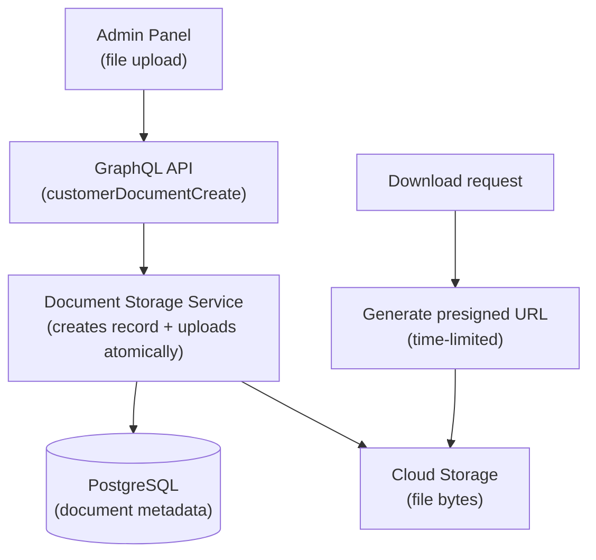
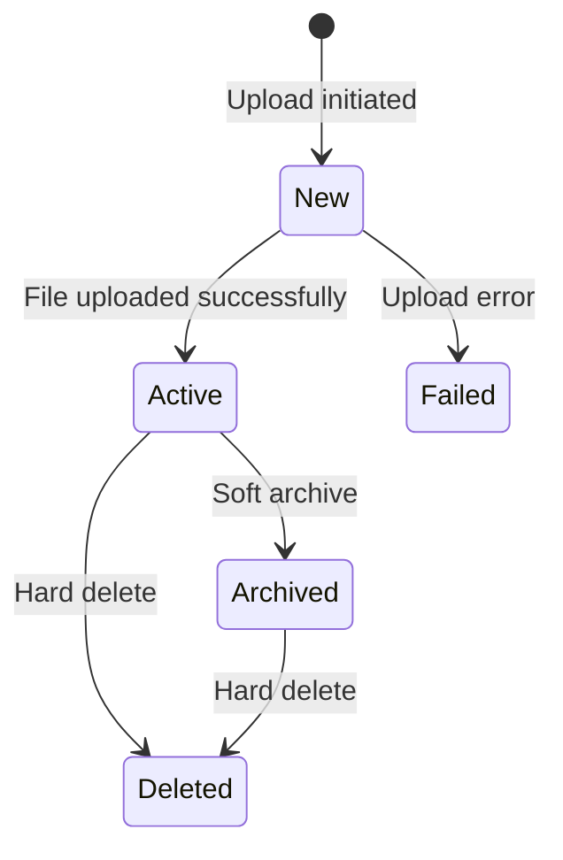

# Gestión de Documentos de Clientes

El sistema de gestión de documentos maneja la carga de archivos, el almacenamiento en la nube y la generación de enlaces de descarga seguros para documentos relacionados con clientes. Los documentos se almacenan en almacenamiento en la nube (Google Cloud Storage o compatible con S3) con metadatos rastreados en la base de datos mediante event sourcing. El sistema soporta cualquier tipo de archivo, pero se utiliza principalmente para documentos de identidad, registros corporativos y materiales de apoyo para procesos de KYC y crédito.

## Arquitectura de Almacenamiento

Los documentos se almacenan utilizando un enfoque de dos partes: los metadatos del archivo (ID, nombre de archivo, tipo de contenido, estado, referencia al cliente propietario) se persisten como una entidad con event sourcing en PostgreSQL, mientras que los bytes reales del archivo se cargan en el almacenamiento en la nube. La ruta de almacenamiento sigue el patrón `documents/customer_document/{document_id}{extension}`.

Cuando un usuario solicita una descarga, el sistema genera una URL prefirmada con una expiración limitada en el tiempo, permitiendo la descarga directa desde el navegador desde el almacenamiento en la nube sin necesidad de proxy del archivo a través del servidor de la aplicación.

## Ciclo de Vida del Documento

| Estado | Descripción |
|--------|-------------|
| **New** | Registro del documento creado, carga de archivo en progreso |
| **Active** | Archivo cargado exitosamente en el almacenamiento en la nube y disponible para descarga |
| **Failed** | La carga al almacenamiento en la nube falló (se puede reintentar) |
| **Archived** | Archivado de forma lógica; el archivo permanece en el almacenamiento en la nube pero está marcado como obsoleto |
| **Deleted** | Eliminado tanto del registro de la entidad (eliminación lógica) como del almacenamiento en la nube (eliminación física) |

La creación del documento y la carga del archivo ocurren de forma atómica dentro de una única transacción de base de datos. Si la carga falla, el documento transiciona al estado `Failed`. En condiciones normales, los documentos pasan directamente de `New` a `Active`.

## Gestión de Archivos

### Saneamiento de Nombres de Archivo

Cuando se sube un documento, el nombre de archivo original se sanea para un almacenamiento seguro. Todos los caracteres no alfanuméricos (excepto guiones) se reemplazan por guiones, y los espacios en blanco se eliminan. Tanto el nombre de archivo original como el saneado se conservan en el registro del documento para referencia.

### Tipos de Contenido y Extensiones

| Tipo de Contenido | Extensión |
|-------------|-----------|
| `application/pdf` | `.pdf` |
| `text/csv` | `.csv` |
| Todos los demás | No se añade extensión |

El sistema acepta cualquier tipo de contenido. El mapeo de extensiones se utiliza únicamente para construir la ruta de almacenamiento en la nube.

## Operaciones con Documentos

| Operación | Descripción | Permiso |
|-----------|-------------|------------|
| **Adjuntar documento** | Subir un archivo y asociarlo con un cliente | CUSTOMER_DOCUMENT_CREATE |
| **Listar documentos** | Recuperar todos los documentos de un cliente, ordenados por fecha de creación (más recientes primero) | CUSTOMER_DOCUMENT_LIST |
| **Ver documento** | Consultar un documento individual por ID | CUSTOMER_DOCUMENT_READ |
| **Generar enlace de descarga** | Crear una URL prefirmada con límite de tiempo para descargar el archivo | CUSTOMER_DOCUMENT_GENERATE_DOWNLOAD_LINK |
| **Archivar documento** | Marcar un documento como archivado sin eliminar el archivo del almacenamiento | CUSTOMER_DOCUMENT_DELETE |
| **Eliminar documento** | Eliminar el archivo del almacenamiento en la nube y realizar un borrado lógico del registro de la entidad | CUSTOMER_DOCUMENT_DELETE |

### Flujo de Subida

1. El operador selecciona un archivo en el panel de administración e inicia la subida.
2. El sistema crea un registro de documento con estado `New`, incluyendo el nombre de archivo saneado y el tipo de contenido.
3. Los bytes del archivo se suben al almacenamiento en la nube en la ruta calculada.
4. Si tiene éxito, un evento `FileUploaded` transiciona el documento al estado `Active`.
5. Si falla, un evento `UploadFailed` registra el error y transiciona al estado `Failed`.

### Flujo de descarga

1. El operador o sistema solicita un enlace de descarga para un documento.
2. El sistema genera una URL prefirmada desde el proveedor de almacenamiento en la nube.
3. Se registra un evento `DownloadLinkGenerated` con fines de auditoría (el estado del documento no cambia).
4. Se devuelve la URL prefirmada, permitiendo la descarga directa desde el almacenamiento en la nube dentro de la ventana de expiración.

## Seguridad

- **URLs prefirmadas**: Los enlaces de descarga tienen duración limitada y están firmados por el proveedor de almacenamiento en la nube. Expiran después de una duración configurada, evitando el acceso indefinido desde URLs compartidas o filtradas.
- **Transmisión cifrada**: Todas las cargas y descargas utilizan TLS.
- **Cifrado en reposo**: Los archivos en el almacenamiento en la nube se cifran utilizando el cifrado del lado del servidor del proveedor.
- **Autorización**: Cada operación de documento requiere el permiso apropiado, aplicado a través del sistema RBAC. Todas las operaciones se registran en el registro de auditoría.
