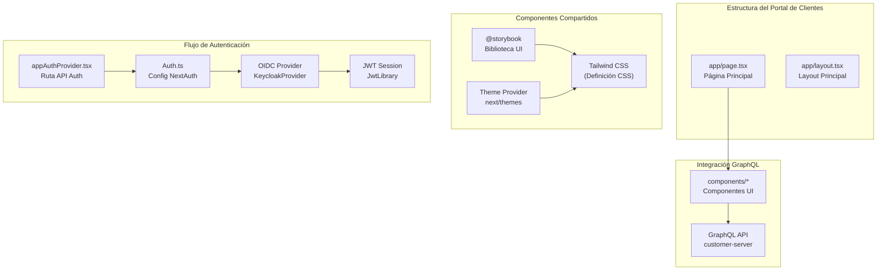
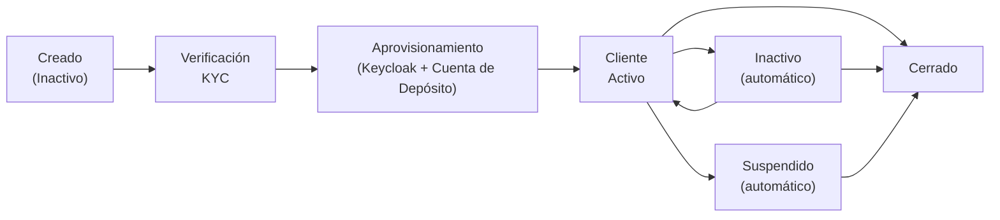

# Gestión de Clientes

El sistema de Gestión de Clientes abarca el ciclo de vida completo del cliente, desde el registro inicial y la verificación KYC hasta el estado de cuenta activa.

## Componentes del Sistema

| Componente | Módulo | Propósito |
|------------|--------|-----------|
| Gestión de Clientes | core-customer | Persistencia, perfiles y documentos |
| Procesamiento KYC | core-applicant | Integración con Sumsub |
| Onboarding de Usuarios | user-onboarding | Aprovisionamiento en Keycloak |

## Ciclo de Vida del Cliente

Un cliente progresa a través de varios estados desde su creación hasta las operaciones activas:

1. **Creación**: Un operador crea el registro del cliente en el panel de administración con correo electrónico, ID de Telegram opcional y tipo de cliente. El cliente comienza en estado `Inactivo` con verificación KYC `Pendiente`.
2. **Verificación KYC**: El operador genera un enlace de verificación de Sumsub. El cliente completa la verificación de identidad a través de la interfaz de Sumsub. Sumsub notifica al sistema mediante webhook cuando concluye la verificación.
3. **Aprovisionamiento**: Cuando se aprueba el KYC, el sistema emite eventos que activan el aprovisionamiento posterior. Se crea una cuenta de usuario de Keycloak para que el cliente pueda autenticarse, se envía un correo electrónico de bienvenida con las credenciales y se crea una cuenta de depósito.
4. **Operaciones activas**: El cliente ahora puede acceder al portal del cliente, recibir depósitos y solicitar líneas de crédito.

## Tipos de Cliente

El sistema soporta múltiples tipos de cliente para clasificación regulatoria:

| Tipo | Descripción | Tratamiento Contable |
|------|-------------|---------------------|
| INDIVIDUAL | Persona natural | Cuentas individuales |
| GOVERNMENT_ENTITY | Organización gubernamental | Cuentas gubernamentales |
| PRIVATE_COMPANY | Corporación privada | Cuentas empresariales |
| BANK | Institución bancaria | Cuentas interbancarias |
| FINANCIAL_INSTITUTION | Empresa de servicios financieros | Cuentas institucionales |
| FOREIGN_AGENCY_OR_SUBSIDIARY | Agencia/sucursal extranjera | Cuentas foráneas |
| NON_DOMICILED_COMPANY | Corporación no domiciliada | Cuentas no residentes |

## Estados del Cliente

| Estado | Descripción |
|--------|-------------|
| ACTIVE | El cliente puede realizar operaciones |
| INACTIVE | La cuenta está inactiva |
| SUSPENDED | La cuenta está suspendida |

## Cerrar un cliente

Un operador puede cerrar una cuenta de cliente a través del panel de administración. El cierre es una acción permanente e irreversible que requiere que se cumplan todas las siguientes condiciones previas:

- Todas las **líneas de crédito** deben estar en estado `Cerrado`
- Todas las **propuestas de líneas de crédito** deben estar en un estado terminal (`Denegado`, `Aprobado` o `DenegadoPorCliente`)
- No debe haber **líneas de crédito pendientes** en espera de colateralización
- Todas las **cuentas de depósito** deben estar cerradas
- No debe haber **retiros pendientes** en ninguna cuenta de depósito

Cuando se cierra un cliente, el sistema desactiva la cuenta de usuario de Keycloak asociada, impidiendo futuras autenticaciones en el portal del cliente.

## Componentes del sistema

| Componente | Módulo | Propósito |
|-----------|--------|---------|
| **Gestión de clientes** | core-customer | Entidad de cliente, perfiles, estado KYC, seguimiento de actividad |
| **Procesamiento KYC** | core-customer (kyc) | Integración API Sumsub, manejo de callbacks webhook |
| **Almacenamiento de documentos** | core-document-storage | Carga de archivos, almacenamiento en la nube, generación de enlaces de descarga |
| **Incorporación de usuarios** | lana-user-onboarding | Aprovisionamiento de usuarios Keycloak en eventos de creación de clientes |

## Integración con otros módulos

El registro de cliente es referenciado por prácticamente todos los demás módulos del sistema:

- **Depósitos**: Cada cliente tiene una cuenta de depósito (creada automáticamente después de la aprobación KYC). El tipo de cliente determina a qué conjunto de cuentas del libro mayor pertenece la cuenta de depósito.
- **Crédito**: Las propuestas de facilidades crediticias están vinculadas a un cliente. La verificación KYC puede ser requerida antes de que se permitan los desembolsos.
- **Contabilidad**: El tipo de cliente determina la ubicación en el plan de cuentas tanto para los pasivos de depósitos como para las cuentas por cobrar de crédito.
- **Gobernanza**: Los procesos de aprobación para retiros y operaciones de crédito referencian al cliente indirectamente a través de las entidades asociadas.

## Documentación relacionada

- [Proceso de incorporación](onboarding) - Flujo completo de incorporación con KYC Sumsub
- [Gestión de documentos](documents) - Manejo de documentos del cliente
