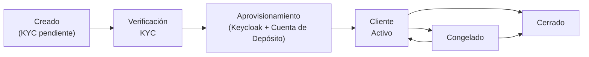

# Gestión de Clientes

El sistema de gestión de clientes es la base de identidad para todas las operaciones financieras en Lana. Cada cuenta de depósito, línea de crédito y transacción financiera se vincula en última instancia a un registro de cliente. El sistema cubre el ciclo de vida completo del cliente, desde el registro inicial y la verificación KYC hasta la gestión continua de la relación.

## Componentes del Sistema

| Componente | Módulo | Propósito |
|------------|--------|-----------|
| Gestión de Clientes | core-customer | Persistencia, perfiles y documentos |
| Procesamiento KYC | core-applicant | Integración con Sumsub |
| Onboarding de Usuarios | user-onboarding | Aprovisionamiento en Keycloak |

## Ciclo de Vida del Cliente

Un cliente pasa por varios estados desde su creación hasta las operaciones activas:

1. **Creación**: Un operador crea el registro de cliente en el panel de administración, ingresando correo electrónico, ID de Telegram (opcional) y tipo de cliente. El cliente inicia con verificación KYC en estado `Pendiente`.
2. **Verificación KYC**: El operador genera un enlace de verificación de Sumsub. El cliente completa la verificación de identidad a través de la plataforma de Sumsub. Cuando finaliza la verificación, Sumsub notifica al sistema mediante webhook.
3. **Aprovisionamiento**: Cuando se aprueba el KYC, el sistema emite eventos que activan el aprovisionamiento: se crea una cuenta de usuario en Keycloak para que el cliente pueda autenticarse, se envía un correo electrónico de bienvenida con las credenciales y se crea una cuenta de depósito.
4. **Operaciones activas**: El cliente ahora puede acceder al portal, recibir depósitos y solicitar líneas de crédito.
5. **Controles operativos**: Un operador puede congelar o descongelar al cliente desde el panel de administración. Al congelar, se suspenden las operaciones del cliente en Lana y se rechaza al solicitante en Sumsub. Al descongelar, se restauran las operaciones y se aprueba nuevamente al solicitante.

## Actividad de la cuenta de depósito

La actividad de las cuentas de depósito se gestiona automáticamente mediante un proceso periódico en segundo plano. El sistema determina la última fecha de actividad de cada cuenta de depósito a partir de la transacción más reciente registrada o, si no existen transacciones, utiliza la fecha de creación de la cuenta. Después, aplica umbrales configurables para determinar si esa cuenta debe considerarse activa, inactiva o sujeta a abandono. Por defecto, esos umbrales son de 365 días para `Inactiva` y 3650 días para `Abandonada`, y los operadores pueden modificarlos en la aplicación de administración mediante las configuraciones de dominio `deposit-activity-inactive-threshold-days` y `deposit-activity-escheatable-threshold-days`.

| Estado | Condición | Efecto |
|--------|-----------|--------|
| **Activa** | Actividad dentro del umbral configurado para inactividad (por defecto: 365 días) | La cuenta se muestra como recientemente activa |
| **Inactiva** | Sin actividad después del umbral de inactividad y antes del de abandono (por defecto: 365-3650 días) | La cuenta se muestra como inactiva para seguimiento del operador |
| **Abandonada** | Sin actividad luego del umbral configurado para abandono (por defecto: 3650 días) | La cuenta se muestra como inactiva durante mucho tiempo y pasada el umbral de abandono |

Este estado pertenece a la cuenta de depósito, no al cliente. La actividad es independiente del `status` operativo de la cuenta de depósito, por lo que un estado de actividad inactivo o abandonado no bloquea por sí solo los depósitos o retiros.

## Estados del Cliente

| Estado | Descripción |
|--------|-------------|
| ACTIVE | El cliente puede realizar operaciones |
| INACTIVE | La cuenta está inactiva |
| SUSPENDED | La cuenta está suspendida |

## Cerrar un cliente

Un operador puede cerrar una cuenta de cliente a través del panel de administración. El cierre es una acción permanente e irreversible que requiere que se cumplan todas las siguientes condiciones previas:

- Todas las **líneas de crédito** deben estar en estado `Cerrado`
- Todas las **propuestas de líneas de crédito** deben estar en un estado terminal (`Denegado`, `Aprobado` o `DenegadoPorCliente`)
- No debe haber **líneas de crédito pendientes** en espera de colateralización
- Todas las **cuentas de depósito** deben estar cerradas
- No debe haber **retiros pendientes** en ninguna cuenta de depósito

Cuando se cierra un cliente, el sistema desactiva la cuenta de usuario de Keycloak asociada, impidiendo futuras autenticaciones en el portal del cliente.

## Congelación y Descongelación de un Cliente

Un operador puede congelar a un cliente activo desde el panel de administración cuando se necesita suspender la relación temporalmente sin cerrarla de forma permanente.

- Un cliente en estado `Congelado` no puede realizar operaciones normales en Lana.
- Las cuentas de depósito del cliente se sincronizan a través de los trabajos de sincronización, de modo que el acceso a los productos aguas abajo queda bloqueado de forma uniforme.
- El solicitante correspondiente en Sumsub es rechazado cuando el cliente se congela y aprobado cuando se descongela.

Descongelar retorna al cliente a estado `Activo` y restaura el estado correspondiente en Sumsub.

## Componentes del sistema

| Componente | Módulo | Propósito |
|-----------|--------|-----------|
| **Gestión de clientes** | core-customer | Entidad de cliente, perfiles y estado KYC |
| **Procesamiento KYC** | core-customer (kyc) | Integración con API de Sumsub, manejo de callbacks de webhook |
| **Almacenamiento de documentos** | core-document-storage | Carga de archivos, almacenamiento en la nube, generación de enlaces de descarga |
| **Incorporación de usuarios** | lana-user-onboarding | Aprovisionamiento de usuarios en Keycloak mediante eventos de creación de clientes |

## Integración con otros módulos

El registro de cliente es referenciado por prácticamente todos los demás módulos del sistema:

- **Depósitos**: Cada cliente tiene una cuenta de depósito (creada automáticamente después de la aprobación KYC). El tipo de cliente determina a qué conjunto de cuentas del libro mayor pertenece la cuenta de depósito.
- **Crédito**: Las propuestas de facilidades crediticias están vinculadas a un cliente. La verificación KYC puede ser requerida antes de que se permitan los desembolsos.
- **Contabilidad**: El tipo de cliente determina la ubicación en el plan de cuentas tanto para los pasivos de depósitos como para las cuentas por cobrar de crédito.
- **Gobernanza**: Los procesos de aprobación para retiros y operaciones de crédito referencian al cliente indirectamente a través de las entidades asociadas.

## Documentación relacionada

- [Proceso de incorporación](onboarding) - Flujo completo de incorporación con KYC de Sumsub
- [Gestión de documentos](documents) - Manejo de documentos del cliente
