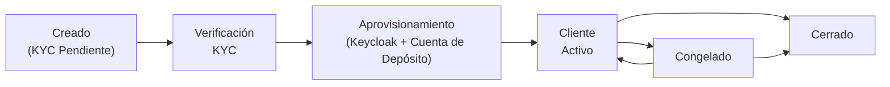

# Gestión de Clientes

El sistema de Gestión de Clientes es la base de identidad para todas las operaciones financieras en Lana. Cada cuenta de depósito, línea de crédito y transacción financiera finalmente se vincula a un registro de cliente. El sistema abarca el ciclo de vida completo del cliente, desde el registro inicial y la verificación KYC hasta la gestión continua de la relación.

## Tipos de Cliente

El tipo de cliente se asigna en el momento de la creación y determina varios comportamientos posteriores: qué nivel de verificación KYC se utiliza (individual vs. empresa), a qué conjunto de cuentas del libro mayor pertenecen las cuentas de depósito del cliente, y cómo se categorizan los asientos contables en los informes financieros.

| Tipo | Descripción | Nivel KYC | Tratamiento Contable |
|------|-------------|-----------|---------------------|
| **Individual** | Persona natural | KYC Básico (verificación de identidad) | Cuentas individuales |
| **Entidad Gubernamental** | Organización gubernamental | KYB Básico (verificación empresarial) | Cuentas gubernamentales |
| **Empresa Privada** | Corporación privada | KYB Básico | Cuentas empresariales |
| **Banco** | Institución bancaria | KYB Básico | Cuentas interbancarias |
| **Institución Financiera** | Empresa de servicios financieros | KYB Básico | Cuentas institucionales |
| **Agencia o Subsidiaria Extranjera** | Agencia/subsidiaria extranjera | KYB Básico | Cuentas extranjeras |
| **Empresa No Domiciliada** | Corporación no domiciliada | KYB Básico | Cuentas no residentes |

La distinción entre KYC y KYB es importante porque Sumsub aplica diferentes flujos de verificación para cada uno. Los clientes individuales pasan por la verificación de documentos de identidad (pasaporte, selfie), mientras que todos los demás tipos pasan por flujos de verificación empresarial (documentos corporativos, titularidad real).

## Ciclo de Vida del Cliente

Un cliente progresa a través de varios estados desde su creación hasta las operaciones activas:

1. **Creación**: Un operador crea el registro del cliente en el panel de administración con correo electrónico, ID de Telegram opcional y tipo de cliente. El cliente comienza con la verificación KYC en estado `Pendiente`.
2. **Verificación KYC**: El operador genera un enlace de verificación de Sumsub. El cliente completa la verificación de identidad a través de la interfaz de Sumsub. Sumsub notifica al sistema mediante webhook cuando la verificación concluye.
3. **Aprovisionamiento**: Cuando se aprueba el KYC, el sistema emite eventos que desencadenan el aprovisionamiento posterior. Se crea una cuenta de usuario de Keycloak para que el cliente pueda autenticarse, se envía un correo electrónico de bienvenida con las credenciales y se crea una cuenta de depósito.
4. **Operaciones activas**: El cliente ahora puede acceder al portal de clientes, recibir depósitos y solicitar líneas de crédito.

## Actividad de Cuenta de Depósito

La actividad de la cuenta de depósito se gestiona automáticamente mediante un trabajo periódico en segundo plano. El sistema determina la fecha de última actividad de cada cuenta de depósito a partir de la transacción más reciente iniciada por el cliente registrada en la cuenta, o utiliza la fecha de creación de la cuenta de depósito cuando aún no existen transacciones elegibles. Las transferencias de saldo internas de congelación y descongelación se ignoran, por lo que las operaciones de gestión de estado no reactivan una cuenta inactiva. Luego aplica umbrales configurables para determinar si esa cuenta debe considerarse activa, inactiva o susceptible de abandono. Por defecto, esos umbrales son 365 días para `Inactive` y 3650 días para `Escheatable`, y los operadores pueden modificarlos en la aplicación de administración a través de las configuraciones de dominio expuestas `deposit-activity-inactive-threshold-days` y `deposit-activity-escheatable-threshold-days`.

| Estado | Condición | Efecto |
|--------|-----------|--------|
| **Active** | Actividad dentro del umbral de inactividad configurado (predeterminado: 365 días) | La cuenta se muestra como recientemente activa |
| **Inactive** | Sin actividad más allá del umbral de inactividad y por debajo del umbral de abandono (predeterminados: 365-3650 días) | La cuenta se muestra como inactiva para seguimiento del operador |
| **Escheatable** | Sin actividad más allá del umbral de abandono configurado (predeterminado: 3650 días) | La cuenta se muestra como inactiva por largo tiempo y pasado el umbral de reversión al estado |

Este estado pertenece a la cuenta de depósito, no al cliente. La actividad es independiente del `status` operacional de la cuenta de depósito, por lo que un estado de actividad inactivo o susceptible de abandono no bloquea por sí mismo los depósitos o retiros.

## Estados de Verificación KYC

| Estado | Descripción | Acción Siguiente |
|--------|-------------|------------------|
| **Pending Verification** | Estado inicial para todos los clientes nuevos | Generar enlace de verificación de Sumsub |
| **Verified** | Identidad confirmada por Sumsub | El cliente puede acceder a productos financieros |
| **Rejected** | Verificación fallida | Revisar razones de rechazo en Sumsub |

La verificación KYC es una puerta unidireccional: una vez verificado, un cliente permanece verificado. Si la verificación es rechazada, el operador puede revisar las razones del rechazo en el panel de control de Sumsub y potencialmente solicitar un nuevo intento de verificación.

Cuando los requisitos de verificación KYC están habilitados en la configuración del sistema, un cliente debe estar verificado antes de que se pueda crear una cuenta de depósito o se pueda iniciar una línea de crédito. Esta es una política configurable que el banco puede habilitar o deshabilitar.

## Cierre de un Cliente

Un operador puede cerrar la cuenta de un cliente a través del panel de administración. El cierre es una acción permanente e irreversible que requiere que se cumplan todas las siguientes condiciones previas:

- Todas las **líneas de crédito** deben estar en estado `Cerrado`
- Todas las **propuestas de líneas de crédito** deben estar en un estado terminal (`Denegado`, `Aprobado` o `DenegadoPorCliente`)
- No debe haber **líneas de crédito pendientes** en espera de colateralización
- Todas las **cuentas de depósito** deben estar cerradas
- No debe haber **retiros pendientes** en ninguna cuenta de depósito

Cuando se cierra un cliente, el sistema desactiva la cuenta de usuario de Keycloak asociada, impidiendo futuras autenticaciones en el portal del cliente.

## Componentes del Sistema

| Componente | Módulo | Propósito |
|-----------|--------|---------|
| **Gestión de Clientes** | core-customer | Entidad de cliente, perfiles y estado KYC |
| **Procesamiento KYC** | core-customer (kyc) | Integración con API de Sumsub, manejo de callbacks mediante webhooks |
| **Almacenamiento de Documentos** | core-document-storage | Carga de archivos, almacenamiento en la nube, generación de enlaces de descarga |
| **Incorporación de Usuarios** | lana-user-onboarding | Aprovisionamiento de usuarios en Keycloak ante eventos de creación de clientes |

## Integración con Otros Módulos

El registro del cliente es referenciado por prácticamente todos los demás módulos del sistema:

- **Depósitos**: Cada cliente tiene una cuenta de depósito (creada automáticamente después de la aprobación KYC). El tipo de cliente determina a qué conjunto de cuentas contables pertenece la cuenta de depósito.
- **Crédito**: Las propuestas de líneas de crédito están vinculadas a un cliente. La verificación KYC puede ser requerida antes de que se permitan los desembolsos.
- **Contabilidad**: El tipo de cliente determina la ubicación en el plan de cuentas tanto para los pasivos por depósitos como para las cuentas por cobrar de crédito.
- **Gobernanza**: Los procesos de aprobación para retiros y operaciones de crédito referencian al cliente indirectamente a través de las entidades asociadas.

## Documentación Relacionada

- [Proceso de Incorporación](onboarding) - Flujo completo de incorporación con KYC de Sumsub
- [Gestión de Documentos](documents) - Manejo de documentos del cliente
