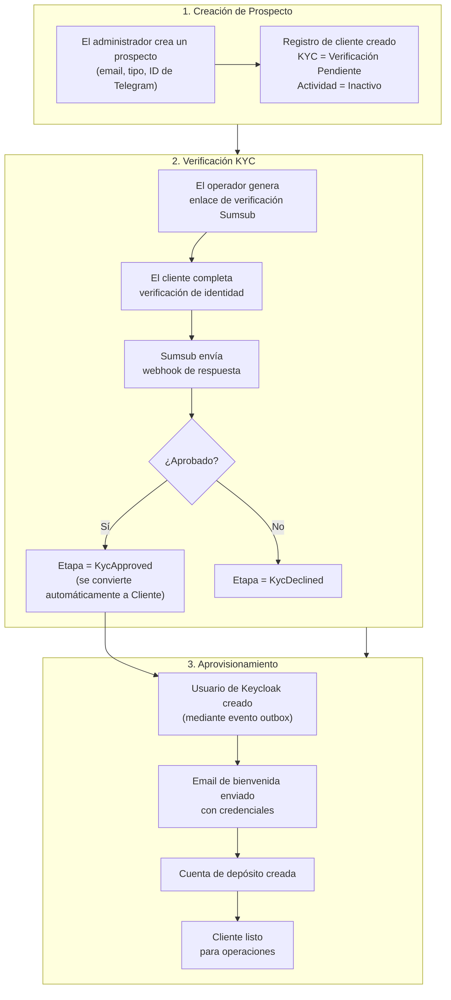

# Proceso de Incorporación de Clientes

La incorporación de clientes es un proceso de múltiples pasos que establece la identidad del cliente, provisiona su acceso al sistema y crea las cuentas financieras necesarias para las operaciones. El proceso implica coordinación entre el panel de administración, el proveedor KYC Sumsub, el servidor de identidad Keycloak y el módulo de depósitos.

## Flujo de Incorporación

## Paso 1: Creación de Prospecto

Un operador crea un prospecto proporcionando:

- **Dirección de email** (requerida) - Utilizada para el inicio de sesión en Keycloak y comunicación. Debe ser única.
- **ID de Telegram** (opcional) - Canal de contacto alternativo.
- **Tipo de cliente** (requerido) - Determina el flujo de verificación KYC (KYC para individuos, KYB para empresas) y el tratamiento contable de las cuentas del cliente.

El nuevo prospecto comienza con:
- Etapa: `New`
- Estado: `Open`
- Estado KYC: `Not Started`

Un prospecto aún no es un cliente y no puede realizar operaciones financieras. El prospecto se convierte en cliente solo después de que se apruebe el KYC.

## Paso 2: Verificación KYC

### Etapas del Prospecto

A medida que el prospecto avanza por el KYC, su etapa cambia:

| Etapa | Descripción | Siguiente Acción |
|-------|-------------|------------------|
| **New** | Prospecto creado, KYC no iniciado | El operador genera enlace de Sumsub |
| **KycStarted** | Prospecto inició verificación en Sumsub | Esperar webhook de Sumsub |
| **KycPending** | Sumsub revisando documentos | Esperar decisión final |
| **KycDeclined** | Verificación KYC rechazada | Revisar rechazo, opcionalmente reintentar o cerrar prospecto |
| **Converted** | KYC aprobado, prospecto convertido en cliente | El aprovisionamiento comienza automáticamente |
| **Closed** | Prospecto cerrado sin conversión | No se requiere más acción |

### Integración con Sumsub

Cuando Sumsub completa una verificación, envía un webhook al sistema. El manejador de callback procesa varios tipos de eventos:

- **Applicant Created** - Confirma que Sumsub ha registrado al cliente. Registra el ID de solicitante de Sumsub en el registro del cliente.
- **Applicant Reviewed (Green)** - Verificación aprobada. Establece el nivel KYC en `Basic` y el estado de verificación en `Verified`. Activa eventos de aprovisionamiento posteriores.
- **Applicant Reviewed (Red)** - Verificación rechazada. Establece el estado de verificación en `Rejected`. El rechazo incluye etiquetas y comentarios que explican el motivo.
- **Applicant Pending** / **Personal Info Changed** - Eventos informativos que se registran pero no cambian el estado del cliente.

Cada callback se procesa exactamente una vez mediante un mecanismo de idempotencia que elimina duplicados basándose en el ID de correlación y la marca de tiempo del callback.

### Qué Sucede al Aprobar el KYC

Cuando llega una revisión Green de Sumsub, se activa la siguiente cadena de eventos:

1. El nivel KYC de la entidad del cliente se establece en `Basic` y el estado de verificación en `Verified`.
2. Se publica un evento `CustomerKycUpdated` en la bandeja de salida.
3. Los listeners posteriores reaccionan al evento de la bandeja de salida:
   - El módulo de **incorporación de usuarios** crea una cuenta de Keycloak para que el cliente pueda iniciar sesión en el portal.
   - Se envía un **correo electrónico de bienvenida** con las credenciales de inicio de sesión.
   - Se crea una **cuenta de depósito**, proporcionando al cliente un lugar para recibir fondos.

Esta arquitectura basada en eventos significa que el aprovisionamiento ocurre de forma asíncrona. Si algún paso falla (por ejemplo, Keycloak no está disponible temporalmente), el sistema de trabajos reintenta automáticamente hasta que tenga éxito.

## Paso 3: Aprovisionamiento Automático

Cuando se aprueba el KYC, el sistema aprovisiona tres cosas:

| Recurso | Módulo | Propósito |
|----------|--------|---------|
| **Usuario de Keycloak** | Incorporación de Usuarios | Habilita la autenticación en el portal. El usuario se crea en el realm del cliente. |
| **Correo de bienvenida** | SMTP | Entrega las credenciales iniciales al cliente. |
| **Cuenta de depósito** | Depósito | Crea la cuenta de depósito en USD con prevención de sobregiros. Se vincula al conjunto de cuentas del libro mayor correcto según el tipo de cliente. |

Después de que se completa el aprovisionamiento, el cliente puede:
- Iniciar sesión en el portal del cliente
- Recibir depósitos en su cuenta
- Ser considerado para propuestas de líneas de crédito

## Operaciones del Panel de Administración

### Lista de Prospectos

- Filtrar por etapa (Nuevo, KYC Iniciado, KYC Pendiente, KYC Rechazado, Convertido, Cerrado)
- Buscar por correo electrónico o ID público
- Ordenar por fecha de creación

### Acciones Disponibles

| Acción | Descripción |
|--------|-------------|
| Crear prospecto | Registrar un nuevo prospecto para incorporación |
| Ver prospecto | Consultar información del prospecto |
| Iniciar KYC | Comenzar verificación Sumsub para un prospecto |
| Convertir prospecto | Convertir manualmente un prospecto a cliente (omite KYC) |
| Cerrar prospecto | Cerrar un prospecto sin convertir |

## Recorrido del panel de administración: Creación de prospecto y KYC

Este recorrido refleja el flujo del operador usado en los manuales de Cypress y se alinea con el ciclo de vida del dominio de cliente (crear prospecto -> verificar -> convertir a cliente).

### 1) Crear un prospecto

**Paso 1.** Abre la lista de prospectos.

**Paso 2.** Haz clic en **Crear**.

**Paso 3.** El formulario de creación de prospecto se abre con el campo de entrada de correo electrónico listo.

**Paso 4.** Introduce un correo electrónico único del prospecto.

**Paso 5.** Introduce un ID de Telegram único (si lo usa tu proceso).

**Paso 6.** Revisa los detalles antes de enviar.

**Paso 7.** Verifica el diálogo de confirmación que muestra los detalles del cliente introducidos.

**Paso 8.** Haz clic en **Confirmar** para crear el prospecto.

**Paso 9.** Confirma la página de detalles del prospecto y los campos de identidad.

**Paso 10.** Verificar que el prospecto aparece en las vistas de lista.

### 2) Iniciar y monitorear KYC

El sistema se integra con Sumsub. Los operadores generan el enlace de verificación y luego monitorean los cambios de estado impulsados por actualizaciones de webhook.

**Paso 11.** Abrir la sección KYC del prospecto y generar el enlace de verificación.

**Paso 12.** Confirmar que se creó el enlace KYC.

**Paso 13.** Después de la verificación KYC, verificar que el cliente aparece en las vistas de lista.

