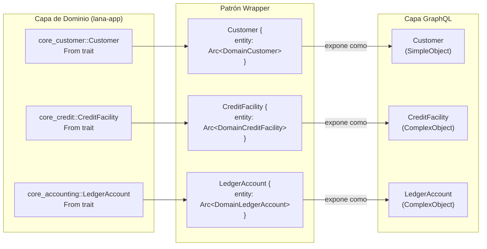
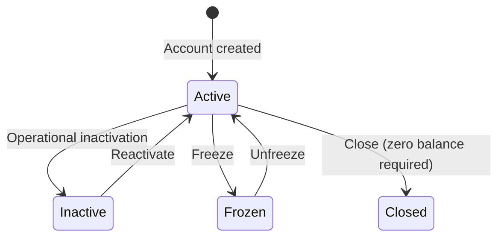
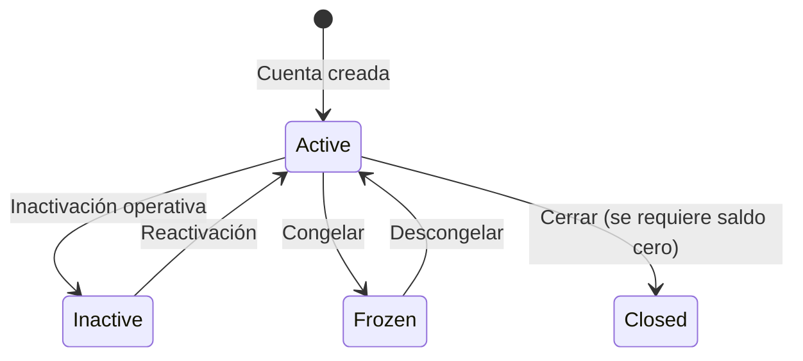
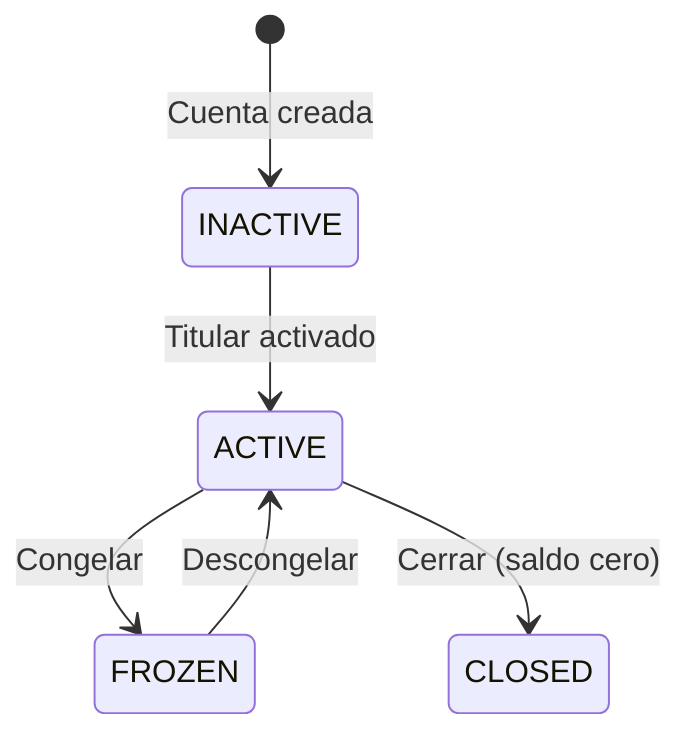
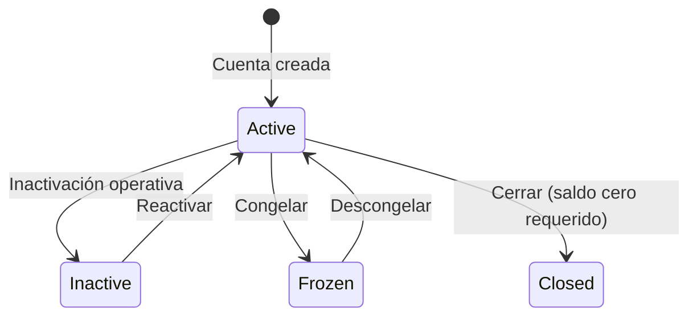

# Sistema de Depósitos y Retiros

El Sistema de Depósitos y Retiros gestiona las cuentas de depósito de clientes y facilita las operaciones de depósito/retiro dentro de la plataforma.


```mermaid
graph LR
    subgraph DomainLayer["Capa de Dominio (lana-app)"]
        DC["core_customer::Customer<br/>From trait"]
        DCR["core_credit::CreditFacility<br/>From trait"]
        DLA["core_accounting::LedgerAccount<br/>From trait"]
    end

    subgraph Wrapper["Patrón Wrapper"]
        WC["Customer {<br/>entity: Arc&lt;DomainCustomer&gt;<br/>}"]
        WCF["CreditFacility {<br/>entity: Arc&lt;DomainCreditFacility&gt;<br/>}"]
        WLA["LedgerAccount {<br/>entity: Arc&lt;DomainLedgerAccount&gt;<br/>}"]
    end

    subgraph GQLLayer["Capa GraphQL"]
        GC["Customer<br/>(SimpleObject)"]
        GCF["CreditFacility<br/>(ComplexObject)"]
        GLA["LedgerAccount<br/>(ComplexObject)"]
    end

    DC --> WC
    DCR --> WCF
    DLA --> WLA
    WC -->|"expone como"| GC
    WCF -->|"expone como"| GCF
    WLA -->|"expone como"| GLA
```

## Propósito

El sistema maneja el ciclo de vida completo de los fondos del cliente:
- Creación de cuentas de depósito
- Registro de depósitos
- Procesamiento de retiros
- Flujos de trabajo de aprobación

Todas las operaciones financieras están integradas con Cala Ledger para contabilidad de partida doble.

## Arquitectura del Sistema

```
┌─────────────────────────────────────────────────────────────────┐
│                       CoreDeposit                               │
│  ┌─────────────────┐  ┌─────────────────┐  ┌─────────────────┐ │
│  │DepositAccountRepo│  │   DepositRepo   │  │  WithdrawalRepo │ │
│  └─────────────────┘  └─────────────────┘  └─────────────────┘ │
│                              │                                  │
│                              ▼                                  │
│  ┌─────────────────────────────────────────────────────────┐   │
│  │                    DepositLedger                         │   │
│  │              (Operaciones contables)                     │   │
│  └─────────────────────────────────────────────────────────┘   │
│                              │                                  │
│                              ▼                                  │
│  ┌─────────────────────────────────────────────────────────┐   │
│  │                 ApproveWithdrawal                        │   │
│  │              (Proceso de aprobación)                     │   │
│  └─────────────────────────────────────────────────────────┘   │
└─────────────────────────────────────────────────────────────────┘
```

## Entidades Principales

### Cuenta de Depósito (DepositAccount)

| Campo | Tipo | Descripción |
|-------|------|-------------|
| id | UUID | Identificador único |
| publicId | String | ID público legible |
| accountHolderId | UUID | ID del cliente titular |
| status | Enum | Estado de la cuenta |
| accountType | Enum | Tipo de cuenta |

### Depósito (Deposit)

| Campo | Tipo | Descripción |
|-------|------|-------------|
| id | UUID | Identificador único |
| depositAccountId | UUID | Cuenta destino |
| amount | UsdCents | Monto en centavos USD |
| reference | String | Referencia externa |
| status | Enum | Estado del depósito |


```mermaid
stateDiagram-v2
    [*] --> Active : Account created
    Active --> Inactive : Operational inactivation
    Inactive --> Active : Reactivate
    Active --> Frozen : Freeze
    Frozen --> Active : Unfreeze
    Active --> Closed : Close (zero balance required)
```

| Estado | Descripción | Depósitos permitidos | Retiros permitidos |
|--------|-------------|:---:|:---:|
| **Activa** | Operaciones normales | Sí | Sí |
| **Inactiva** | Cuenta operativamente inactiva | No | No |
| **Congelada** | Retención por cumplimiento o disputa | No | No |
| **Cerrada** | Desactivada permanentemente | No | No |

La actividad de la cuenta se rastrea por separado del estado de la cuenta. El sistema clasifica cada cuenta de depósito como `Active`, `Inactive` o `Suspended` para el monitoreo de inactividad, mientras que el `status` operativo anterior continúa controlando si se permiten depósitos y retiros.

| Campo | Tipo | Descripción |
|-------|------|-------------|
| id | UUID | Identificador único |
| depositAccountId | UUID | Cuenta origen |
| amount | UsdCents | Monto en centavos USD |
| reference | String | Referencia externa |
| status | Enum | Estado del retiro |


```mermaid
stateDiagram-v2
    [*] --> Active : Cuenta creada
    Active --> Inactive : Inactivación operativa
    Inactive --> Active : Reactivación
    Active --> Frozen : Congelar
    Frozen --> Active : Descongelar
    Active --> Closed : Cerrar (se requiere saldo cero)
```

| Estado | Descripción | Depósitos permitidos | Retiros permitidos |
|--------|-------------|:---:|:---:|
| **Activa** | Operaciones normales | Sí | Sí |
| **Inactiva** | Cuenta operativamente inactiva | No | No |
| **Congelada** | Retención por cumplimiento o disputa | No | No |
| **Cerrada** | Desactivada permanentemente | No | No |

La actividad de la cuenta se registra por separado del estado de la cuenta. El sistema clasifica cada cuenta de depósito como `Activa`, `Inactiva` o `Suspendida` para el monitoreo de inactividad, obteniendo la fecha de la última actividad de la última transacción en el libro mayor de la cuenta, o de la fecha de creación si aún no existen transacciones. El `estado` operativo anterior continúa determinando si se permiten depósitos y retiros.

| Tipo | Descripción | Uso |
|------|-------------|-----|
| Individual | Cuenta personal | Clientes individuales |
| GovernmentEntity | Cuenta gubernamental | Entidades de gobierno |
| PrivateCompany | Cuenta empresarial | Empresas privadas |
| Bank | Cuenta bancaria | Instituciones financieras |
| FinancialInstitution | Cuenta institucional | Otras instituciones |
| ForeignAgencyOrSubsidiary | Cuenta foránea | Agencias extranjeras |
| NonDomiciledCompany | Cuenta no residente | Empresas no domiciliadas |


```mermaid
stateDiagram-v2
    [*] --> Active : Cuenta creada
    Active --> Inactive : Inactivación operativa
    Inactive --> Active : Reactivación
    Active --> Frozen : Congelar
    Frozen --> Active : Descongelar
    Active --> Closed : Cerrar (se requiere saldo cero)
```

| Estado | Descripción | Depósitos permitidos | Retiros permitidos |
|--------|-------------|:---:|:---:|
| **Activa** | Operaciones normales | Sí | Sí |
| **Inactiva** | Cuenta operativamente inactiva | No | No |
| **Congelada** | Retención por cumplimiento o disputa | No | No |
| **Cerrada** | Desactivada permanentemente | No | No |

La actividad de la cuenta se rastrea por separado del estado de la cuenta. El sistema clasifica cada cuenta de depósito como `Activa`, `Inactiva` o `Escheatable` para el monitoreo de inactividad, obteniendo la fecha de la última actividad de la transacción más reciente en el libro mayor de la cuenta, o de la fecha de creación si aún no existen transacciones. Por defecto, las cuentas se vuelven `Inactivas` tras 365 días sin actividad y `Escheatable` después de 3650 días, y estos umbrales pueden modificarse desde la aplicación administrativa a través de las configuraciones de dominio `deposit-activity-inactive-threshold-days` y `deposit-activity-escheatable-threshold-days`. El `estado` operativo anterior sigue controlando si se permiten depósitos y retiros.

| Estado | Descripción |
|--------|-------------|
| ACTIVE | Cuenta operativa — depósitos y retiros permitidos |
| INACTIVE | Cuenta desactivada |
| FROZEN | Cuenta congelada — no se permiten nuevos depósitos ni retiros |
| CLOSED | Cuenta cerrada permanentemente (requiere saldo cero) |


```mermaid
stateDiagram-v2
    [*] --> INACTIVE : Cuenta creada
    INACTIVE --> ACTIVE : Titular activado
    ACTIVE --> FROZEN : Congelar
    FROZEN --> ACTIVE : Descongelar
    ACTIVE --> CLOSED : Cerrar (saldo cero)
```


```mermaid
stateDiagram-v2
    [*] --> Active : Cuenta creada
    Active --> Inactive : Inactivación operativa
    Inactive --> Active : Reactivar
    Active --> Frozen : Congelar
    Frozen --> Active : Descongelar
    Active --> Closed : Cerrar (saldo cero requerido)
```

| Estado | Descripción | Depósitos permitidos | Retiros permitidos |
|--------|-------------|:---:|:---:|
| **Activo** | Operaciones normales | Sí | Sí |
| **Inactivo** | Cuenta inactiva operativamente | No | No |
| **Congelado** | Retención por cumplimiento o disputa | No | No |
| **Cerrado** | Desactivado permanentemente | No | No |

La actividad de la cuenta se rastrea de forma independiente al estado de la cuenta. El sistema clasifica cada cuenta de depósito como `Active`, `Inactive` o `Escheatable` para el monitoreo de inactividad, determinando la última fecha de actividad a partir de la transacción más reciente dirigida por el cliente en el libro mayor de la cuenta, o desde la fecha de creación de la cuenta si aún no existen transacciones que califiquen. Las transferencias internas de saldo para congelar o descongelar están excluidas, por lo que cambiar el estado operativo de una cuenta no reinicia la inactividad por sí solo. Por defecto, las cuentas pasan a `Inactive` después de 365 días sin actividad y a `Escheatable` después de 3650 días, y estos umbrales pueden modificarse desde la aplicación de administración mediante las configuraciones de dominio expuestas `deposit-activity-inactive-threshold-days` y `deposit-activity-escheatable-threshold-days`. El `status` operativo anterior sigue controlando si se permiten depósitos y retiros.

### Congelar Cuenta

Congelar una cuenta de depósito impide todos los nuevos depósitos y retiros, manteniendo la cuenta y sus saldos visibles. Se utiliza para retenciones de cumplimiento o investigaciones de disputas.

- La cuenta transiciona de `ACTIVE` a `FROZEN`
- Los saldos liquidados y pendientes permanecen visibles
- Se emite un evento `DepositAccountFrozen`
- Una cuenta `INACTIVE` o `CLOSED` no puede ser congelada

### Descongelar Cuenta

Descongelar restaura una cuenta congelada a operación normal, habilitando nuevamente depósitos y retiros.

- La cuenta transiciona de `FROZEN` a `ACTIVE`
- Se emite un evento `DepositAccountUnfrozen`
- La operación es idempotente — descongelar una cuenta ya activa no tiene efecto

### Cerrar Cuenta

Cerrar desactiva permanentemente una cuenta de depósito. Esta acción no puede revertirse.

- **Requiere saldo cero** — tanto el saldo liquidado como el pendiente deben ser cero
- Una cuenta `FROZEN` no puede cerrarse directamente; primero descongelar
- La cuenta contable correspondiente se bloquea al cierre
- Se emite un evento `DepositAccountClosed`

## Documentación Relacionada

- [Operaciones de Depósito](operations) - Depósitos y retiros
- [Libro Mayor](ledger) - Resumen de conjuntos de cuentas y plantillas de transacción

## Recorrido en Panel de Administración: Alta de Cuenta de Depósito

Las cuentas de depósito son prerequisito para operar transacciones. En onboarding, el operador puede
necesitar crearlas desde el perfil del cliente cuando no existen.

**Paso 1.** Detecta ausencia de cuenta en el banner del detalle del cliente.


**Paso 2.** Abre el diálogo para crear la cuenta.


**Paso 3.** Confirma creación exitosa.


Verificaciones operativas posteriores:
- estado de cuenta en `ACTIVE`,
- relación cliente-cuenta correcta,
- cuenta disponible para iniciar depósitos y retiros.
