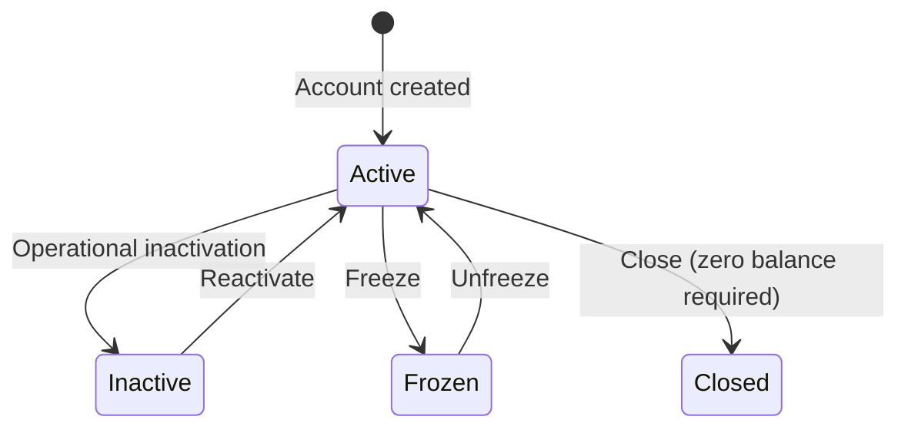

# Sistema de Depósitos y Retiros

El Sistema de Depósitos y Retiros gestiona las cuentas de depósito de los clientes y facilita todos los movimientos de fondos dentro de la plataforma. Cada cliente tiene una única cuenta de depósito en USD que sirve como centro para recibir depósitos, procesar retiros y recibir desembolsos de líneas de crédito. El sistema está completamente integrado con el libro mayor de doble entrada Cala, asegurando que cada movimiento de fondos se registre adecuadamente y que las cuentas no puedan tener sobregiros.

## Estructura de la Cuenta de Depósito

Cada cuenta de depósito en Lana está respaldada por **dos** cuentas contables en el libro mayor Cala:

| Cuenta Contable | Saldo Normal | Propósito |
|----------------|---------------|---------|
| **Cuenta de Depósito** | Crédito (pasivo) | Rastrea el saldo disponible del cliente. Representa la obligación del banco con el cliente. |
| **Cuenta de Depósito Congelada** | Crédito (pasivo) | Mantiene el saldo del cliente mientras la cuenta está congelada. Los saldos se transfieren aquí durante una congelación y se restauran al descongelar. |

Además, una única **Cuenta Ómnibus de Depósitos** a nivel del sistema (débito-normal, activo) sirve como contraparte para todas las transacciones de depósito y retiro. Representa las reservas de efectivo reales del banco que respaldan los depósitos de los clientes.

### Prevención de Sobregiros

Cada cuenta de depósito tiene un control de velocidad que impide que el saldo liquidado caiga por debajo de cero. Esto se aplica a nivel del libro mayor, lo que significa que ninguna transacción puede hacer que el saldo sea negativo independientemente de cómo se inicie. Esto proporciona una garantía firme contra sobregiros sin necesidad de verificaciones de saldo a nivel de aplicación.

### Modelo de Saldo

Los saldos de las cuentas de depósito se reportan como dos cifras separadas:

- **Saldo liquidado**: Fondos confirmados y disponibles. Refleja los depósitos completados menos los retiros completados.
- **Saldo pendiente**: Fondos comprometidos por retiros en tránsito que han sido iniciados pero aún no confirmados o cancelados. El monto pendiente reduce el saldo disponible efectivo.

Cuando se inicia un retiro, el monto se traslada inmediatamente de liquidado a pendiente (mediante una transacción contable). Esto asegura que los fondos estén reservados y no puedan gastarse dos veces. Cuando se confirma el retiro, el saldo pendiente se elimina. Si el retiro es cancelado o denegado, el saldo pendiente se restaura a liquidado.

## Tipos de Cuenta

Las cuentas de depósito se categorizan por el tipo de cliente de su titular. Cada tipo de cliente se asigna a un conjunto de cuentas contables separado, permitiendo informes de saldo agregado por categoría de cliente:

| Tipo | Descripción |
|------|-------------|
| Individual | Cuentas de clientes personales |
| GovernmentEntity | Cuentas de organizaciones gubernamentales |
| PrivateCompany | Cuentas empresariales |
| Bank | Cuentas de instituciones bancarias |
| FinancialInstitution | Cuentas de otras instituciones financieras |
| NonDomiciledCompany | Cuentas de empresas no residentes |

Esta categorización se utiliza en el plan de cuentas para ubicar los pasivos de depósito bajo los nodos principales correctos para la presentación de informes financieros.

## Estado y Ciclo de Vida de la Cuenta

```mermaid
stateDiagram-v2
    [*] --> Active : Account created
    Active --> Inactive : Operational inactivation
    Inactive --> Active : Reactivate
    Active --> Frozen : Freeze
    Frozen --> Active : Unfreeze
    Active --> Closed : Close (zero balance required)
```

| Estado | Descripción | Depósitos Permitidos | Retiros Permitidos |
|--------|-------------|:---:|:---:|
| **Active** | Operaciones normales | Sí | Sí |
| **Inactive** | Cuenta operativamente inactiva | No | No |
| **Frozen** | Retención por cumplimiento o disputa | No | No |
| **Closed** | Desactivada permanentemente | No | No |

La actividad de la cuenta se rastrea por separado del estado de la cuenta. El sistema clasifica cada cuenta de depósito como `Active`, `Inactive` o `Escheatable` para el monitoreo de inactividad, derivando la fecha de última actividad de la transacción contable más reciente iniciada por el cliente en la cuenta, o de la fecha de creación de la cuenta cuando aún no existen transacciones calificadas. Las transferencias de saldo internas de congelación y descongelación se excluyen, por lo que cambiar el estado operativo de una cuenta no restablece por sí solo la inactividad. Por defecto, las cuentas se vuelven `Inactive` después de 365 días sin actividad y `Escheatable` después de 3650 días, y estos umbrales pueden modificarse desde la aplicación de administración a través de las configuraciones de dominio expuestas `deposit-activity-inactive-threshold-days` y `deposit-activity-escheatable-threshold-days`. El `status` operativo mencionado anteriormente continúa controlando si se permiten depósitos y retiros.

### Congelar Cuenta

Congelar una cuenta de depósito impide todos los nuevos depósitos y retiros mientras preserva el saldo de la cuenta. Esto se utiliza para retenciones de cumplimiento, investigaciones de disputas o requisitos regulatorios.

Cuando una cuenta está congelada:
1. El saldo liquidado se traslada desde la cuenta contable de depósito principal a la cuenta complementaria congelada mediante una transacción contable.
2. La cuenta contable de depósito principal se bloquea, impidiendo cualquier transacción adicional.
3. Se emite un evento `DepositAccountFrozen`.

El saldo permanece visible para los operadores durante la congelación. Una cuenta `Inactive` o `Closed` no puede ser congelada.

### Descongelar Cuenta

Descongelar restaura una cuenta congelada a su operación normal:
1. La cuenta contable de depósito principal se desbloquea.
2. El saldo congelado se traslada de vuelta desde la cuenta complementaria congelada a la cuenta de depósito principal.
3. Se emite un evento `DepositAccountUnfrozen`.

La operación es idempotente: descongelar una cuenta ya activa no tiene ningún efecto.

### Cerrar Cuenta

Cerrar desactiva permanentemente una cuenta de depósito. Esta acción no se puede revertir.

- **Requiere saldo cero**: Tanto el saldo liquidado como el pendiente deben ser cero antes del cierre.
- Una cuenta `Frozen` no puede cerrarse directamente; primero debe descongelarse.
- La cuenta contable correspondiente se bloquea al cerrarse, impidiendo cualquier transacción futura.
- Se emite un evento `DepositAccountClosed`.

## Relación con las Facilidades de Crédito

Las cuentas de depósito sirven como destino para los desembolsos de facilidades de crédito. Cuando se confirma un desembolso, el monto desembolsado se acredita en la cuenta de depósito del cliente. Esto significa que el saldo de la cuenta de depósito refleja tanto los depósitos directos como los productos de las facilidades de crédito.

De manera similar, cuando un cliente realiza un pago en una facilidad de crédito, los fondos se debitan de su cuenta de depósito y se aplican a las obligaciones pendientes.

## Documentación relacionada

- [Operaciones de depósito](operations) - Depósitos y retiros
- [Libro mayor](ledger) - Descripción general de conjuntos de cuentas y plantillas de transacciones

## Recorrido en Panel de Administración: Alta de Cuenta de Depósito

Las cuentas de depósito son prerequisito para operar transacciones. En onboarding, el operador puede
necesitar crearlas desde el perfil del cliente cuando no existen.

**Paso 1.** Detecta ausencia de cuenta en el banner del detalle del cliente.

**Paso 2.** Abre el diálogo para crear la cuenta.

**Paso 3.** Confirma creación exitosa.

Verificaciones operativas posteriores:
- estado de cuenta en `ACTIVE`,
- relación cliente-cuenta correcta,
- cuenta disponible para iniciar depósitos y retiros.
