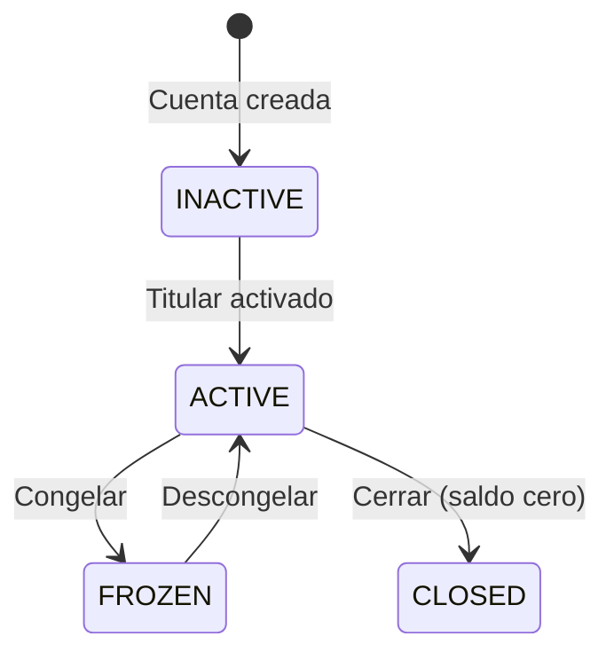

# Sistema de Depósitos y Retiros

El Sistema de Depósitos y Retiros gestiona las cuentas de depósito de clientes y facilita las operaciones de depósito/retiro dentro de la plataforma.


## Propósito

El sistema maneja el ciclo de vida completo de los fondos del cliente:
- Creación de cuentas de depósito
- Registro de depósitos
- Procesamiento de retiros
- Flujos de trabajo de aprobación

Todas las operaciones financieras están integradas con Cala Ledger para contabilidad de partida doble.

## Arquitectura del Sistema

```
┌─────────────────────────────────────────────────────────────────┐
│                       CoreDeposit                               │
│  ┌─────────────────┐  ┌─────────────────┐  ┌─────────────────┐ │
│  │DepositAccountRepo│  │   DepositRepo   │  │  WithdrawalRepo │ │
│  └─────────────────┘  └─────────────────┘  └─────────────────┘ │
│                              │                                  │
│                              ▼                                  │
│  ┌─────────────────────────────────────────────────────────┐   │
│  │                    DepositLedger                         │   │
│  │              (Operaciones contables)                     │   │
│  └─────────────────────────────────────────────────────────┘   │
│                              │                                  │
│                              ▼                                  │
│  ┌─────────────────────────────────────────────────────────┐   │
│  │                 ApproveWithdrawal                        │   │
│  │              (Proceso de aprobación)                     │   │
│  └─────────────────────────────────────────────────────────┘   │
└─────────────────────────────────────────────────────────────────┘
```

## Entidades Principales

### Cuenta de Depósito (DepositAccount)

| Campo | Tipo | Descripción |
|-------|------|-------------|
| id | UUID | Identificador único |
| publicId | String | ID público legible |
| accountHolderId | UUID | ID del cliente titular |
| status | Enum | Estado de la cuenta |
| accountType | Enum | Tipo de cuenta |

### Depósito (Deposit)

| Campo | Tipo | Descripción |
|-------|------|-------------|
| id | UUID | Identificador único |
| depositAccountId | UUID | Cuenta destino |
| amount | UsdCents | Monto en centavos USD |
| reference | String | Referencia externa |
| status | Enum | Estado del depósito |

### Retiro (Withdrawal)

| Campo | Tipo | Descripción |
|-------|------|-------------|
| id | UUID | Identificador único |
| depositAccountId | UUID | Cuenta origen |
| amount | UsdCents | Monto en centavos USD |
| reference | String | Referencia externa |
| status | Enum | Estado del retiro |

## Tipos de Cuenta

| Tipo | Descripción | Uso |
|------|-------------|-----|
| Individual | Cuenta personal | Clientes individuales |
| GovernmentEntity | Cuenta gubernamental | Entidades de gobierno |
| PrivateCompany | Cuenta empresarial | Empresas privadas |
| Bank | Cuenta bancaria | Instituciones financieras |
| FinancialInstitution | Cuenta institucional | Otras instituciones |
| ForeignAgencyOrSubsidiary | Cuenta foránea | Agencias extranjeras |
| NonDomiciledCompany | Cuenta no residente | Empresas no domiciliadas |

## Estados de Cuenta

| Estado | Descripción |
|--------|-------------|
| ACTIVE | Cuenta operativa — depósitos y retiros permitidos |
| INACTIVE | Cuenta desactivada |
| FROZEN | Cuenta congelada — no se permiten nuevos depósitos ni retiros |
| CLOSED | Cuenta cerrada permanentemente (requiere saldo cero) |



## Operaciones del Ciclo de Vida de la Cuenta

### Congelar Cuenta

Congelar una cuenta de depósito impide todos los nuevos depósitos y retiros, manteniendo la cuenta y sus saldos visibles. Se utiliza para retenciones de cumplimiento o investigaciones de disputas.

- La cuenta transiciona de `ACTIVE` a `FROZEN`
- Los saldos liquidados y pendientes permanecen visibles
- Se emite un evento `DepositAccountFrozen`
- Una cuenta `INACTIVE` o `CLOSED` no puede ser congelada

### Descongelar Cuenta

Descongelar restaura una cuenta congelada a operación normal, habilitando nuevamente depósitos y retiros.

- La cuenta transiciona de `FROZEN` a `ACTIVE`
- Se emite un evento `DepositAccountUnfrozen`
- La operación es idempotente — descongelar una cuenta ya activa no tiene efecto

### Cerrar Cuenta

Cerrar desactiva permanentemente una cuenta de depósito. Esta acción no puede revertirse.

- **Requiere saldo cero** — tanto el saldo liquidado como el pendiente deben ser cero
- Una cuenta `FROZEN` no puede cerrarse directamente; primero descongelar
- La cuenta contable correspondiente se bloquea al cierre
- Se emite un evento `DepositAccountClosed`

## Documentación Relacionada

- [Operaciones de Depósito](operations) - Depósitos y retiros
- [Libro Mayor](ledger) - Resumen de conjuntos de cuentas y plantillas de transacción

## Recorrido en Panel de Administración: Alta de Cuenta de Depósito

Las cuentas de depósito son prerequisito para operar transacciones. En onboarding, el operador puede
necesitar crearlas desde el perfil del cliente cuando no existen.

**Paso 1.** Detecta ausencia de cuenta en el banner del detalle del cliente.


**Paso 2.** Abre el diálogo para crear la cuenta.


**Paso 3.** Confirma creación exitosa.


Verificaciones operativas posteriores:
- estado de cuenta en `ACTIVE`,
- relación cliente-cuenta correcta,
- cuenta disponible para iniciar depósitos y retiros.
