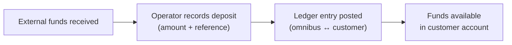
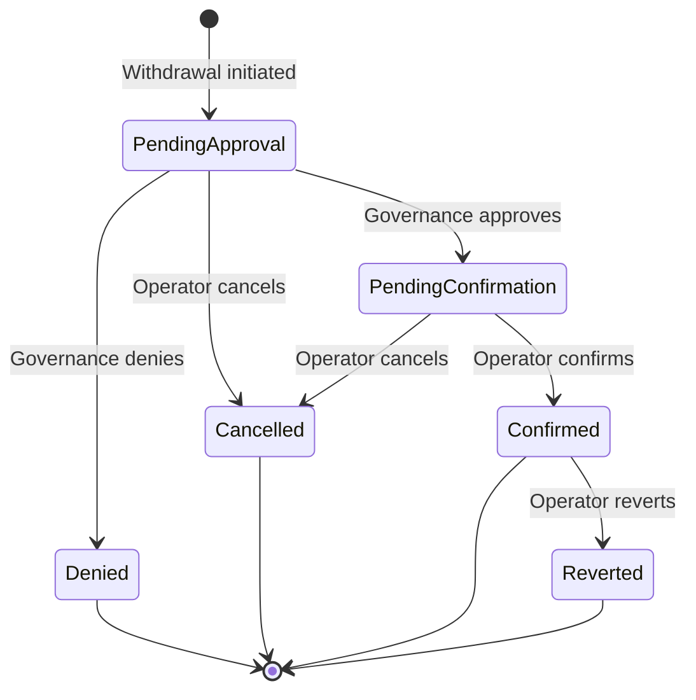

# Operaciones de Depósito y Retiro

Este documento describe la mecánica del registro de depósitos y el procesamiento de retiros, incluido el flujo de trabajo de aprobación, los asientos contables y las capacidades de reversión.

## Operaciones de Depósito

### Cómo Funcionan los Depósitos

Un depósito representa un movimiento de fondos entrantes hacia la cuenta de un cliente. Los depósitos son registrados por operadores cuando se han recibido fondos externos (por ejemplo, mediante transferencia bancaria, cheque u otro mecanismo de liquidación). El sistema no inicia el movimiento real de fondos; registra el hecho de que los fondos han llegado.

Cuando se registra un depósito:

1. El sistema valida que la cuenta de depósito esté activa y que el monto sea diferente de cero.
2. Se crea una nueva entidad de depósito con estado `Confirmed`.
3. Una transacción contable registra dos asientos en la capa de liquidación.
4. El depósito está disponible inmediatamente en el saldo del cliente.

### Asiento Contable del Depósito

| Cuenta | Débito | Crédito | Capa |
|---------|:-----:|:------:|-------|
| Depósito Omnibus (Activo) | X | | Liquidada |
| Cuenta de Depósito del Cliente (Pasivo) | | X | Liquidada |

La cuenta omnibus (efectivo/reservas del banco) aumenta en el lado del débito, y la cuenta de depósito del cliente (un pasivo que el banco debe al cliente) aumenta en el lado del crédito.

### Reversión de Depósito

Si un depósito fue registrado por error, puede ser revertido. La reversión registra la transacción contable inversa (acredita el omnibus, debita la cuenta del cliente), devolviendo ambas cuentas a su estado previo al depósito. La entidad de depósito pasa al estado `Reverted`. La reversión es idempotente: revertir un depósito ya revertido no tiene efecto.

## Operaciones de Retiro

### Ciclo de Vida del Retiro

Los retiros son más complejos que los depósitos porque requieren aprobación de gobernanza antes de que se liberen los fondos. El ciclo de vida completo implica comprometer los fondos en la iniciación, esperar la aprobación y luego confirmar o cancelar el retiro.

| Estado | Descripción |
|--------|-------------|
| **Pendiente de Aprobación** | Retiro iniciado, fondos comprometidos, esperando decisión de gobernanza |
| **Pendiente de Confirmación** | Gobernanza aprobada, esperando confirmación del operador del desembolso real de fondos |
| **Confirmado** | Fondos liberados, retiro completado |
| **Denegado** | Gobernanza rechazó el retiro, fondos restaurados |
| **Cancelado** | Operador canceló el retiro antes de la confirmación, fondos restaurados |
| **Revertido** | Retiro previamente confirmado revertido, fondos restaurados |

### Flujo de Retiro Paso a Paso

**1. Iniciación** - Un operador inicia un retiro especificando el monto y una referencia opcional. El sistema:
- Valida que la cuenta esté activa y que el monto no sea cero.
- Crea un proceso de aprobación de gobernanza (tipo: `withdraw`).
- Registra una transacción contable `INITIATE_WITHDRAW` que mueve fondos de liquidado a pendiente.
- El saldo liquidado del cliente disminuye inmediatamente, evitando que los fondos se utilicen para otras operaciones.

**2. Aprobación** - El sistema de gobernanza procesa el retiro según la política configurada:
- Si la política es `AutoApprove`, el retiro se aprueba instantáneamente.
- Si la política utiliza `CommitteeThreshold`, los miembros del comité deben votar para aprobar o denegar.
- Una sola denegación de cualquier miembro del comité rechaza inmediatamente el retiro.
- Este paso ocurre de forma asíncrona a través del sistema de trabajos basado en eventos.

**3a. Confirmación** - Después de la aprobación, un operador confirma el retiro, indicando que el desembolso real de fondos ha ocurrido externamente. Una transacción contable `CONFIRM_WITHDRAW` elimina el saldo pendiente.

**3b. Cancelación** - En cualquier momento antes de la confirmación (incluso antes de que concluya la aprobación), un operador puede cancelar el retiro. Una transacción contable `CANCEL_WITHDRAW` revierte el gravamen, restaurando el saldo liquidado.

**3c. Denegación** - Si la gobernanza deniega el retiro, una transacción contable `DENY_WITHDRAW` revierte automáticamente el gravamen, idéntica en efecto a la cancelación.

**4. Reversión (opcional)** - Un retiro confirmado puede revertirse si el movimiento de fondos externo falló o fue devuelto. Una transacción contable `REVERT_WITHDRAW` restaura el saldo liquidado.

### Asientos contables de retiro

El proceso de retiro utiliza cuatro plantillas de libro mayor diferentes según la etapa:

#### Inicio (retener fondos)

| Cuenta | Débito | Crédito | Capa |
|---------|:-----:|:------:|-------|
| Ómnibus de depósitos (Activo) | | X | Liquidada |
| Cuenta de depósito del cliente (Pasivo) | X | | Liquidada |
| Ómnibus de depósitos (Activo) | X | | Pendiente |
| Cuenta de depósito del cliente (Pasivo) | | X | Pendiente |

Esto transfiere el importe de liquidado a pendiente tanto en las cuentas ómnibus como en las del cliente.

#### Confirmación (liberar fondos)

| Cuenta | Débito | Crédito | Capa |
|---------|:-----:|:------:|-------|
| Ómnibus de depósitos (Activo) | | X | Pendiente |
| Cuenta de depósito del cliente (Pasivo) | X | | Pendiente |

Liquida la retención pendiente. El saldo liquidado ya se redujo al inicio.

#### Cancelación o denegación (restaurar fondos)

| Cuenta | Débito | Crédito | Capa |
|---------|:-----:|:------:|-------|
| Ómnibus de depósitos (Activo) | | X | Pendiente |
| Cuenta de depósito del cliente (Pasivo) | X | | Pendiente |
| Ómnibus de depósitos (Activo) | X | | Liquidada |
| Cuenta de depósito del cliente (Pasivo) | | X | Liquidada |

El inverso exacto del inicio: liquida lo pendiente y restaura lo liquidado.

#### Reversión (deshacer retiro confirmado)

| Cuenta | Débito | Crédito | Capa |
|---------|:-----:|:------:|-------|
| Ómnibus de depósitos (Activo) | X | | Liquidada |
| Cuenta de depósito del cliente (Pasivo) | | X | Liquidada |

Restaurа el saldo liquidado como si el retiro nunca hubiera ocurrido.

## Recorrido en Panel de Administración: Depósitos y Retiros

Este flujo muestra la creación y gestión operativa de depósitos y retiros.

### A) Crear un depósito

**Paso 1.** Haz clic en **Crear** global.

**Paso 2.** Selecciona **Crear Depósito**.

**Paso 3.** Ingresa monto del depósito.

**Paso 4.** Envía el formulario.

**Paso 5.** Confirma mensaje de éxito.

**Paso 6.** Verifica depósito en lista principal.

**Paso 7.** Verifica depósito en historial del cliente.

### B) Crear un retiro

**Paso 8.** Haz clic en **Crear** para iniciar retiro.

**Paso 9.** Selecciona **Crear Retiro**.

**Paso 10.** Ingresa monto del retiro.

**Paso 11.** Envía solicitud.

**Paso 12.** Verifica retiro en lista principal.

**Paso 13.** Verifica retiro en historial del cliente.

### C) Gestionar resultado del retiro

#### Cancelar retiro pendiente

**Paso 14.** Haz clic en **Cancelar**.

**Paso 15.** Confirma cancelación.

**Paso 16.** Verifica estado cancelado.

#### Aprobar retiro pendiente

**Paso 17.** Haz clic en **Aprobar**.

**Paso 18.** Confirma aprobación.

**Paso 19.** Verifica estado aprobado/confirmado.

