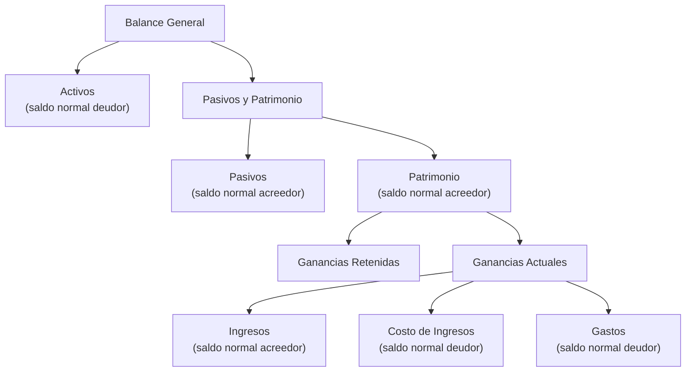

# Informes Financieros

Los informes financieros en Lana se generan en tiempo real a partir del libro mayor de doble entrada de Cala. A diferencia de los informes regulatorios (que se generan por lotes a través del pipeline de Dagster), los estados financieros están siempre actualizados y reflejan el estado más reciente de todas las cuentas. Están disponibles a través del panel de administración y la API de GraphQL.

## Balance de Comprobación

El balance de comprobación enumera todas las cuentas de primer nivel del plan de cuentas con sus saldos deudores y acreedores para un rango de fechas especificado. Su propósito principal es la verificación: el total de débitos debe ser igual al total de créditos. Si no coinciden, existe un error contable en algún punto del sistema.

### Qué Muestra

| Columna | Descripción |
|--------|-------------|
| **Cuenta** | Código y nombre de la cuenta del plan de cuentas |
| **Saldo Inicial** | Saldo al inicio del período seleccionado |
| **Actividad del Período (Débito)** | Total de movimientos de débito durante el período |
| **Actividad del Período (Crédito)** | Total de movimientos de crédito durante el período |
| **Saldo Final** | Saldo al final del período seleccionado |

El balance de comprobación agrega los saldos de todas las cuentas subordinadas bajo cada nodo de primer nivel utilizando los conjuntos de cuentas de CALA. Se admiten las monedas USD y BTC y pueden visualizarse por separado.

### Cuándo Utilizarlo

- **Verificación diaria**: Confirmar que el libro mayor sea internamente consistente (débitos = créditos).
- **Antes del cierre mensual**: Verificar el balance de comprobación antes de cerrar un mes para detectar discrepancias.
- **Investigación de errores**: El balance de comprobación es el primer lugar donde buscar cuando se sospecha una discrepancia contable.

## Balance General

El balance general presenta la posición financiera del banco como una instantánea en un momento determinado para una fecha específica, organizada según la ecuación contable fundamental: **Activos = Pasivos + Patrimonio**.

### Estructura

El balance general se implementa como una jerarquía de conjuntos de cuentas CALA. Cada categoría (Activos, Pasivos, Patrimonio) es un conjunto de cuentas que contiene los conjuntos de cuentas del plan de cuentas correspondientes como hijos. El Patrimonio incluye una subsección de "Ganancias Actuales" que contiene Ingresos, Costo de Ingresos y Gastos — esto proporciona el vínculo entre el balance general y el estado de resultados.

Ambas monedas USD y BTC están disponibles. La capa de saldos puede filtrarse (liquidados vs. pendientes) para ver saldos solo confirmados o todos los saldos.

### Cuándo Usar

- **Reportes de posición financiera**: Comprender qué posee el banco (activos), qué debe (pasivos) y el valor residual (patrimonio) en cualquier momento.
- **Reportes regulatorios**: El balance general alimenta varios cálculos de informes regulatorios.
- **Revisión de fin de período**: Antes de cerrar un año fiscal, verificar que la ecuación del balance general se cumpla y que las ganancias retenidas sean correctas.

## Estado de Pérdidas y Ganancias

El estado de pérdidas y ganancias (P&L) muestra el desempeño financiero del banco durante un período mediante el cálculo del ingreso neto: **Ingreso Neto = Ingresos - Costo de Ingresos - Gastos**.

### Secciones

| Sección | Saldo Normal | Componentes |
|---------|---------------|------------|
| **Ingresos** | Acreedor | Ingresos por intereses de líneas de crédito, ingresos por comisiones de estructuración |
| **Costo de Ingresos** | Deudor | Costos directos asociados con la generación de ingresos |
| **Gastos** | Deudor | Provisiones para pérdidas crediticias, gastos operativos |

El estado de P&L está estructurado de manera similar al balance general: un conjunto de cuentas raíz contiene Ingresos, Costo de Ingresos y Gastos como hijos, cada uno vinculado a las categorías correspondientes del plan de cuentas.

Al final de cada año fiscal, el proceso de cierre pone a cero todas las cuentas de P&L y transfiere el resultado neto a las ganancias retenidas en el balance general (ver [Cierre de Período](../accounting/closing)).

### Cuándo usar

- **Seguimiento del rendimiento**: Monitorea ingresos y gastos durante cualquier período de tiempo.
- **Antes del cierre del ejercicio fiscal**: Revisa el P&L antes de ejecutar el asiento de cierre de fin de año.
- **Análisis de variaciones**: Compara el rendimiento período tras período para identificar tendencias.

## Exportación CSV de cuenta contable

El historial de transacciones de cuentas contables individuales puede exportarse a CSV para un análisis detallado. Esto es útil para conciliación, auditoría o para alimentar datos en herramientas externas.

### Cómo funciona

1. Navega a una cuenta contable en el plan de cuentas.
2. Solicita una exportación CSV.
3. El sistema genera de forma asíncrona un archivo CSV que contiene el historial completo de transacciones.
4. Una notificación en tiempo real (vía suscripción GraphQL) alerta a la interfaz cuando la exportación está lista.
5. Genera un enlace de descarga para recuperar el archivo.

### Formato CSV

| Columna | Descripción |
|--------|-------------|
| Recorded At | Marca de tiempo de la transacción |
| Currency | USD o BTC |
| Debit Amount | Monto del débito (si aplica) |
| Credit Amount | Monto del crédito (si aplica) |
| Description | Descripción de la transacción |
| Entry Type | Tipo de asiento contable |

## Recorrido del panel de administración: Balance de comprobación

**Paso 1.** Abre el informe de balance de comprobación.

**Paso 2.** Cambia la vista de moneda (ejemplo: BTC).

## Recorrido del panel de administración: Balance general

**Paso 1.** Abre el informe de balance general.

**Paso 2.** Cambia la moneda (USD/BTC).

**Paso 3.** Filtra por capa de saldo (ejemplo: pendiente).

## Recorrido del panel de administración: Pérdidas y ganancias

**Paso 1.** Abrir el informe de pérdidas y ganancias.

**Paso 2.** Cambiar la vista de moneda.

**Paso 3.** Filtrar por capa (ejemplo: pendiente).

