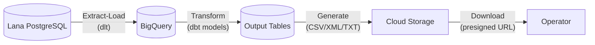
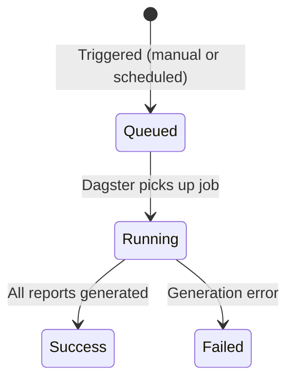

# Sistema de Informes Financieros

El sistema de informes en Lana tiene dos propósitos distintos: **estados financieros en tiempo real** para la gestión operativa e **informes regulatorios basados en archivos** para el cumplimiento normativo. Estas dos vías utilizan diferentes fuentes de datos y mecanismos de generación, pero comparten los mismos datos contables subyacentes.

## Dos Vías de Informes

### Estados Financieros en Tiempo Real

El balance de comprobación, el balance general y el estado de resultados se generan en tiempo real directamente desde el libro mayor de partida doble de Cala. Siempre están actualizados y reflejan el estado actual de todas las cuentas. Están disponibles inmediatamente a través del panel de administración y la API de GraphQL sin ningún procesamiento por lotes.

Consulta [Informes Financieros](financial-reports) para obtener detalles sobre cada estado.

### Informes Regulatorios Basados en Archivos

Los informes regulatorios se generan a través de un pipeline de datos impulsado por Dagster y dbt. Los datos sin procesar se extraen de la base de datos de Lana, se transforman mediante modelos de lógica de negocio y se formatean en los formatos de archivo requeridos por los reguladores. Estos informes se generan según un cronograma (cada dos horas) o bajo demanda, y los archivos de salida se almacenan en almacenamiento en la nube para su descarga.

## Pipeline de Informes Regulatorios

El pipeline tiene tres etapas:

1. **Extracción-Carga**: Los datos sin procesar se replican desde la base de datos PostgreSQL de Lana a BigQuery utilizando `dlt` (herramienta de carga de datos). Esto incluye todas las tablas de eventos (facilidades de crédito, clientes, depósitos, retiros, ciclos de acumulación de intereses), datos del catálogo de cuentas y tablas del libro mayor CALA (cuentas, conjuntos de cuentas, historial de saldos). Esto se ejecuta diariamente.

2. **Transformación**: Los modelos dbt en BigQuery transforman los datos sin procesar en tablas de salida listas para informes. Los modelos están organizados en tres niveles:
   - **Staging**: Limpiar y normalizar los datos de origen sin procesar.
   - **Intermedio**: Aplicar lógica de negocio, reconstruir el estado de las entidades a partir de flujos de eventos, y calcular clasificaciones regulatorias y categorías de riesgo.
   - **Salida**: Tablas de informes finales con las columnas y formatos exactos requeridos por cada norma regulatoria.

3. **Generación de Archivos**: Los assets de Dagster leen de las tablas de salida de dbt y producen los archivos de informes reales (CSV, XML con validación XSD o texto de ancho fijo). Los archivos se cargan en Google Cloud Storage en la ruta `reports/{run_id}/{norm}/{report_name}.{extension}`.

## Ciclo de Vida de Ejecución de Reportes

Cada ejecución de generación de reportes se rastrea como una **Ejecución de Reporte** con su propio ciclo de vida:

| Estado | Descripción |
|--------|-------------|
| **En Cola** | Ejecución de reporte activada, esperando que Dagster inicie |
| **En Ejecución** | El pipeline de Dagster está generando activamente los reportes |
| **Exitosa** | Todos los archivos de reporte generados y cargados al almacenamiento en la nube |
| **Fallida** | El pipeline encontró un error; consulte los registros de Dagster para más detalles |

Las ejecuciones de reportes pueden activarse de dos formas:
- **Programada**: Una programación cron automática se ejecuta cada dos horas.
- **Manual**: Un operador hace clic en "Generar Reporte" en el panel de administración, lo que activa el pipeline inmediatamente.

Después de que una ejecución se completa, Dagster notifica a Lana mediante un webhook. Luego, Lana consulta la API de Dagster para sincronizar el estado de la ejecución y descubrir los archivos de reporte generados. El panel de administración muestra actualizaciones de estado en tiempo real mediante suscripciones GraphQL.

## Categorías de Reportes Regulatorios

### NRP-41: Información de Referencias Crediticias

17 sub-reportes que cubren detalles de la cartera de préstamos para la SSF (Superintendencia del Sistema Financiero). Incluye información de prestatarios, referencias crediticias, detalles de garantías (varios tipos de garantía), referencias de gastos, referencias canceladas, accionistas corporativos y datos de la junta directiva. Salida en XML (con validación XSD) y CSV.

### NRP-51: Información Financiera/Contable

8 sub-reportes que cubren saldos de cuentas y posiciones financieras: saldos de cuentas, depósitos en el extranjero, datos fuera de balance, valores extranjeros, préstamos garantizados, avales garantizados, deuda subordinada y balance proyectado. Salida en XML y CSV.

### NRSF-03: Seguro de Depósitos

9 subreportes para el fondo de garantía de depósitos: datos de clientes, depósitos, documentos de clientes, titulares de cuentas, sucursales, productos, funcionarios y empleados, resumen de depósitos garantizados y ajustes. Salida en CSV y texto de ancho fijo (para envío a SSF).

### UIF-07: Unidad de Inteligencia Financiera

Registro electrónico diario de transacciones para cumplimiento antilavado de dinero. Salida en CSV.

### Informes Internos/Operacionales

Informes no regulatorios para análisis interno: cálculo de riesgo neto, estados de cuenta de préstamos, historial de pagos, listado de préstamos activos e informes de cartera de préstamos. Salida en CSV.

## Descarga de Archivos de Informes

Después de una ejecución exitosa del informe:

1. Navega a la sección de informes en el panel de administración.
2. Selecciona la ejecución de informe completada.
3. Haz clic en el enlace de descarga del archivo de informe deseado.
4. El sistema genera una URL prefirmada desde el almacenamiento en la nube, válida por tiempo limitado.
5. El navegador descarga el archivo directamente desde el almacenamiento en la nube.

## Documentación Relacionada

- [Informes Financieros](financial-reports) - Detalles de balance de comprobación, balance general y P&L

## Recorrido en Panel de Administración: Reportes Regulatorios

Los reportes regulatorios se generan de forma asíncrona. Después de iniciar una corrida, el
operador debe monitorear transiciones de estado (`queued` -> `running` -> `success`/`failed`) y
solo generar enlaces de descarga cuando el resultado sea exitoso.

**Paso 1.** Abre reportes regulatorios y haz clic en **Generar Informe**.

Checklist de verificación:
- la corrida aparece en el listado,
- el estado se actualiza en UI,
- los enlaces de descarga se generan solo cuando la corrida finaliza con éxito.
