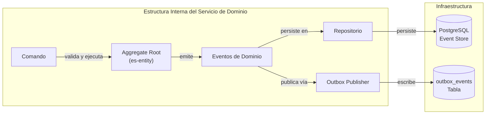

# Sistema de Gobernanza y Aprobación

El sistema de gobernanza proporciona un mecanismo de aprobación estructurado para operaciones financieras críticas que requieren autorización multipartita antes de su ejecución.



## Propósito

El sistema actúa como un guardián para acciones de alto riesgo:
- Propuestas de líneas de crédito
- Desembolsos de préstamos
- Retiros de clientes

## Arquitectura del Sistema

```
┌─────────────────────────────────────────────────────────────────┐
│                    SISTEMA DE GOBERNANZA                        │
│                                                                  │
│  ┌─────────────────┐  ┌─────────────────┐  ┌─────────────────┐ │
│  │ Policy          │  │   Approval      │  │   Committee     │ │
│  │ Definitions     │  │   Processes     │  │   Registry      │ │
│  └─────────────────┘  └─────────────────┘  └─────────────────┘ │
│                              │                                  │
│                              ▼                                  │
│  ┌─────────────────────────────────────────────────────────┐   │
│  │                    Event System                          │   │
│  │              (Outbox Pattern)                            │   │
│  └─────────────────────────────────────────────────────────┘   │
│                              │                                  │
│                              ▼                                  │
│  ┌─────────────────────────────────────────────────────────┐   │
│  │                 Domain Integration                       │   │
│  │    (Credit Facilities, Deposits, Withdrawals)           │   │
│  └─────────────────────────────────────────────────────────┘   │
└─────────────────────────────────────────────────────────────────┘
```

## Tipos de Procesos de Aprobación

El sistema define tipos específicos de procesos para diferentes categorías de operaciones:

| Tipo de Proceso | Constante | Propósito |
|-----------------|-----------|-----------|
| Propuesta de Línea de Crédito | `APPROVE_CREDIT_FACILITY_PROPOSAL_PROCESS` | Aprobar nuevas solicitudes |
| Desembolso | `APPROVE_DISBURSAL_PROCESS` | Aprobar desembolsos |
| Retiro | `APPROVE_WITHDRAWAL_PROCESS` | Aprobar retiros de clientes |

## Ciclo de Vida del Flujo de Aprobación

```
┌──────────────┐    ┌──────────────┐    ┌──────────────┐
│   Iniciado   │───▶│  En Proceso  │───▶│   Aprobado   │
│              │    │              │    │              │
└──────────────┘    └──────────────┘    └──────────────┘
                           │
                           ▼
                    ┌──────────────┐
                    │   Rechazado  │
                    │              │
                    └──────────────┘
```

### Estados del Proceso

| Estado | Descripción |
|--------|-------------|
| PENDING | Proceso iniciado, esperando revisión |
| IN_REVIEW | Proceso bajo revisión del comité |
| APPROVED | Proceso aprobado |
| DENIED | Proceso rechazado |

## Componentes del Sistema

### Definiciones de Políticas

Las políticas definen las reglas para cada tipo de aprobación:
- Umbrales de aprobación
- Comités responsables
- Reglas de quórum

### Registro de Comités

Gestiona los comités de aprobación:
- Miembros del comité
- Roles y permisos
- Historial de decisiones

### Procesos de Aprobación

Ejecuta el flujo de aprobación:
- Validación de requisitos
- Recopilación de votos
- Ejecución de la decisión

## Documentación Relacionada

- [Configuración de Comités](committees) - Gestión de comités de aprobación
- [Políticas de Aprobación](policies) - Configuración de políticas

