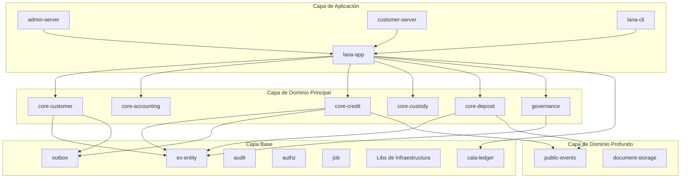

# Custodia y Gestión de Carteras

El módulo `core-custody` gestiona operaciones de custodia de Bitcoin mediante integración con proveedores de custodia externos (BitGo y Komainu).



## Propósito y Alcance

El módulo proporciona:

- Registro y configuración de custodios
- Creación y gestión del ciclo de vida de carteras de Bitcoin
- Generación de direcciones de cartera para depósitos
- Sincronización de saldos desde custodios externos
- Integración con el sistema de colateral de facilidades de crédito

## Arquitectura del Sistema

```
┌─────────────────────────────────────────────────────────────────┐
│                    Consumer - core-credit                       │
│  ┌─────────────────────────────────────────────────────────┐   │
│  │                   CoreCredit                             │   │
│  │              custody: CoreCustody                        │   │
│  │           collaterals: Collaterals                       │   │
│  └─────────────────────────────────────────────────────────┘   │
└─────────────────────────────────────────────────────────────────┘
                              │
                              ▼
┌─────────────────────────────────────────────────────────────────┐
│                    Domain Layer - core-custody                  │
│  ┌─────────────────────────────────────────────────────────┐   │
│  │                   CoreCustody                            │   │
│  │        create_wallet_in_op()                             │   │
│  │        generate_wallet_address_in_op()                   │   │
│  │        sync_balance()                                    │   │
│  └─────────────────────────────────────────────────────────┘   │
└─────────────────────────────────────────────────────────────────┘
                              │
                              ▼
┌─────────────────────────────────────────────────────────────────┐
│                External Integration Layer                       │
│  ┌─────────────────┐  ┌─────────────────┐  ┌────────────────┐  │
│  │     BitGo       │  │    Komainu      │  │ Mock Custodian │  │
│  └─────────────────┘  └─────────────────┘  └────────────────┘  │
└─────────────────────────────────────────────────────────────────┘
```

## Tipos de Datos Principales

### Entidades de Dominio

| Entidad | Propósito | Campos Clave |
|---------|-----------|--------------|
| Custodian | Configuración del proveedor de custodia | id, name, provider_type, config |
| Wallet | Cartera de Bitcoin en un custodio | id, custodian_id, external_id, name |
| WalletAddress | Dirección de depósito de Bitcoin | id, wallet_id, address, created_at |
| WalletBalance | Saldo actual de la cartera | wallet_id, balance, last_synced_at |

### Alias de Tipos Clave

```rust
pub type CustodianId = EntityId<Custodian>;
pub type WalletId = EntityId<Wallet>;
pub type WalletAddressId = EntityId<WalletAddress>;
```

## Integración con Proveedores de Custodia

### Arquitectura del Proveedor

```rust
#[async_trait]
pub trait CustodyProvider: Send + Sync {
    async fn create_wallet(&self, name: &str) -> Result<ExternalWallet, CustodyError>;
    async fn generate_address(&self, wallet_id: &str) -> Result<String, CustodyError>;
    async fn get_balance(&self, wallet_id: &str) -> Result<Satoshis, CustodyError>;
}
```

### Integración con BitGo

```rust
pub struct BitGoProvider {
    client: BitGoClient,
    enterprise_id: String,
    coin: String, // "tbtc" para testnet, "btc" para mainnet
}

impl BitGoProvider {
    pub fn new(config: BitGoConfig) -> Self {
        let client = BitGoClient::new(&config.api_url, &config.access_token);
        Self {
            client,
            enterprise_id: config.enterprise_id,
            coin: config.coin,
        }
    }
}
```

### Integración con Komainu

```rust
pub struct KomainuProvider {
    client: KomainuClient,
    vault_id: String,
}

impl KomainuProvider {
    pub fn new(config: KomainuConfig) -> Self {
        let client = KomainuClient::new(
            &config.api_url,
            &config.api_key,
            &config.api_secret,
        );
        Self {
            client,
            vault_id: config.vault_id,
        }
    }
}
```

### Custodio Simulado (Mock)

Para pruebas, se proporciona un custodio simulado:

```rust
#[cfg(feature = "mock-custodian")]
pub struct MockCustodyProvider {
    wallets: Arc<RwLock<HashMap<String, MockWallet>>>,
}

impl MockCustodyProvider {
    pub fn new() -> Self {
        Self {
            wallets: Arc::new(RwLock::new(HashMap::new())),
        }
    }

    pub fn set_balance(&self, wallet_id: &str, balance: Satoshis) {
        let mut wallets = self.wallets.write().unwrap();
        if let Some(wallet) = wallets.get_mut(wallet_id) {
            wallet.balance = balance;
        }
    }
}
```

## Ciclo de Vida de la Cartera

### Creación de Cartera

```rust
impl CoreCustody {
    pub async fn create_wallet_in_op(
        &self,
        custodian_id: CustodianId,
        name: String,
        db_op: &mut DbOp<'_>,
    ) -> Result<Wallet, CustodyError> {
        // 1. Cargar custodio
        let custodian = self.custodians.find(&custodian_id, db_op).await?;

        // 2. Crear cartera en el proveedor externo
        let provider = self.get_provider(&custodian)?;
        let external_wallet = provider.create_wallet(&name).await?;

        // 3. Persistir cartera localmente
        let wallet = Wallet::new(custodian_id, external_wallet.id, name);
        self.wallets.create_in_op(&wallet, db_op).await?;

        Ok(wallet)
    }
}
```

### Generación de Direcciones

```rust
pub async fn generate_wallet_address_in_op(
    &self,
    wallet_id: WalletId,
    db_op: &mut DbOp<'_>,
) -> Result<WalletAddress, CustodyError> {
    // 1. Cargar cartera y custodio
    let wallet = self.wallets.find(&wallet_id, db_op).await?;
    let custodian = self.custodians.find(&wallet.custodian_id, db_op).await?;

    // 2. Generar dirección en el proveedor
    let provider = self.get_provider(&custodian)?;
    let address = provider.generate_address(&wallet.external_id).await?;

    // 3. Persistir dirección
    let wallet_address = WalletAddress::new(wallet_id, address);
    self.wallet_addresses.create_in_op(&wallet_address, db_op).await?;

    // 4. Publicar evento
    self.publisher.publish(
        WalletEvent::AddressGenerated { wallet_id, address: wallet_address.address.clone() },
        db_op
    ).await?;

    Ok(wallet_address)
}
```

### Sincronización de Saldos

```rust
pub async fn sync_balance(&self, wallet_id: WalletId) -> Result<WalletBalance, CustodyError> {
    let wallet = self.wallets.find(&wallet_id).await?;
    let custodian = self.custodians.find(&wallet.custodian_id).await?;

    let provider = self.get_provider(&custodian)?;
    let balance = provider.get_balance(&wallet.external_id).await?;

    let wallet_balance = WalletBalance {
        wallet_id,
        balance,
        last_synced_at: Utc::now(),
    };

    self.wallet_balances.upsert(&wallet_balance).await?;

    // Publicar evento para actualizar colateral
    self.publisher.publish(
        WalletEvent::BalanceUpdated { wallet_id, balance }
    ).await?;

    Ok(wallet_balance)
}
```

## Sincronización de Colateral

### Arquitectura de Sincronización

El sistema sincroniza automáticamente los saldos de carteras y actualiza los valores de colateral:

```
┌─────────────────┐    ┌─────────────────┐    ┌─────────────────┐
│ CollateralSync  │───▶│   CoreCustody   │───▶│ CustodyProvider │
│      Job        │    │   sync_balance  │    │                 │
└─────────────────┘    └─────────────────┘    └─────────────────┘
         │
         ▼
┌─────────────────┐    ┌─────────────────┐
│  PriceService   │───▶│   Collaterals   │
│ get_btc_price() │    │ update_value()  │
└─────────────────┘    └─────────────────┘
```

### Tipos de Eventos de Colateral

| Evento | Propósito |
|--------|-----------|
| WalletBalanceUpdated | Saldo de cartera actualizado |
| CollateralValueUpdated | Valor en USD del colateral recalculado |
| CollateralRatioChanged | Ratio de colateralización cambió |

## Integración con Facilidades de Crédito

### Estructura de Entidad Colateral

```rust
pub struct Collateral {
    pub id: CollateralId,
    pub facility_id: CreditFacilityId,
    pub wallet_id: WalletId,
    pub btc_balance: Satoshis,
    pub usd_value: Money,
    pub last_price: Decimal,
    pub last_updated_at: DateTime<Utc>,
}
```

### Seguimiento del Valor del Colateral

```rust
impl Collaterals {
    pub async fn update_value(
        &self,
        collateral_id: CollateralId,
        btc_balance: Satoshis,
        btc_price: Decimal,
    ) -> Result<Collateral, Error> {
        let mut collateral = self.find(&collateral_id).await?;

        let usd_value = Money::from_satoshis(btc_balance) * btc_price;

        collateral.btc_balance = btc_balance;
        collateral.usd_value = usd_value;
        collateral.last_price = btc_price;
        collateral.last_updated_at = Utc::now();

        self.update(&collateral).await?;

        Ok(collateral)
    }
}
```

## Autorización y Permisos

### Modelo de Permisos

```rust
pub enum CustodyPermission {
    ReadCustodian,
    WriteCustodian,
    ReadWallet,
    WriteWallet,
    SyncBalance,
}
```

### Control de Acceso

```rust
pub async fn create_wallet(
    &self,
    subject: &Subject,
    input: CreateWalletInput,
) -> Result<Wallet, Error> {
    // Verificar permiso
    self.authz.enforce(
        subject,
        Object::Wallet,
        CustodyPermission::WriteWallet
    ).await?;

    // Ejecutar operación...
}
```

## Seguridad Criptográfica

### Cifrado de Credenciales

Las credenciales de los proveedores de custodia se cifran en reposo:

```rust
pub struct EncryptedCredentials {
    pub ciphertext: Vec<u8>,
    pub nonce: [u8; 12],
}

impl EncryptedCredentials {
    pub fn encrypt(plaintext: &str, key: &[u8; 32]) -> Self {
        let cipher = ChaCha20Poly1305::new(key.into());
        let nonce = ChaCha20Poly1305::generate_nonce(&mut OsRng);
        let ciphertext = cipher.encrypt(&nonce, plaintext.as_bytes()).unwrap();

        Self {
            ciphertext,
            nonce: nonce.into(),
        }
    }

    pub fn decrypt(&self, key: &[u8; 32]) -> Result<String, Error> {
        let cipher = ChaCha20Poly1305::new(key.into());
        let plaintext = cipher.decrypt(&self.nonce.into(), &self.ciphertext[..])?;
        Ok(String::from_utf8(plaintext)?)
    }
}
```

## Infraestructura de Pruebas

### Habilitación del Custodio Simulado

```toml
[features]
default = []
mock-custodian = []
```

### Comportamiento del Mock

```rust
#[cfg(test)]
mod tests {
    use super::*;

    #[tokio::test]
    async fn test_collateral_sync() {
        let custody = CoreCustody::new_with_mock();

        // Crear cartera
        let wallet = custody.create_wallet("test-wallet").await.unwrap();

        // Simular depósito
        custody.mock_provider().set_balance(&wallet.id, Satoshis(100_000_000));

        // Sincronizar
        let balance = custody.sync_balance(wallet.id).await.unwrap();

        assert_eq!(balance.balance, Satoshis(100_000_000));
    }
}
```
