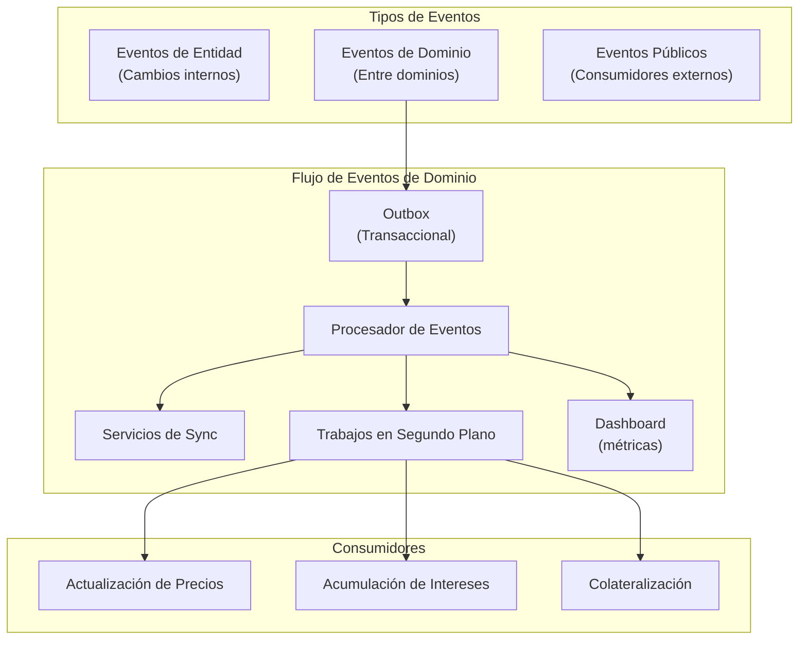

# Sistema de Eventos y Patrón Outbox

Este documento describe la arquitectura orientada a eventos implementada en Lana Bank, centrándose en el patrón de event sourcing usado dentro de las entidades de dominio y el patrón outbox usado para la publicación confiable de eventos.



## Modelo Dual de Eventos

El sistema implementa un modelo dual que separa los eventos internos de entidad de los eventos de dominio externos. Esta separación permite una integración confiable entre contextos acotados manteniendo una estricta consistencia dentro de cada dominio.

### Eventos de Entidad vs Eventos de Dominio

| Tipo de Evento | Propósito | Alcance | Ejemplos |
|----------------|-----------|---------|----------|
| Eventos de Entidad | Cambios de estado internos | Un único agregado | `CreditFacilityEvent::Initialized`, `ObligationEvent::DueRecorded` |
| Eventos de Dominio | Eventos de negocio para consumo externo | Integración entre dominios | `CoreCreditEvent::FacilityActivated`, `CoreCreditEvent::ObligationDue` |

Los eventos de entidad se persisten como fuente de la verdad mediante event sourcing. Los eventos de dominio se derivan y publican a través del patrón outbox.

## Event Sourcing para Entidades

### Arquitectura de Event Sourcing

```
┌──────────────────┐
│ Business Command │
└────────┬─────────┘
         │
         ▼
┌──────────────────┐    ┌──────────────────┐
│  Domain Entity   │───▶│  Entity Events   │
│ (execute logic)  │    │  push(new_event) │
└────────┬─────────┘    └────────┬─────────┘
         │                       │
         ▼                       ▼
┌──────────────────┐    ┌──────────────────┐
│   Repository     │    │  Domain Publisher│
│ update_in_op()   │    │  publish()       │
└────────┬─────────┘    └────────┬─────────┘
         │                       │
         ▼                       ▼
┌──────────────────┐    ┌──────────────────┐
│   PostgreSQL     │    │   Outbox Table   │
│  (Event Store)   │    │                  │
└──────────────────┘    └──────────────────┘
```

### Implementación con es-entity

Las entidades de dominio usan el framework `es-entity`:

```rust
use es_entity::*;

#[derive(EsEntity)]
pub struct CreditFacility {
    events: EntityEvents<CreditFacilityEvent>,
    // ... otros campos
}

#[derive(EsEvent)]
pub enum CreditFacilityEvent {
    Initialized {
        id: CreditFacilityId,
        customer_id: CustomerId,
        terms: TermsId,
    },
    Activated {
        activated_at: DateTime<Utc>,
    },
    DisbursalInitiated {
        disbursal_id: DisbursalId,
        amount: Money,
    },
    // ... más variantes
}
```

### Flujo de Procesamiento

1. **Comando de negocio**: Se recibe una solicitud (ej. activar facilidad)
2. **Ejecución de lógica**: La entidad valida y ejecuta la operación
3. **Emisión de evento**: Se crea y agrega el evento al historial
4. **Persistencia**: El repositorio guarda los nuevos eventos en transacción
5. **Publicación**: El publisher convierte a eventos de dominio y publica al outbox

```rust
impl CreditFacility {
    pub fn activate(&mut self) -> Result<(), CreditFacilityError> {
        // Validar estado actual
        if self.status != CreditFacilityStatus::Approved {
            return Err(CreditFacilityError::InvalidStatus);
        }

        // Emitir evento
        self.events.push(CreditFacilityEvent::Activated {
            activated_at: Utc::now(),
        });

        Ok(())
    }
}
```

## Patrón Outbox

El patrón outbox garantiza la publicación confiable de eventos persistiendo los eventos de dominio en la misma transacción de base de datos que los datos de negocio.

### Arquitectura del Outbox

```
┌─────────────────────────────────────────────────────────────────┐
│                    PostgreSQL Transaction                        │
│  ┌─────────────────────┐    ┌─────────────────────┐            │
│  │   Entity Events     │    │   Outbox Events     │            │
│  │      Table          │    │      Table          │            │
│  └─────────────────────┘    └─────────────────────┘            │
└─────────────────────────────────────────────────────────────────┘
                                        │
                                        │ (async)
                                        ▼
┌─────────────────────────────────────────────────────────────────┐
│                    Event Consumers                               │
│  ┌─────────────────────┐    ┌─────────────────────┐            │
│  │   Background Jobs   │    │   External Systems  │            │
│  └─────────────────────┘    └─────────────────────┘            │
└─────────────────────────────────────────────────────────────────┘
```

### Esquema de la Tabla Outbox

| Columna | Tipo | Propósito |
|---------|------|-----------|
| sequence | BIGSERIAL | Orden de eventos autoincremental |
| recorded_at | TIMESTAMPTZ | Marca de tiempo de creación |
| event_type | TEXT | Discriminador para variantes de evento |
| payload | JSONB | Evento de dominio serializado |
| trace_context | JSONB | Contexto de trazabilidad para observabilidad |

```sql
CREATE TABLE outbox_events (
    sequence BIGSERIAL PRIMARY KEY,
    recorded_at TIMESTAMPTZ NOT NULL DEFAULT NOW(),
    event_type TEXT NOT NULL,
    payload JSONB NOT NULL,
    trace_context JSONB
);

CREATE INDEX idx_outbox_events_sequence ON outbox_events(sequence);
```

### Preservación del Contexto de Trazas

El outbox preserva el contexto de trazabilidad para correlacionar eventos:

```rust
pub struct OutboxEvent {
    pub sequence: i64,
    pub recorded_at: DateTime<Utc>,
    pub event_type: String,
    pub payload: serde_json::Value,
    pub trace_context: Option<TraceContext>,
}

impl OutboxEvent {
    pub fn new<E: Serialize>(event: &E, trace_context: Option<TraceContext>) -> Self {
        Self {
            sequence: 0, // Asignado por la BD
            recorded_at: Utc::now(),
            event_type: std::any::type_name::<E>().to_string(),
            payload: serde_json::to_value(event).unwrap(),
            trace_context,
        }
    }
}
```

## Eventos de Dominio Publicados

### Tipos de Eventos del Dominio Core

```rust
// lana/events/src/lib.rs
pub enum CoreCreditEvent {
    FacilityCreated {
        id: CreditFacilityId,
        customer_id: CustomerId,
    },
    FacilityActivated {
        id: CreditFacilityId,
    },
    DisbursalCompleted {
        facility_id: CreditFacilityId,
        disbursal_id: DisbursalId,
        amount: Money,
    },
    ObligationDue {
        facility_id: CreditFacilityId,
        obligation_id: ObligationId,
        due_date: NaiveDate,
    },
    PaymentReceived {
        facility_id: CreditFacilityId,
        payment_id: PaymentId,
        amount: Money,
    },
}

pub enum CoreDepositEvent {
    AccountCreated {
        id: DepositAccountId,
        customer_id: CustomerId,
    },
    DepositRecorded {
        account_id: DepositAccountId,
        amount: Money,
    },
    WithdrawalInitiated {
        account_id: DepositAccountId,
        withdrawal_id: WithdrawalId,
        amount: Money,
    },
}

pub enum CoreCustomerEvent {
    CustomerCreated {
        id: CustomerId,
    },
    KycCompleted {
        id: CustomerId,
        status: KycStatus,
    },
}
```

## Patrón Publisher

### Implementación del Publisher

```rust
// core/credit/src/publisher.rs
pub struct CreditFacilityPublisher {
    outbox: OutboxPublisher,
}

impl CreditFacilityPublisher {
    pub async fn publish(
        &self,
        events: &[CreditFacilityEvent],
        db_op: &mut DbOp<'_>,
    ) -> Result<(), PublisherError> {
        for event in events {
            if let Some(domain_event) = self.to_domain_event(event) {
                self.outbox.publish(&domain_event, db_op).await?;
            }
        }
        Ok(())
    }

    fn to_domain_event(&self, event: &CreditFacilityEvent) -> Option<CoreCreditEvent> {
        match event {
            CreditFacilityEvent::Activated { .. } => {
                Some(CoreCreditEvent::FacilityActivated {
                    id: self.facility_id
                })
            }
            // No todos los eventos internos se publican externamente
            CreditFacilityEvent::InternalStateChange { .. } => None,
            // ... más mappings
        }
    }
}
```

### Publicación Selectiva

No todos los eventos de entidad se publican como eventos de dominio:

```rust
fn to_domain_event(&self, event: &CreditFacilityEvent) -> Option<CoreCreditEvent> {
    match event {
        // Eventos que SÍ se publican
        CreditFacilityEvent::Activated { .. } => Some(CoreCreditEvent::FacilityActivated { .. }),
        CreditFacilityEvent::DisbursalCompleted { .. } => Some(CoreCreditEvent::DisbursalCompleted { .. }),

        // Eventos internos que NO se publican
        CreditFacilityEvent::TermsUpdated { .. } => None,
        CreditFacilityEvent::CollateralRevalued { .. } => None,
    }
}
```

## Integración con Jobs

### Consumo de Eventos

```rust
// Job que consume eventos del outbox
pub struct CollateralSyncJob {
    outbox_consumer: OutboxConsumer,
}

impl Job for CollateralSyncJob {
    async fn run(&self) -> Result<(), JobError> {
        let events = self.outbox_consumer
            .poll::<CoreCreditEvent>()
            .await?;

        for event in events {
            match event.payload {
                CoreCreditEvent::FacilityActivated { id } => {
                    self.sync_collateral_for_facility(id).await?;
                }
                _ => {}
            }
            self.outbox_consumer.ack(event.sequence).await?;
        }
        Ok(())
    }
}
```

## Garantías de Confiabilidad

### Consistencia Transaccional

Los eventos y datos de negocio se persisten en la misma transacción:

```rust
pub async fn activate_facility(
    &self,
    facility_id: CreditFacilityId,
) -> Result<(), Error> {
    let mut db_op = self.pool.begin().await?;

    // Cargar entidad
    let mut facility = self.repo.find(&facility_id, &mut db_op).await?;

    // Ejecutar lógica de negocio
    facility.activate()?;

    // Guardar entidad (eventos incluidos)
    self.repo.update(&mut facility, &mut db_op).await?;

    // Publicar eventos de dominio (mismo tx)
    self.publisher.publish(facility.events(), &mut db_op).await?;

    // Commit atómico
    db_op.commit().await?;

    Ok(())
}
```

### Ordenación de Eventos

Los eventos se procesan en orden usando la columna `sequence`:

```rust
pub async fn poll(&self, after_sequence: i64, limit: i32) -> Result<Vec<OutboxEvent>, Error> {
    sqlx::query_as!(
        OutboxEvent,
        r#"
        SELECT * FROM outbox_events
        WHERE sequence > $1
        ORDER BY sequence ASC
        LIMIT $2
        "#,
        after_sequence,
        limit
    )
    .fetch_all(&self.pool)
    .await
}
```

### Idempotencia

Los consumidores deben ser idempotentes ya que los eventos pueden reprocesarse:

```rust
pub async fn handle_event(&self, event: &CoreCreditEvent) -> Result<(), Error> {
    // Verificar si ya se procesó
    if self.was_processed(event.sequence).await? {
        return Ok(());
    }

    // Procesar evento
    self.process(event).await?;

    // Marcar como procesado
    self.mark_processed(event.sequence).await?;

    Ok(())
}
```
