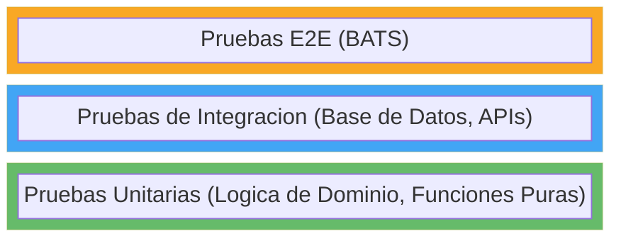

# Estrategia de Pruebas

Este documento describe el enfoque de pruebas utilizado en Lana.

## Piramide de Pruebas



## Tipos de Pruebas

### Pruebas Unitarias

Prueban la logica de negocio de forma aislada:

```rust
#[cfg(test)]
mod tests {
    use super::*;

    #[test]
    fn test_interest_calculation() {
        let rate = InterestRate::new(Decimal::new(5, 2)); // 5%
        let principal = UsdCents::new(100_000);
        let days = 30;

        let interest = calculate_interest(principal, rate, days);

        assert_eq!(interest, UsdCents::new(411)); // ~$4.11
    }
}
```

### Pruebas de Integracion

Prueban con una base de datos real:

```rust
#[tokio::test]
async fn test_create_facility() {
    let app = TestApp::new().await;

    let customer = app.create_customer().await;
    let facility = app.create_facility(customer.id).await;

    assert_eq!(facility.status, FacilityStatus::PendingCollateral);
}
```

### Pruebas E2E (BATS)

Prueban flujos de trabajo completos:

```bash
@test "create customer and facility" {
    # Crear cliente
    run create_customer
    [ "$status" -eq 0 ]

    # Crear facilidad
    run create_facility "$customer_id"
    [ "$status" -eq 0 ]
}
```

### Pruebas de Frontend (Cypress)

```typescript
describe('Credit Facility', () => {
  it('should create a new facility', () => {
    cy.login('admin', 'admin');
    cy.visit('/credit/new');
    cy.get('[data-testid="customer-select"]').click();
    cy.get('[data-testid="customer-option"]').first().click();
    cy.get('[data-testid="amount-input"]').type('10000');
    cy.get('[data-testid="submit-button"]').click();
    cy.contains('Facility created').should('be.visible');
  });
});
```

## Ejecucion de Pruebas

### Pruebas de Rust

```bash
# Todas las pruebas
cargo nextest run

# Un solo crate
cargo nextest run -p core-credit

# Una sola prueba
cargo nextest run credit::tests::test_create_facility
```

### Pruebas E2E

```bash
make e2e
```

### Pruebas de Frontend

```bash
# Sin interfaz grafica
pnpm cypress:run-headless

# Interactivo
pnpm cypress:open
```

## Datos de Prueba

### Fixtures

```rust
pub struct TestFixtures {
    pub customer: Customer,
    pub facility: CreditFacility,
}

impl TestFixtures {
    pub async fn create(app: &TestApp) -> Self {
        let customer = app.create_customer().await;
        let facility = app.create_facility(customer.id).await;
        Self { customer, facility }
    }
}
```

### Carga de Datos en la Base de Datos

```bash
# Cargar datos de desarrollo
cargo run -- seed
```

## Cobertura

```bash
# Generar informe de cobertura
cargo llvm-cov --html

# Abrir informe
open target/llvm-cov/html/index.html
```

## Integracion con CI

Las pruebas se ejecutan en cada PR:

- Pruebas unitarias (cargo nextest)
- Pruebas de integracion
- Pruebas E2E (BATS)
- Pruebas de frontend (Cypress)
- Verificacion de cobertura de codigo
