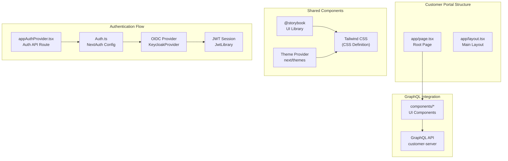

# Customer Management

The Customer Management system covers the complete customer lifecycle, from initial registration and KYC verification to active account status.



## System Components

| Component | Module | Purpose |
|-----------|--------|---------|
| Customer Management | core-customer | Persistence, profiles, and documents |
| KYC Processing | core-applicant | Sumsub integration |
| User Onboarding | user-onboarding | Keycloak provisioning |

## Customer Lifecycle

```
┌─────────────┐    ┌─────────────┐    ┌─────────────┐    ┌─────────────┐
│   Initial   │───▶│     KYC     │───▶│   Deposit   │───▶│   Active    │
│Registration │    │ Verification│    │   Account   │    │  Customer   │
└─────────────┘    └─────────────┘    └─────────────┘    └─────────────┘
```

The system establishes the fundamental identity layer required before customers can access financial products:

1. **Initial registration**: Basic customer data capture
2. **KYC verification**: Identity validation through Sumsub
3. **Deposit account**: Automatic creation after KYC approval
4. **Product access**: Credit facilities enabled

## Customer Types

| Type | Description | Accounting Treatment |
|------|-------------|---------------------|
| INDIVIDUAL | Natural person | Individual accounts |
| GOVERNMENT_ENTITY | Government organization | Government accounts |
| PRIVATE_COMPANY | Private corporation | Business accounts |
| BANK | Banking institution | Interbank accounts |
| FINANCIAL_INSTITUTION | Financial services company | Institutional accounts |
| FOREIGN_AGENCY_OR_SUBSIDIARY | Foreign agency/subsidiary | Foreign accounts |
| NON_DOMICILED_COMPANY | Non-domiciled corporation | Non-resident accounts |

## Customer Status

| Status | Description |
|--------|-------------|
| ACTIVE | Customer can perform operations |
| INACTIVE | Account is inactive |
| SUSPENDED | Account is suspended |

## Related Documentation

- [Onboarding Process](onboarding) - Complete onboarding flow
- [Document Management](documents) - Customer document handling

