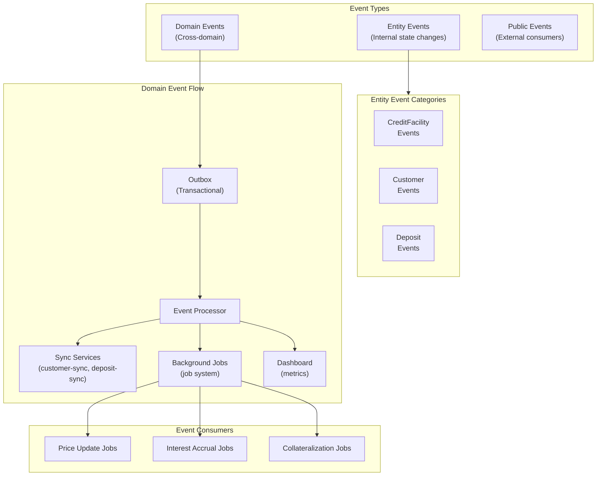

# Event System and Outbox Pattern

This document describes Lana's event system, including event sourcing, the outbox pattern, and cross-domain communication.



## Overview

Lana uses an event-driven architecture with:

- **Event Sourcing**: State changes captured as events
- **Outbox Pattern**: Reliable event publishing
- **Domain Events**: Cross-context communication

## Event Types

```
┌─────────────────────────────────────────────────────────────────┐
│                    EVENT TYPES                                  │
│                                                                  │
│  ┌─────────────────┐  ┌─────────────────┐  ┌─────────────────┐ │
│  │  Entity Events  │  │  Domain Events  │  │ Public Events   │ │
│  │  (Internal)     │  │ (Cross-domain)  │  │ (External)      │ │
│  └─────────────────┘  └─────────────────┘  └─────────────────┘ │
│                                                                  │
│  State changes        Business processes    Webhooks/APIs       │
│  within aggregate     within application    external consumers  │
└─────────────────────────────────────────────────────────────────┘
```

## Entity Events

Internal state changes within an aggregate:

```rust
#[derive(EsEvent)]
pub enum CreditFacilityEvent {
    Initialized {
        id: CreditFacilityId,
        customer_id: CustomerId,
        amount: UsdCents,
    },
    CollateralPosted {
        collateral_id: CollateralId,
        amount: Satoshis,
    },
    Activated {
        activated_at: DateTime<Utc>,
    },
    DisbursalInitiated {
        disbursal_id: DisbursalId,
        amount: UsdCents,
    },
}
```

## Outbox Pattern

The outbox ensures reliable event delivery:

```
┌─────────────────────────────────────────────────────────────────┐
│                    OUTBOX PATTERN                               │
│                                                                  │
│  ┌─────────────────┐                                            │
│  │ Domain Service  │                                            │
│  │   Operation     │                                            │
│  └─────────────────┘                                            │
│           │                                                      │
│           ▼ (Single Transaction)                                │
│  ┌─────────────────────────────────────────────────────────┐   │
│  │                    PostgreSQL                            │   │
│  │  ┌─────────────────┐  ┌─────────────────┐              │   │
│  │  │  Entity Table   │  │  Outbox Table   │              │   │
│  │  │  (State)        │  │  (Events)       │              │   │
│  │  └─────────────────┘  └─────────────────┘              │   │
│  └─────────────────────────────────────────────────────────┘   │
│                              │                                  │
│                              ▼ (Background Process)             │
│  ┌─────────────────────────────────────────────────────────┐   │
│  │                  Event Processor                         │   │
│  │  - Reads pending events                                  │   │
│  │  - Dispatches to handlers                                │   │
│  │  - Marks as processed                                    │   │
│  └─────────────────────────────────────────────────────────┘   │
└─────────────────────────────────────────────────────────────────┘
```

### Outbox Table Structure

```sql
CREATE TABLE outbox (
    id UUID PRIMARY KEY,
    aggregate_type VARCHAR NOT NULL,
    aggregate_id UUID NOT NULL,
    event_type VARCHAR NOT NULL,
    payload JSONB NOT NULL,
    created_at TIMESTAMP NOT NULL,
    processed_at TIMESTAMP,
    correlation_id UUID
);
```

### Publishing Events

```rust
impl CreditFacilityRepo {
    pub async fn create(&self, facility: CreditFacility) -> Result<CreditFacility> {
        let mut tx = self.pool.begin().await?;

        // Save entity
        facility.persist(&mut tx).await?;

        // Publish to outbox (same transaction)
        for event in facility.events() {
            self.outbox.publish(&mut tx, event).await?;
        }

        tx.commit().await?;
        Ok(facility)
    }
}
```

## Event Processing

### Event Processor

```rust
pub struct EventProcessor {
    handlers: Vec<Box<dyn EventHandler>>,
}

impl EventProcessor {
    pub async fn process_pending(&self) -> Result<()> {
        let events = self.outbox.fetch_pending(100).await?;

        for event in events {
            for handler in &self.handlers {
                if handler.can_handle(&event) {
                    handler.handle(&event).await?;
                }
            }
            self.outbox.mark_processed(event.id).await?;
        }

        Ok(())
    }
}
```

### Event Handlers

```rust
pub struct CustomerActivationHandler {
    deposit_service: DepositService,
}

#[async_trait]
impl EventHandler for CustomerActivationHandler {
    fn can_handle(&self, event: &OutboxEvent) -> bool {
        event.event_type == "CustomerActivated"
    }

    async fn handle(&self, event: &OutboxEvent) -> Result<()> {
        let payload: CustomerActivatedEvent = serde_json::from_value(event.payload)?;

        // Create deposit account for new customer
        self.deposit_service
            .create_account(payload.customer_id)
            .await?;

        Ok(())
    }
}
```

## Cross-Domain Communication

```
┌──────────────┐                              ┌──────────────┐
│   Customer   │                              │   Deposit    │
│   Domain     │                              │   Domain     │
└──────────────┘                              └──────────────┘
       │                                              ▲
       │ CustomerActivated                            │
       ▼                                              │
┌──────────────────────────────────────────────────────────────┐
│                        Outbox                                 │
│                  (Event Queue)                                │
└──────────────────────────────────────────────────────────────┘
       │                                              │
       │            Event Processor                   │
       │                                              │
       └──────────────────────────────────────────────┘
                    Creates Deposit Account
```

## Event Correlation

Events can be correlated for tracing:

```rust
pub struct CorrelationContext {
    correlation_id: Uuid,
    causation_id: Option<Uuid>,
    trace_id: String,
}

impl Outbox {
    pub async fn publish_with_context(
        &self,
        tx: &mut Transaction,
        event: impl Event,
        context: CorrelationContext,
    ) -> Result<()> {
        // Include correlation data in outbox record
    }
}
```

## Idempotency

Event handlers must be idempotent:

```rust
impl DepositAccountCreationHandler {
    async fn handle(&self, event: &CustomerActivatedEvent) -> Result<()> {
        // Check if already processed
        if self.repo.exists_for_customer(event.customer_id).await? {
            return Ok(()); // Already created
        }

        // Create new account
        self.repo.create_account(event.customer_id).await
    }
}
```

## Event Replay

Events can be replayed for recovery or testing:

```rust
pub async fn replay_events(
    from: DateTime<Utc>,
    to: DateTime<Utc>,
) -> Result<()> {
    let events = outbox.fetch_range(from, to).await?;

    for event in events {
        processor.process(event).await?;
    }

    Ok(())
}
```

## Monitoring

### Metrics

- Events published per second
- Event processing latency
- Pending event count
- Handler success/failure rates

### Alerts

- High pending event count
- Processing failures
- Slow handlers

