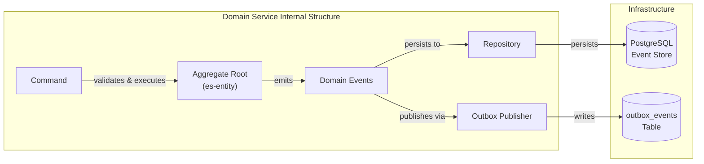
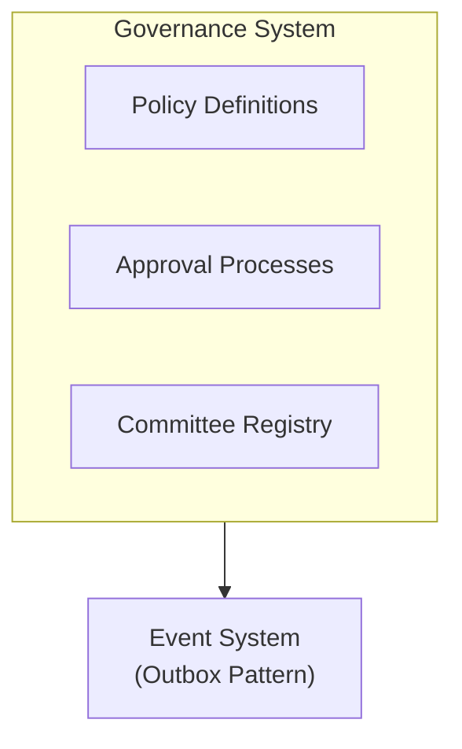
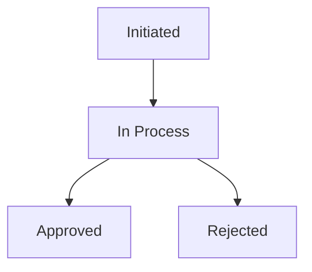

# Governance and Approval System

The governance system provides a structured approval mechanism for critical financial operations requiring multi-party authorization before execution.

## Purpose

The system acts as a guardian for high-risk actions:
- Credit facility proposals
- Loan disbursements
- Customer withdrawals

## System Architecture

## Approval Process Types

| Process Type | Constant | Purpose |
|--------------|----------|---------|
| Credit Facility Proposal | `APPROVE_CREDIT_FACILITY_PROPOSAL_PROCESS` | Approve new applications |
| Disbursement | `APPROVE_DISBURSAL_PROCESS` | Approve disbursements |
| Withdrawal | `APPROVE_WITHDRAWAL_PROCESS` | Approve customer withdrawals |

## Approval Flow Lifecycle

### Process Status

| Status | Description |
|--------|-------------|
| PENDING | Process initiated, awaiting review |
| IN_REVIEW | Process under committee review |
| APPROVED | Process approved |
| DENIED | Process rejected |

## System Components

### Policy Definitions

Policies define rules for each approval type:
- Approval thresholds
- Responsible committees
- Quorum rules

### Committee Registry

Manages approval committees:
- Committee members
- Roles and permissions
- Decision history

### Approval Processes

Executes the approval flow:
- Requirements validation
- Vote collection
- Decision execution

## Related Documentation

- [Committee Configuration](committees) - Managing approval committees
- [Approval Policies](policies) - Policy configuration

