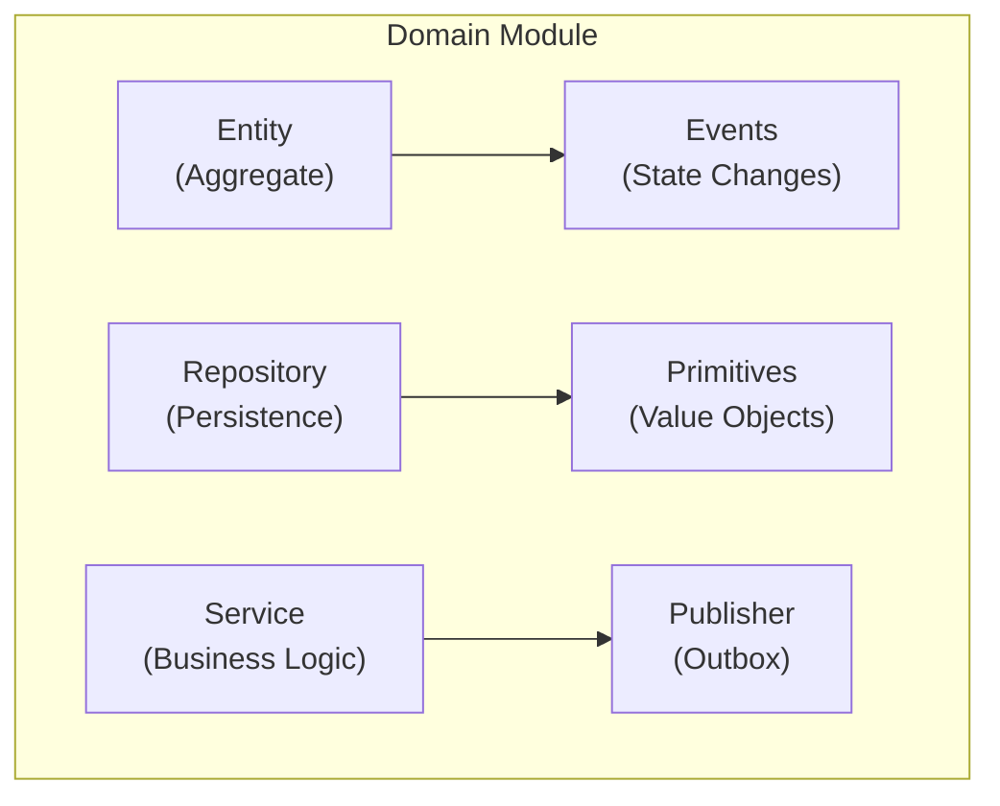
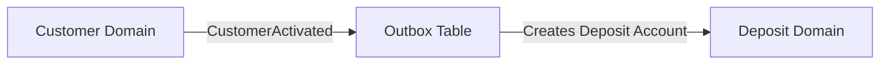

# Domain Services

This document describes the implementation of Domain-Driven Design in Lana, including patterns, structures, and best practices.

## Domain-Driven Design Overview

Lana implements DDD principles:

- **Bounded Contexts**: Each domain module has clear boundaries
- **Aggregates**: Entities grouped by business invariants
- **Domain Events**: Communication between contexts
- **Repositories**: Persistence abstraction

## Domain Structure



## File Organization

Each domain module follows a consistent structure:

```
core/<domain>/
├── mod.rs              # Module interface
├── entity.rs           # Entity definition with events
├── repo.rs             # Repository implementation
├── error.rs            # Domain-specific errors
├── primitives.rs       # Value objects and types
├── publisher.rs        # Event publisher (outbox)
├── job.rs              # Background jobs
└── public/             # Public events for other domains
    └── events.rs
```

## Entity Pattern with es-entity

Lana uses the `es-entity` crate for event-sourced entities:

```rust
use es_entity::*;

#[derive(EsEntity)]
pub struct CreditFacility {
    events: EntityEvents<CreditFacilityEvent>,
    id: CreditFacilityId,
    customer_id: CustomerId,
    amount: UsdCents,
    status: FacilityStatus,
}

#[derive(EsEvent)]
pub enum CreditFacilityEvent {
    Initialized {
        id: CreditFacilityId,
        customer_id: CustomerId,
        amount: UsdCents,
    },
    Activated {
        activated_at: DateTime<Utc>,
    },
    DisbursalInitiated {
        disbursal_id: DisbursalId,
        amount: UsdCents,
    },
}
```

## Repository Pattern

Repositories handle persistence with event sourcing:

```rust
pub struct CreditFacilityRepo {
    pool: PgPool,
    outbox: Outbox,
}

impl CreditFacilityRepo {
    pub async fn create(&self, facility: CreditFacility) -> Result<CreditFacility, Error> {
        let mut tx = self.pool.begin().await?;

        // Persist events
        facility.persist(&mut tx).await?;

        // Publish to outbox
        self.outbox.publish(&mut tx, facility.events()).await?;

        tx.commit().await?;
        Ok(facility)
    }

    pub async fn find_by_id(&self, id: CreditFacilityId) -> Result<CreditFacility, Error> {
        CreditFacility::load(&self.pool, id).await
    }
}
```

## Domain Events

### Entity Events (Private)

Internal state changes within an aggregate:

```rust
#[derive(EsEvent)]
pub enum CustomerEvent {
    Initialized { id: CustomerId, email: String },
    KycApproved { approved_at: DateTime<Utc> },
    StatusChanged { new_status: CustomerStatus },
}
```

### Public Events

Events published for other domains to consume:

```rust
// public/events.rs
pub enum CustomerPublicEvent {
    CustomerCreated {
        customer_id: CustomerId,
        email: String,
    },
    CustomerActivated {
        customer_id: CustomerId,
    },
}
```

## Domain Services

Services implement business operations:

```rust
pub struct CreditService {
    facility_repo: CreditFacilityRepo,
    customer_repo: CustomerRepo,
    ledger: DepositLedger,
    governance: GovernanceService,
}

impl CreditService {
    pub async fn create_facility(
        &self,
        customer_id: CustomerId,
        terms: FacilityTerms,
    ) -> Result<CreditFacility, CreditError> {
        // Validate customer
        let customer = self.customer_repo.find_by_id(customer_id).await?;
        customer.validate_for_credit()?;

        // Create facility
        let facility = CreditFacility::new(customer_id, terms)?;

        // Persist
        self.facility_repo.create(facility).await
    }
}
```

## Error Handling

Each domain defines specific errors:

```rust
// error.rs
#[derive(Debug, thiserror::Error)]
pub enum CreditError {
    #[error("Customer not found: {0}")]
    CustomerNotFound(CustomerId),

    #[error("Insufficient collateral")]
    InsufficientCollateral,

    #[error("Facility already active")]
    FacilityAlreadyActive,
}
```

## Value Objects (Primitives)

Strongly typed domain concepts:

```rust
// primitives.rs
#[derive(Debug, Clone, Copy, Serialize, Deserialize)]
pub struct UsdCents(i64);

impl UsdCents {
    pub fn new(cents: i64) -> Self {
        Self(cents)
    }

    pub fn as_dollars(&self) -> f64 {
        self.0 as f64 / 100.0
    }
}

#[derive(Debug, Clone, Copy, Serialize, Deserialize)]
pub struct InterestRate(Decimal);
```

## Cross-Domain Communication

Domains communicate through events and the outbox pattern:



## Testing Patterns

### Unit Tests

```rust
#[tokio::test]
async fn test_create_facility() {
    let facility = CreditFacility::new(
        CustomerId::new(),
        FacilityTerms::default(),
    ).unwrap();

    assert_eq!(facility.status(), FacilityStatus::PendingCollateral);
}
```

### Integration Tests

```rust
#[tokio::test]
async fn test_full_credit_flow() {
    let app = TestApp::new().await;

    // Create customer
    let customer = app.create_customer().await;

    // Create facility
    let facility = app.create_facility(customer.id).await;

    // Verify state
    assert!(facility.is_active());
}
```

