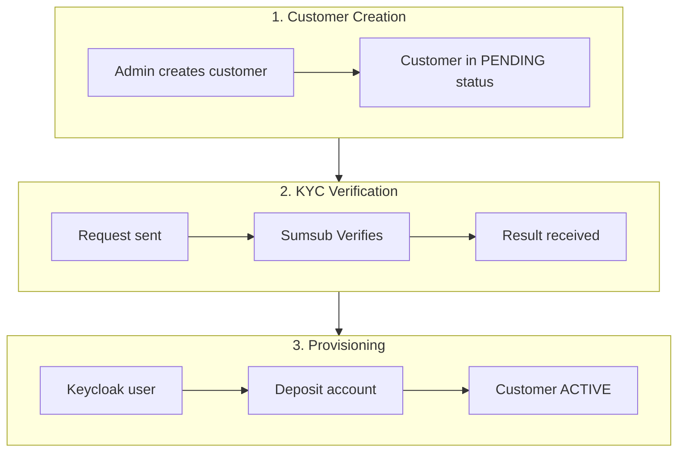

# Customer Onboarding Process

This document describes the complete customer onboarding flow, from initial registration to account activation.

## Onboarding Flow

## Step 1: Customer Creation

### From Admin Panel

1. Navigate to **Customers** > **New Customer**
2. Complete basic information:
   - Email
   - Telegram ID (optional)
   - Customer type
3. Click **Create**

## Step 2: KYC Verification

### Starting Verification

1. Navigate to customer detail
2. Click **Start KYC**
3. Sumsub verification link is generated

### KYC Status

| Status | Description | Next Action |
|--------|-------------|-------------|
| NOT_STARTED | KYC not initiated | Start verification |
| PENDING | Verification in progress | Wait for result |
| APPROVED | Identity verified | Proceed to activation |
| REJECTED | Verification failed | Review and retry |
| REVIEW_NEEDED | Manual review required | Review in Sumsub |

## Step 3: Automatic Provisioning

When KYC is approved, automatically:

1. Keycloak user created (customer realm)
2. Welcome email sent with credentials
3. Deposit account created
4. Customer can access portal

## Admin Panel Operations

### Customer List

- Filter by status (Active, Inactive, Pending)
- Search by email or public ID
- Sort by creation date

### Available Actions

| Action | Description | Required Permission |
|--------|-------------|---------------------|
| Create customer | New registration | CUSTOMER_CREATE |
| View customer | Query information | CUSTOMER_READ |
| Start KYC | Begin verification | CUSTOMER_UPDATE |
| Deactivate | Suspend account | CUSTOMER_UPDATE |

