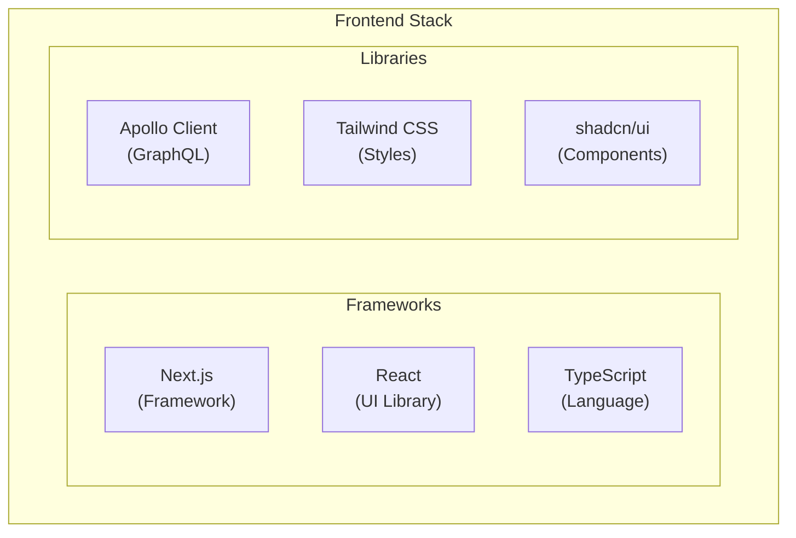

# Frontend Applications

This document describes Lana's frontend applications, their architecture, and development patterns.

## Overview

Lana includes two main frontend applications:

| Application | Purpose | Users |
|-------------|---------|-------|
| Admin Panel | Bank management | Administrative staff |
| Customer Portal | Self-service | Bank customers |

## Technology Stack



## Directory Structure

```
apps/
├── admin-panel/           # Admin Panel
│   ├── app/               # Next.js App Router
│   ├── components/        # React components
│   ├── lib/               # Utilities and config
│   └── generated/         # Generated code (GraphQL)
│
├── customer-portal/       # Customer Portal
│   ├── app/               # Next.js App Router
│   ├── components/        # React components
│   └── generated/         # Generated code (GraphQL)
│
└── shared/                # Shared code
    ├── ui/                # UI components
    └── utils/             # Common utilities
```

## Development Patterns

### Server Components vs Client Components

```typescript
// Server Component (default)
export default async function CustomersPage() {
  const customers = await fetchCustomers();
  return <CustomerList customers={customers} />;
}

// Client Component (interactive)
'use client';

export function CustomerForm() {
  const [name, setName] = useState('');
  // ...
}
```

### State Management

- **Apollo Client**: Server state (GraphQL data)
- **React Context**: Global UI state
- **useState/useReducer**: Local component state

## Local Development

### Start Applications

```bash
# Admin Panel
cd apps/admin-panel
pnpm dev

# Customer Portal
cd apps/customer-portal
pnpm dev
```

### Development URLs

| Application | URL |
|-------------|-----|
| Admin Panel | http://admin.localhost:4455 |
| Customer Portal | http://app.localhost:4455 |

## Related Documentation

- [Admin Panel](admin-panel) - Admin panel documentation
- [Customer Portal](customer-portal) - Customer portal documentation
- [Shared Components](shared-components) - UI library
- [Credit UI](credit-ui) - Credit facility management

