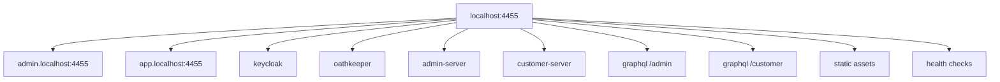
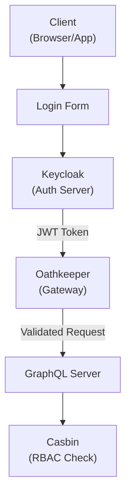
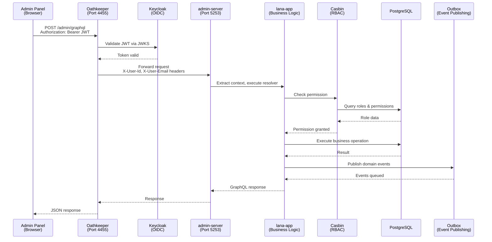
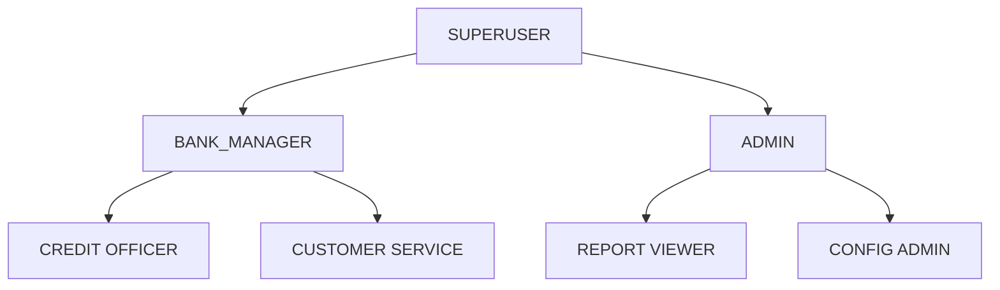

# Authentication and Authorization Architecture

This document describes Lana's authentication and authorization system, including Keycloak integration, OAuth 2.0 flows, and RBAC implementation.



## Overview

Lana's security architecture consists of:

- **Keycloak**: Identity provider and token issuer
- **Oathkeeper**: API gateway for JWT validation
- **Casbin**: Role-based access control engine
- **Audit System**: Authorization decision logging

## Architecture



## Keycloak Configuration

### Realms

| Realm | Purpose | Users |
|-------|---------|-------|
| admin | Administrative access | Bank employees |
| customer | Customer access | Bank customers |

### Clients

Each realm has configured clients:

- **admin-panel**: Web application for administrators
- **customer-portal**: Web application for customers
- **api-client**: For programmatic API access

### Token Configuration

JWT tokens include:
- User ID (`sub`)
- Realm roles
- Client roles
- Token expiration

## Oathkeeper Gateway

Oathkeeper validates incoming requests at port 4455:

### Rules Configuration

```yaml
# Admin API rule
- id: admin-api
  upstream:
    url: http://admin-server:5253
  match:
    url: http://admin.localhost:4455/graphql
    methods: [POST]
  authenticators:
    - handler: jwt
      config:
        jwks_urls:
          - http://keycloak:8081/realms/admin/protocol/openid-connect/certs
  authorizer:
    handler: allow
```

### Request Mutation



Validated requests include:
- `X-Auth-Subject`: User ID
- `X-Auth-Roles`: User roles

## Role-Based Access Control

### Casbin Model

```ini
[request_definition]
r = sub, obj, act

[policy_definition]
p = sub, obj, act

[role_definition]
g = _, _

[policy_effect]
e = some(where (p.eft == allow))

[matchers]
m = g(r.sub, p.sub) && r.obj == p.obj && r.act == p.act
```

### Permission Structure

| Role | Permissions |
|------|-------------|
| SUPERUSER | All permissions |
| BANK_MANAGER | Customer, credit, reports management |
| CREDIT_OFFICER | Credit facility operations |
| TELLER | Basic deposit/withdrawal operations |

### GraphQL Authorization

```rust
#[derive(SimpleObject)]
pub struct Query;

#[Object]
impl Query {
    #[graphql(guard = "RoleGuard::new(Permission::CustomerRead)")]
    async fn customer(&self, ctx: &Context<'_>, id: ID) -> Result<Customer> {
        // Implementation
    }
}
```

## Permission Hierarchy



## Audit Logging

All authorization decisions are logged:

```rust
pub struct AuthorizationAudit {
    timestamp: DateTime<Utc>,
    subject: SubjectId,
    object: String,
    action: String,
    decision: Decision,
    reason: Option<String>,
}
```

### Audit Query

```graphql
query GetAuthorizationAudits($filter: AuditFilter!) {
  authorizationAudits(filter: $filter) {
    edges {
      node {
        timestamp
        subject
        action
        decision
      }
    }
  }
}
```

## Session Management

### Token Refresh

Tokens have configurable lifetimes:
- Access token: 5 minutes
- Refresh token: 30 minutes
- Session: 8 hours

### Logout

```typescript
// Client-side logout
keycloak.logout({
  redirectUri: window.location.origin,
});
```

## Security Best Practices

### Token Storage

- Store tokens in memory (not localStorage)
- Use httpOnly cookies for refresh tokens
- Clear tokens on logout

### CORS Configuration

- Restrict allowed origins
- Validate Referer headers
- Use strict Content-Type checking

### Rate Limiting

- Implement per-user rate limits
- Monitor for unusual patterns
- Block after failed authentication attempts

