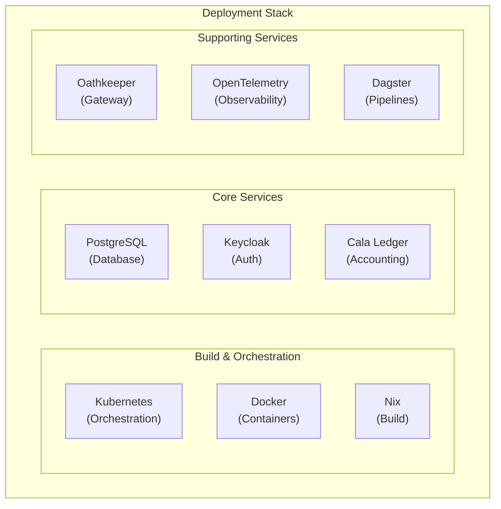

# Deployment Guide

This section describes deployment procedures and infrastructure configuration for Lana.

## Deployment Stack



## Environment Types

| Environment | Purpose | Configuration |
|-------------|---------|---------------|
| Development | Local development | Docker Compose + Tilt |
| Staging | Pre-production testing | GKE cluster |
| Production | Live system | GKE cluster with HA |

## Documentation

- [Build System](build-system) - Nix builds and Docker images
- [Development Environment](development-environment) - Local setup
- [Testing Strategy](testing-strategy) - Test layers and tools
- [CI/CD Pipeline](ci-cd) - Automation and deployment

## Quick Start

### Local Development

```bash
# Enter Nix development shell
nix develop

# Start dependencies
make start-deps

# Run application
cargo run
```

### Production Deployment

```bash
# Build Docker images
nix build .#docker-image

# Deploy to Kubernetes
kubectl apply -f k8s/
```

## Infrastructure Requirements

### Compute

| Component | Resources |
|-----------|-----------|
| API Servers | 2 CPU, 4GB RAM |
| PostgreSQL | 4 CPU, 16GB RAM |
| Keycloak | 2 CPU, 4GB RAM |

### Storage

- PostgreSQL: SSD with provisioned IOPS
- Object Storage: For documents and backups

### Network

- Load balancer for API traffic
- VPN for administrative access
- Private network for internal services

