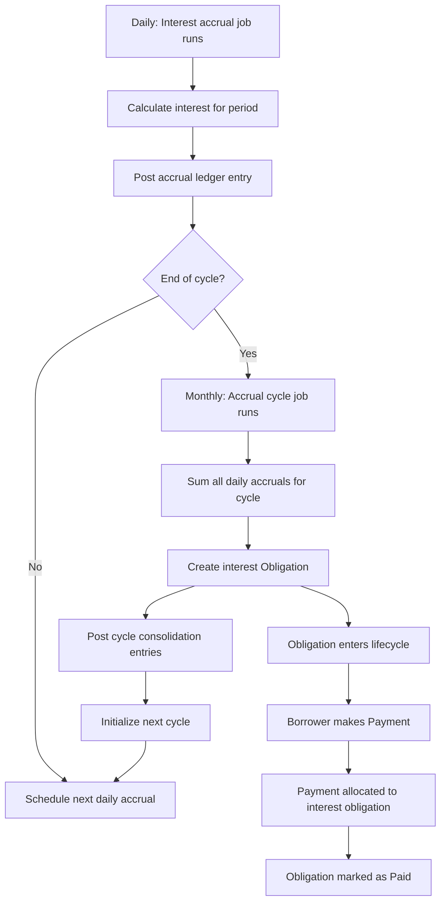

# Interest Process

Interest on a credit facility accrues periodically based on the outstanding principal and the annual rate defined in the facility's terms. The interest process uses a two-level timing system: frequent accruals record interest as it accumulates, while periodic cycles convert that accrued interest into payable obligations. This separation allows the ledger to reflect interest as it is earned (for accounting accuracy) while giving borrowers a predictable payment schedule (for operational simplicity).

## Two-Level Timing System

The interest process is governed by two distinct timing intervals, both defined in the facility's [Terms](terms):

### Accrual Interval

The `accrual_interval` controls how frequently interest is calculated and recorded in the ledger. This is typically set to daily (end of day). At each accrual interval, the system calculates the interest owed for that period based on the outstanding principal balance and the annual rate, then posts an accounting entry to recognize that interest as earned revenue.

During this phase, the interest is recognized in the bank's books but is not yet a payable debt for the borrower. It appears as accrued interest receivable on the balance sheet.

### Accrual Cycle Interval

The `accrual_cycle_interval` controls how frequently accrued interest is consolidated into a payable obligation. This is typically set to monthly (end of month). At the end of each cycle, the system totals all the daily accruals from that period and creates an interest [Obligation](obligation) for the full amount.

Once the obligation is created, the borrower owes that amount and it enters the standard obligation lifecycle (Not Yet Due, Due, Overdue, etc.).

### Why Two Levels?

The two-level system serves different needs simultaneously:

- **Accounting accuracy**: Daily accruals ensure the ledger reflects interest revenue as it is earned, complying with accrual-based accounting principles. Financial statements at any point in time show the correct amount of interest earned but not yet billed.
- **Borrower experience**: Monthly obligation creation gives borrowers a predictable billing cycle rather than daily micro-obligations. The borrower sees one interest payment due per month rather than 30 individual daily charges.
- **Operational clarity**: Operators can see both the real-time accrued interest (for risk assessment) and the formal obligations (for collection management).

## Interest Calculation

Interest for each accrual period is calculated by converting the annual rate to a daily rate and applying it to the outstanding principal balance:

1. The system determines the number of days in the current accrual period.
2. The annual rate is pro-rated for those days (annual rate divided by days in the year, multiplied by period days).
3. The resulting amount is applied to the outstanding disbursed principal, which includes all settled disbursals minus any principal payments already received.

Interest is calculated in USD cents to avoid floating-point precision issues. The calculation uses the actual number of days in each period, accounting for months of varying lengths.

## Interest Accrual Job

The interest accrual job is a recurring background job that runs at every accrual interval (typically daily). For each active credit facility with outstanding principal:

1. **Calculate period interest**: Computes the interest amount for the current period based on the outstanding principal and the annual rate.
2. **Record ledger entry**: Posts an accounting transaction that debits the interest receivable account and credits the interest income account. This recognizes the interest as earned revenue.
3. **Reschedule**: The job automatically schedules itself to run again at the next accrual interval.

If the current accrual period is the last one in the current cycle, the job also triggers the accrual cycle job to consolidate the cycle's interest into an obligation.

## Interest Accrual Cycle Job

The interest accrual cycle job runs at the end of each accrual cycle (typically monthly). It performs the consolidation step that converts accrued interest into a payable debt:

1. **Total the cycle's accruals**: Sums all the individual accrual amounts recorded during the cycle.
2. **Create an interest obligation**: If the total is non-zero, creates a new Obligation of type Interest with the consolidated amount. The obligation's due date is calculated based on the `interest_due_duration_from_accrual` term parameter.
3. **Post cycle ledger entries**: Records accounting transactions that reclassify the interest from accrued (pending) to posted (settled). This moves the amounts from the pending receivable layer to the settled receivable layer in the ledger.
4. **Initialize the next cycle**: Creates the next accrual cycle entity and schedules the first accrual job for the new cycle.

## Lifecycle of Interest Through the System

The full journey of interest from calculation to payment follows these steps:

1. **Day 1-30**: Interest accrues daily. Each day, the accrual job records a small ledger entry. The borrower does not see individual daily charges.
2. **End of Month**: The cycle job consolidates 30 days of accruals into a single interest obligation. The borrower now owes this amount.
3. **Due Date**: Based on the terms, the obligation becomes due after the configured `interest_due_duration_from_accrual` period.
4. **Payment**: When the borrower makes a payment, the allocation system distributes funds to the interest obligation (which has priority over principal within the same status tier).

## Interest at Facility Maturity

When a credit facility reaches its maturity date, any interest that has accrued but not yet been consolidated into an obligation is immediately posted. The final accrual cycle closes regardless of whether a full cycle period has elapsed, ensuring that all earned interest is captured as a payable obligation before the facility completes.

## One-Time Structuring Fee

In addition to periodic interest, each disbursal may incur a one-time structuring fee based on the `one_time_fee_rate` defined in the facility terms. This fee is calculated as a percentage of the disbursed amount and is recognized as fee income at the time of disbursal. Unlike periodic interest, the structuring fee is charged once per disbursal rather than accruing over time.

## Accounting Entries

The interest process creates two types of ledger entries:

### Daily Accrual Entry
- **Debit**: Interest receivable account (asset, pending layer) — recognizes the bank's right to receive interest
- **Credit**: Interest income account (revenue) — recognizes the interest as earned revenue

### Cycle Consolidation Entry
- **Debit**: Interest receivable account (settled layer) — reclassifies the receivable as a formal obligation
- **Credit**: Interest receivable account (pending layer) — removes the pending accruals now that they have been consolidated

This two-step approach keeps the ledger accurate at all times: the bank's books show interest income as it is earned daily, while the receivable classification correctly distinguishes between interest that has been billed (obligation created) and interest that is still accruing.
