# Deposit and Withdrawal Operations

This document describes the mechanics of recording deposits and processing withdrawals, including the approval workflow, ledger entries, and reversal capabilities.

## Deposit Operations

### How Deposits Work

A deposit represents an inbound fund movement into a customer's account. Deposits are recorded by operators when external funds have been received (e.g., via wire transfer, check, or other settlement mechanism). The system does not initiate the actual fund movement; it records the fact that funds have arrived.

```mermaid
graph LR
    RCV["External funds received"] --> REC["Operator records deposit<br/>(amount + reference)"] --> LEDGER["Ledger entry posted<br/>(omnibus ↔ customer)"] --> AVL["Funds available<br/>in customer account"]
```

When a deposit is recorded:

1. The system validates that the deposit account is active and the amount is non-zero.
2. A new deposit entity is created with status `Confirmed`.
3. A ledger transaction posts two entries on the settled layer.
4. The deposit is immediately available in the customer's balance.

### Deposit Accounting Entry

| Account | Debit | Credit | Layer |
|---------|:-----:|:------:|-------|
| Deposit Omnibus (Asset) | X | | Settled |
| Customer Deposit Account (Liability) | | X | Settled |

The omnibus account (the bank's cash/reserves) increases on the debit side, and the customer's deposit account (a liability the bank owes to the customer) increases on the credit side.

### Deposit Reversal

If a deposit was recorded in error, it can be reverted. Reversal posts the inverse ledger transaction (credit the omnibus, debit the customer account), returning both accounts to their pre-deposit state. The deposit entity transitions to `Reverted` status. Reversal is idempotent: reversing an already-reverted deposit has no effect.

## Withdrawal Operations

### Withdrawal Lifecycle

Withdrawals are more complex than deposits because they require governance approval before funds are released. The full lifecycle involves encumbering funds at initiation, waiting for approval, and then confirming or cancelling the withdrawal.

| Status | Description |
|--------|-------------|
| **Pending Approval** | Withdrawal initiated, funds encumbered, awaiting governance decision |
| **Pending Confirmation** | Governance approved, awaiting operator confirmation of actual fund disbursement |
| **Confirmed** | Funds released, withdrawal complete |
| **Denied** | Governance rejected the withdrawal, funds restored |
| **Cancelled** | Operator cancelled the withdrawal before confirmation, funds restored |
| **Reverted** | Previously confirmed withdrawal reversed, funds restored |

### Step-by-Step Withdrawal Flow

**1. Initiation** - An operator initiates a withdrawal by specifying the amount and an optional reference. The system:
- Validates that the account is active and the amount is non-zero.
- Creates a governance approval process (type: `withdraw`).
- Posts an `INITIATE_WITHDRAW` ledger transaction that moves funds from settled to pending.
- The customer's settled balance decreases immediately, preventing the funds from being used for other operations.

**2. Approval** - The governance system processes the withdrawal according to the configured policy:
- If the policy is `SystemAutoApprove`, the withdrawal is approved instantly.
- If the policy uses `CommitteeThreshold`, committee members must vote to approve or deny.
- A single denial from any committee member immediately rejects the withdrawal.
- This step happens asynchronously via the event-driven job system.

**3a. Confirmation** - After approval, an operator confirms the withdrawal, indicating that the actual fund disbursement has occurred externally. A `CONFIRM_WITHDRAW` ledger transaction clears the pending balance.

**3b. Cancellation** - At any point before confirmation (even before approval concludes), an operator can cancel the withdrawal. A `CANCEL_WITHDRAW` ledger transaction reverses the encumbrance, restoring the settled balance.

**3c. Denial** - If governance denies the withdrawal, a `DENY_WITHDRAW` ledger transaction automatically reverses the encumbrance, identical in effect to cancellation.

**4. Reversal (optional)** - A confirmed withdrawal can be reversed if the external fund movement failed or was returned. A `REVERT_WITHDRAW` ledger transaction restores the settled balance.

### Withdrawal Accounting Entries

The withdrawal process uses four different ledger templates depending on the stage:

#### Initiation (encumber funds)

| Account | Debit | Credit | Layer |
|---------|:-----:|:------:|-------|
| Deposit Omnibus (Asset) | | X | Settled |
| Customer Deposit Account (Liability) | X | | Settled |
| Deposit Omnibus (Asset) | X | | Pending |
| Customer Deposit Account (Liability) | | X | Pending |

This moves the amount from settled to pending on both the omnibus and customer accounts.

#### Confirmation (release funds)

| Account | Debit | Credit | Layer |
|---------|:-----:|:------:|-------|
| Deposit Omnibus (Asset) | | X | Pending |
| Customer Deposit Account (Liability) | X | | Pending |

Clears the pending encumbrance. The settled balance was already reduced at initiation.

#### Cancellation or Denial (restore funds)

| Account | Debit | Credit | Layer |
|---------|:-----:|:------:|-------|
| Deposit Omnibus (Asset) | | X | Pending |
| Customer Deposit Account (Liability) | X | | Pending |
| Deposit Omnibus (Asset) | X | | Settled |
| Customer Deposit Account (Liability) | | X | Settled |

The exact inverse of initiation: clears pending and restores settled.

#### Reversal (undo confirmed withdrawal)

| Account | Debit | Credit | Layer |
|---------|:-----:|:------:|-------|
| Deposit Omnibus (Asset) | X | | Settled |
| Customer Deposit Account (Liability) | | X | Settled |

Restores the settled balance as if the withdrawal never happened.

## Admin Panel Walkthrough: Deposits and Withdrawals

This flow shows operational creation and management of deposits and withdrawals.

### A) Create a deposit

**Step 1.** Click global **Create**.

**Step 2.** Select **Create Deposit**.

**Step 3.** Enter deposit amount.

**Step 4.** Submit.

**Step 5.** Confirm success message.

**Step 6.** Verify deposit in deposit list.

**Step 7.** Verify deposit in customer transaction history.

### B) Create a withdrawal

**Step 8.** Click **Create** for withdrawal initiation.

**Step 9.** Select **Create Withdrawal**.

**Step 10.** Enter withdrawal amount.

**Step 11.** Submit the request.

**Step 12.** Verify withdrawal appears in withdrawal list.

**Step 13.** Verify withdrawal appears in customer transactions.

### C) Manage withdrawal outcome

#### Cancel a pending withdrawal

**Step 14.** Click **Cancel**.

**Step 15.** Confirm cancellation.

**Step 16.** Verify status becomes cancelled.

#### Approve a pending withdrawal

**Step 17.** Click **Approve**.

**Step 18.** Confirm approval.

**Step 19.** Verify approved/confirmed status.

