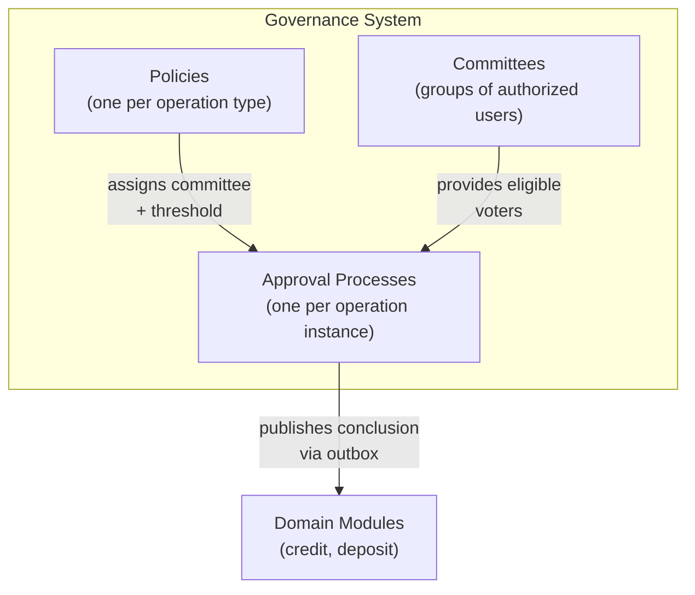
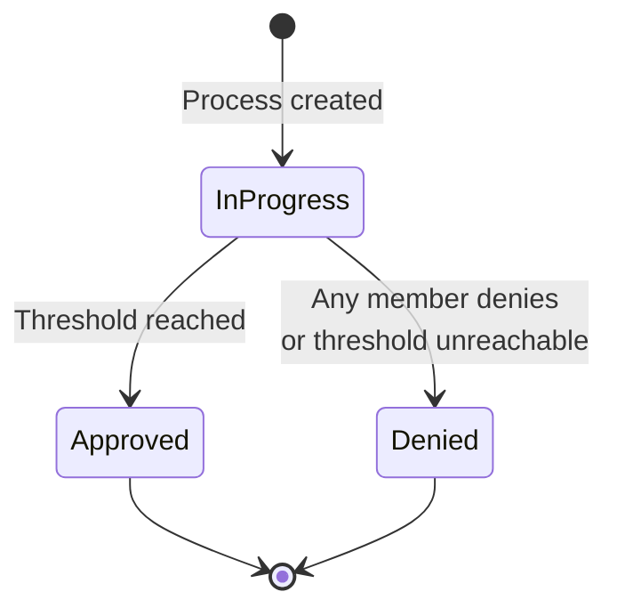

# Governance and Approval System

The governance system provides structured multi-party authorization for critical financial operations. Before a credit facility proposal can proceed, before a disbursal releases funds, or before a withdrawal is confirmed, the governance system ensures that the appropriate people have reviewed and approved the action.

The system is built on three core concepts: **policies** define the rules, **committees** provide the people, and **approval processes** execute the workflow for each individual operation.

## How It Works

When a domain operation requires approval:

1. The originating module (credit or deposit) calls the governance system to **start an approval process**.
2. The governance system looks up the **policy** configured for that operation type.
3. The policy's **rules** are copied into the new process (either auto-approve or committee threshold).
4. If the rules require committee approval, **committee members vote** to approve or deny.
5. When the threshold is met (or a denial occurs), the process **concludes** and publishes an outbox event.
6. The originating module reacts to the conclusion event and proceeds accordingly (e.g., settling a disbursal or reversing a withdrawal hold).

## Governed Operation Types

Three operation types are governed by the approval system:

| Operation | Process Type | Triggered When | On Approval | On Denial |
|-----------|-------------|----------------|-------------|-----------|
| **Credit Facility Proposal** | `credit-facility-proposal` | Customer accepts a proposal | Proposal converts to a pending facility | Proposal is rejected |
| **Disbursal** | `disbursal` | Operator creates a disbursal | Disbursal is settled, funds credited | Disbursal is cancelled, no funds released |
| **Withdrawal** | `withdraw` | Operator initiates a withdrawal | Withdrawal proceeds to confirmation | Withdrawal is denied, held funds restored |

Each operation type has exactly one policy. By default, all policies start with `SystemAutoApprove` rules, meaning operations are approved instantly without human intervention. An administrator can then assign a committee and threshold to any policy, switching it to require manual approval.

## Approval Rules

The rules determine how an approval process reaches its conclusion. There are two modes:

### System Auto-Approve

The default mode for all policies. When an approval process is created under a `SystemAutoApprove` policy, it concludes immediately with an approved result. No human intervention is needed.

This is appropriate for low-risk operations or during initial system setup before governance committees are configured.

### Committee Threshold

When a policy is configured with a committee and a threshold number, each approval process requires that at least N eligible committee members vote to approve before the process concludes. The threshold must be:

- At least 1 (zero-threshold policies are not allowed)
- At most equal to the number of current committee members

**Denial is immediate**: A single deny vote from any eligible committee member causes the entire process to be denied, regardless of how many approvals have already been cast. This gives every committee member effective veto power.

**Eligible voters are evaluated at vote time**: If a member is added to a committee after a process starts, they can still vote on that process. If a member is removed, their existing votes still count, but the eligible set shrinks, potentially making the threshold unreachable (which also results in denial).

## Approval Process Lifecycle

| Status | Description |
|--------|-------------|
| **In Progress** | Process is active, accepting votes from committee members |
| **Approved** | Sufficient approvals received; the governed operation can proceed |
| **Denied** | A committee member denied, or the threshold became unreachable |

When a process concludes (either approved or denied), an `ApprovalProcessConcluded` event is published to the outbox. The domain module that started the process listens for this event and takes the appropriate action.

## Integration Pattern

All three domain modules follow the same integration pattern with governance:

1. **Policy initialization**: At application startup, each module registers its approval process type. If the policy already exists, the existing one is reused (idempotent initialization).
2. **Process creation**: When the domain operation occurs, a new approval process is started within the same database transaction. If the policy is auto-approve, the process concludes immediately.
3. **Asynchronous conclusion handling**: A background job runner listens to the outbox for `ApprovalProcessConcluded` events, filters by process type, and executes the domain-specific consequence.

This event-driven pattern means the governance system is decoupled from the domain modules. The governance system does not know or care what a "disbursal" or "withdrawal" is; it only knows about approval processes with types and votes.

## Role-Based Access Control

Governance operations are protected by RBAC permissions:

- **GovernanceWriter**: Can create committees, manage membership, create policies, update rules, and cast votes.
- **GovernanceViewer**: Can read and list committees, policies, and approval processes.

All governance actions are recorded in the audit log, including who voted, when, and what the outcome was.

## Related Documentation

- [Committee Configuration](committees) - Managing approval committees
- [Approval Policies](policies) - Policy configuration

## Admin Panel Walkthrough: User and Role Management

Governance operations depend on correct user-role assignments. Lana uses role-based access control
where roles map to permission sets, and effective permissions are the union across assigned roles.

**Step 1.** Open the users list.

**Step 2.** Click **Create**.

**Step 3.** Enter user email.

**Step 4.** Select initial role (example: admin role assignment).

**Step 5.** Submit user creation.

**Step 6.** Verify creation success.

**Step 7.** Confirm user appears in list.

**Step 8.** Open role-management for the user.

**Step 9.** Update role set/permissions.

**Step 10.** Verify role update success.

