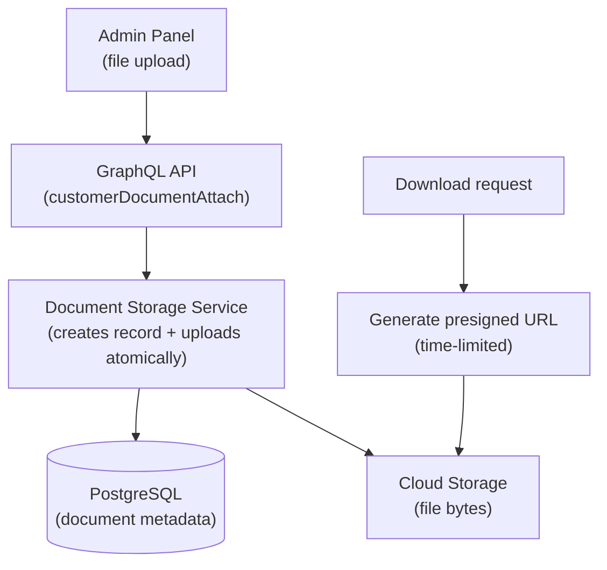
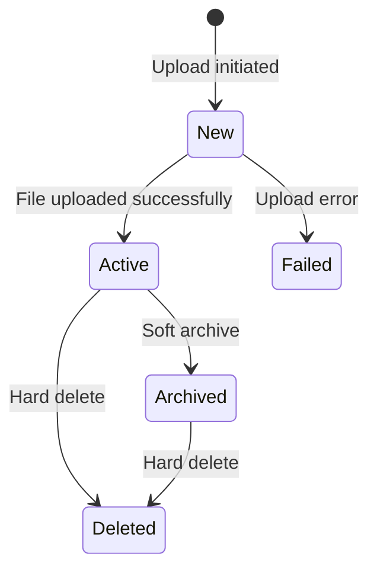

# Customer Document Management

The document management system handles file uploads, cloud storage, and secure download link generation for customer-related documents. Documents are stored in cloud storage (Google Cloud Storage or S3-compatible) with metadata tracked in the database through event sourcing. The system supports any file type but is primarily used for identity documents, corporate filings, and supporting materials for KYC and credit processes.

## Storage Architecture

Documents are stored using a two-part approach: the file metadata (ID, filename, content type, status, reference to owning customer) is persisted as an event-sourced entity in PostgreSQL, while the actual file bytes are uploaded to cloud storage. The storage path follows the pattern `documents/customer_document/{document_id}{extension}`.

When a user requests a download, the system generates a presigned URL with a time-limited expiration, allowing direct browser download from cloud storage without proxying the file through the application server.

## Document Lifecycle

| Status | Description |
|--------|-------------|
| **New** | Document record created, file upload in progress |
| **Active** | File successfully uploaded to cloud storage and available for download |
| **Failed** | Upload to cloud storage failed (can be retried) |
| **Archived** | Soft-archived; file remains in cloud storage but is marked as no longer current |
| **Deleted** | Removed from both the entity record (soft delete) and cloud storage (hard delete) |

Document creation and file upload happen atomically within a single database transaction. If the upload fails, the document transitions to `Failed` status. Under normal conditions, documents move directly from `New` to `Active`.

## File Handling

### Filename Sanitization

When a document is uploaded, the original filename is sanitized for safe storage. All non-alphanumeric characters (except hyphens) are replaced with hyphens, and whitespace is trimmed. Both the original and sanitized filenames are preserved in the document record for reference.

### Content Types and Extensions

| Content Type | Extension |
|-------------|-----------|
| `application/pdf` | `.pdf` |
| `text/csv` | `.csv` |
| All others | No extension added |

The system accepts any content type. The extension mapping is used only for constructing the cloud storage path.

## Document Operations

| Operation | Description | Permission |
|-----------|-------------|------------|
| **Attach document** | Upload a file and associate it with a customer | CUSTOMER_DOCUMENT_CREATE |
| **List documents** | Retrieve all documents for a customer, sorted by creation date (newest first) | CUSTOMER_DOCUMENT_LIST |
| **View document** | Look up a single document by ID | CUSTOMER_DOCUMENT_READ |
| **Generate download link** | Create a time-limited presigned URL for downloading the file | CUSTOMER_DOCUMENT_GENERATE_DOWNLOAD_LINK |
| **Archive document** | Mark a document as archived without removing the file from storage | CUSTOMER_DOCUMENT_DELETE |
| **Delete document** | Remove the file from cloud storage and soft-delete the entity record | CUSTOMER_DOCUMENT_DELETE |

### Upload Flow

1. The operator selects a file in the admin panel and initiates the upload.
2. The system creates a document record with status `New`, including the sanitized filename and content type.
3. The file bytes are uploaded to cloud storage at the computed path.
4. On success, a `FileUploaded` event transitions the document to `Active` status.
5. On failure, an `UploadFailed` event records the error and transitions to `Failed` status.

### Download Flow

1. The operator or system requests a download link for a document.
2. The system generates a presigned URL from the cloud storage provider.
3. A `DownloadLinkGenerated` event is recorded for audit purposes (the document status does not change).
4. The presigned URL is returned, allowing direct download from cloud storage within the expiration window.

## Security

- **Presigned URLs**: Download links are time-limited and signed by the cloud storage provider. They expire after a configured duration, preventing indefinite access from shared or leaked URLs.
- **Encrypted transmission**: All uploads and downloads use TLS.
- **Encrypted at rest**: Files in cloud storage are encrypted using the provider's server-side encryption.
- **Authorization**: Every document operation requires the appropriate permission, enforced through the RBAC system. All operations are recorded in the audit log.

