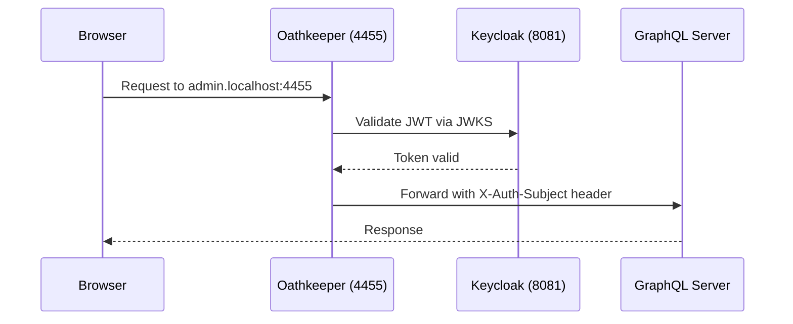

# Authentication for Local Development

This guide covers how authentication works in the local development environment, including Keycloak setup and login procedures.

## Keycloak Setup

Keycloak runs at **http://localhost:8081** and is automatically configured with realm imports when you run `make start-deps`.

### Keycloak Admin Console

- **URL**: http://localhost:8081
- **Username**: `admin`
- **Password**: `admin`

### Realms

| Realm | Purpose | Used by |
|-------|---------|---------|
| `internal` | Administrative users | Admin Panel |
| `customer` | Bank customers | Customer Portal |

Realm definitions are stored in `dev/keycloak/` and imported automatically on startup.

## Admin Panel Login

1. Navigate to http://admin.localhost:4455
2. You'll be redirected to Keycloak
3. Log in with: **admin@galoy.io**
4. The admin panel uses the `internal` Keycloak realm with OIDC Code Flow

## Customer Portal Login

1. First, create a customer via the Admin Panel
2. Open http://app.localhost:4455 in a separate browser or incognito window
3. Enter the customer's email address
4. Retrieve the login code:

```bash
make get-customer-login-code EMAIL=customer@example.com
```

5. Enter the code to complete login

The Customer Portal uses NextAuth with the Keycloak provider for OIDC authentication.

## Authentication Flow



### How Oathkeeper Works

Oathkeeper sits at port 4455 and handles all authentication:

1. Receives incoming requests with Bearer JWT tokens
2. Validates the JWT signature against Keycloak's JWKS endpoint
3. Issues an internal JWT with route-specific audience and user subject
4. Proxies the request to the appropriate upstream service (admin-server or customer-server)

The backend servers only accept internal JWTs from Oathkeeper — they verify using Oathkeeper's JWKS and check the audience claim.

## Token Lifetimes (Development)

| Token | Lifetime |
|-------|----------|
| Access token | 5 minutes |
| Refresh token | 30 minutes |
| Session | 8 hours |
