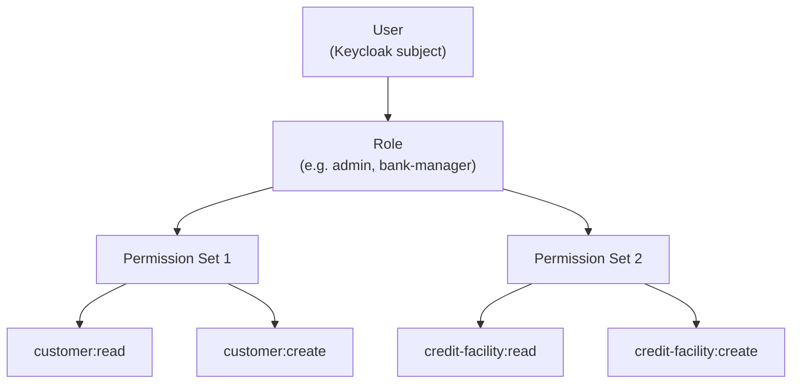

# Authorization and RBAC

Lana uses [Casbin](https://casbin.org/) for role-based access control (RBAC). Policies are stored in PostgreSQL and evaluated at runtime for every API operation.

## RBAC Model

The authorization model follows a three-level structure:

```
User → Role → PermissionSet → Permissions (Object + Action)
```



## Predefined Roles

| Role | Description | Key Permissions |
|------|-------------|-----------------|
| **Superuser** | Full system access | All permission sets |
| **Admin** | Full operational access | All except system-level |
| **Bank Manager** | Operations management | Customer, credit, deposits, reports (no access management or custody) |
| **Accountant** | Financial operations | Accounting and viewing functions |

A user's effective permissions are the **union** of permissions from all assigned roles.

## Permission Sets

Each domain module defines its own permission sets, typically following a **viewer/writer** pattern:

- `PERMISSION_SET_CUSTOMER_VIEWER` — read-only access to customer data
- `PERMISSION_SET_CUSTOMER_WRITER` — create/update customer data
- `PERMISSION_SET_CREDIT_VIEWER` — read credit facilities
- `PERMISSION_SET_CREDIT_WRITER` — manage credit facilities
- `PERMISSION_SET_EXPOSED_CONFIG_VIEWER` — read system configuration
- `PERMISSION_SET_EXPOSED_CONFIG_WRITER` — modify system configuration

## Casbin Policy Model

```
[request_definition]
r = sub, obj, act

[policy_definition]
p = sub, obj, act

[role_definition]
g = _, _

[policy_effect]
e = some(where (p.eft == allow))

[matchers]
m = g(r.sub, p.sub) && r.obj == p.obj && r.act == p.act
```

## How Authorization Works in Code

Every GraphQL resolver enforces permissions through the `Authorization::enforce_permission` function:

1. The request context contains the authenticated subject (from Oathkeeper)
2. The resolver calls `enforce_permission(subject, object, action)`
3. Casbin evaluates the policy against the subject's roles
4. If denied, an authorization error is returned
5. Every decision (allow and deny) is recorded in the audit log

## Audit Integration

Authorization decisions are automatically logged with:

- **Subject**: Who attempted the action
- **Object**: What the action targeted
- **Action**: The operation type (e.g., `customer:read`, `credit-facility:create`)
- **Authorized**: Whether it was allowed or denied

Both successful and failed access attempts are recorded, providing a complete audit trail for compliance.
