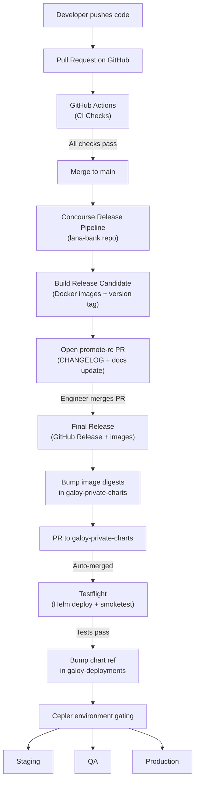
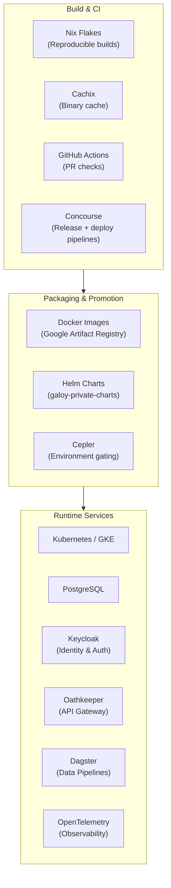

# Deployment & Release Engineering

Getting code from a developer's laptop into production involves several systems working together. This section explains every step of that journey — from how we build the software, to how it gets tested, packaged into Docker images, bundled into Helm charts, and finally deployed across multiple environments.

If you're new to the project, start with the [CI/CD & Release Engineering](ci-cd) page. It walks through the entire pipeline end-to-end in the order things actually happen.

## The Big Picture

The diagram below shows the full path a code change takes. Don't worry if it looks like a lot — each step is explained in detail in the linked pages.

In short: code goes through **three repositories** before it reaches production. Each repository has its own CI pipeline, and each one adds a layer of validation.

## Three Repositories, Three Pipelines

| Repository | What lives here | What its CI does |
|------------|----------------|-----------------|
| **lana-bank** | Application source code | Runs tests on PRs (GitHub Actions), builds Docker images and creates releases (Concourse) |
| **galoy-private-charts** | Helm chart that bundles the app with all its dependencies | Deploys the chart to a throwaway namespace to verify it works ("testflight"), then pushes the chart reference forward |
| **galoy-deployments** | Per-environment Terraform configs and Cepler gating rules | Deploys to staging, QA, and production — in that order, with safety gates between each |

## The Technology Stack

## Where to Go Next

- **[Build System](build-system)** — How Nix builds work, how the Cachix binary cache keeps things fast, and how Docker images are produced.
- **[CI/CD & Release Engineering](ci-cd)** — The main guide. Walks through every step from a PR all the way to production, including GitHub Actions, Concourse pipelines, Helm chart testing, Cepler environment gating, and production promotion.
