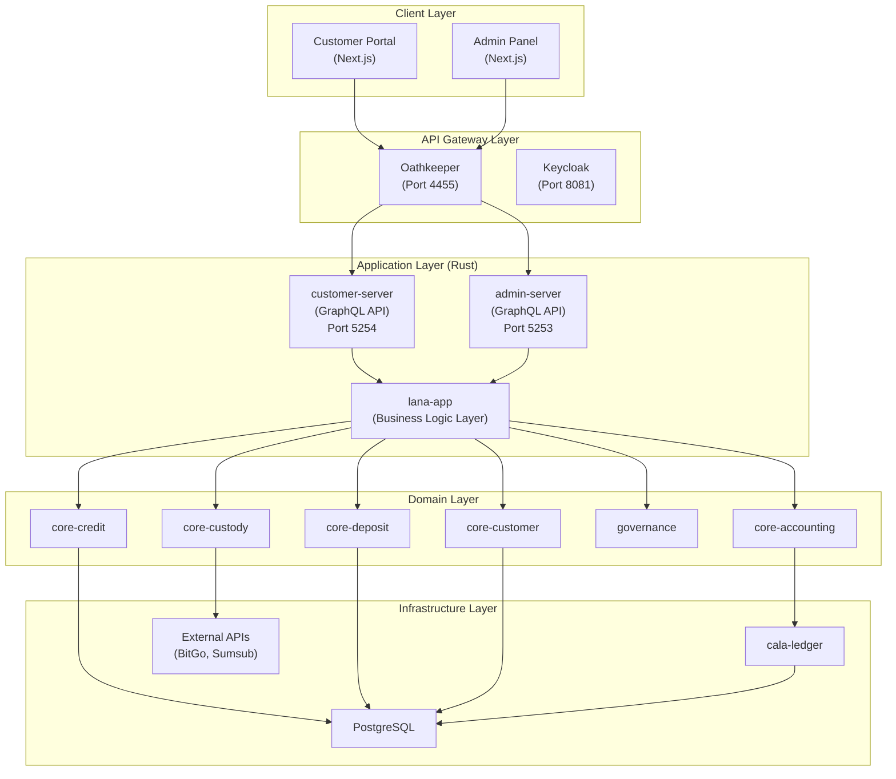
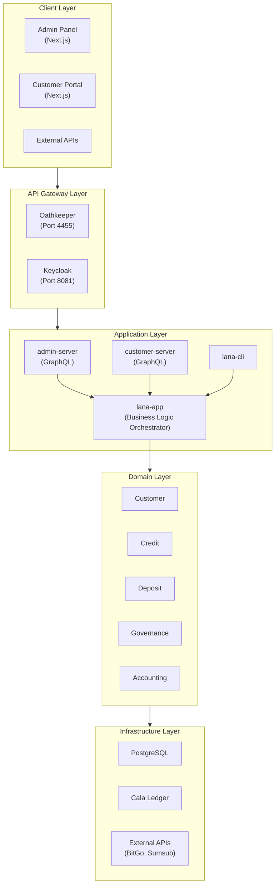
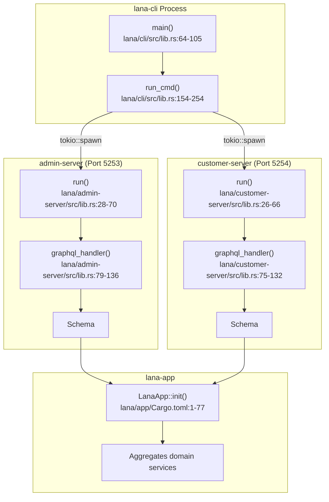
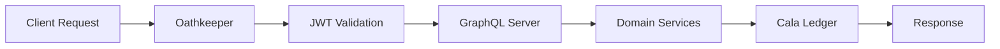
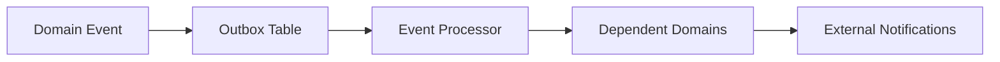

# System Architecture

This document describes Lana's system architecture, including layers, components, and data flow.

## System Layer Overview

Lana follows a layered architecture that separates concerns and enables maintainability:

## Client Layer

### Admin Panel

Web application for bank operations:
- Customer management
- Credit administration
- Financial reports
- Configuration

### Customer Portal

Client-facing interface:
- Account view
- Credit requests
- Transaction history
- Documents

## API Gateway Layer

### Oathkeeper (Port 4455)

Handles JWT validation and request routing:
- Validates tokens issued by Keycloak
- Routes requests to appropriate servers
- Enforces authentication policies

### Keycloak (Port 8081)

Identity and access management:
- Two realms: `admin` and `customer`
- OAuth 2.0 / OpenID Connect
- User authentication and session management

## Application Layer

### admin-server

GraphQL API for administrative operations:
- Full system access
- RBAC-based authorization
- Connects to admin Keycloak realm

### customer-server

GraphQL API for customer operations:
- Limited scope to customer's own data
- Simplified interface
- Connects to customer Keycloak realm

### lana-cli

Command-line tool for:
- Starting servers
- Running migrations
- Administrative tasks
- Batch operations

### lana-app

Central business logic orchestrator:
- Initializes all domain services
- Coordinates cross-domain operations
- Manages application lifecycle

## Domain Layer

Implements core business logic using Domain-Driven Design:

| Domain | Purpose |
|--------|---------|
| Customer | Customer lifecycle and KYC |
| Credit | Credit facilities and disbursements |
| Deposit | Deposit accounts and withdrawals |
| Governance | Multi-party approval workflows |
| Accounting | Financial period management |

## Infrastructure Layer

### PostgreSQL

Primary data store:
- Event storage
- Entity state
- Audit logs

### Cala Ledger

Double-entry accounting system:
- Account hierarchy
- Transaction recording
- Balance calculation

### External Integrations

- **BitGo/Komainu**: Cryptocurrency custody
- **Sumsub**: KYC verification
- **SMTP**: Email notifications

## Data Flow

### Request Processing

### Event Flow

## Key Architectural Decisions

### Event Sourcing

All state changes are captured as events:
- Complete audit trail
- Temporal queries
- Event replay capability

### Hexagonal Architecture

Clean separation of concerns:
- Domain logic isolated from infrastructure
- Adapter pattern for external services
- Testable business logic

### CQRS Pattern

Command Query Responsibility Segregation:
- Optimized read paths
- Separate write operations
- Eventual consistency where appropriate

