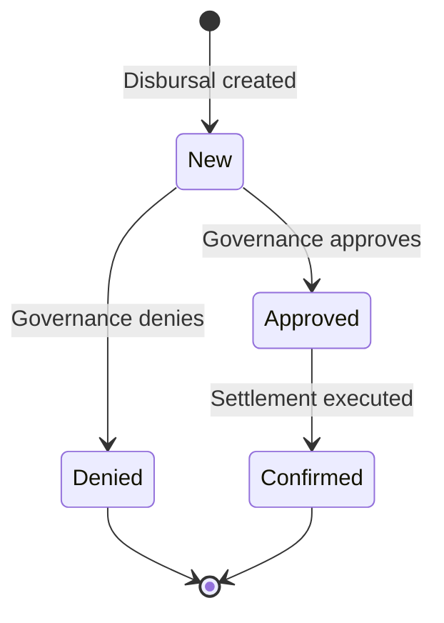

# Disbursal

A disbursal represents a drawdown of funds from an active credit facility to the customer. It is the mechanism through which the approved credit limit is converted into actual lending. Each disbursal records the amount released, links it to the facility, and triggers the creation of a principal obligation that the borrower must repay.

Facilities can be configured for either single or multiple disbursals. A single-disbursal facility releases the entire credit limit in one transaction. A multiple-disbursal facility allows the borrower to draw funds incrementally over time, up to the facility limit, which can be useful for working capital lines where the borrower's cash needs vary.

## Preconditions and Validation

Before a disbursal can be initiated, the system applies strict checks to ensure the lending event is safe and compliant:

- **Facility must be Active**: Disbursals cannot be created against facilities that are still in the proposal, pending, or completed states. The facility must have passed through both the governance and collateral gates.
- **Before maturity**: The disbursal date must be before the facility's maturity date. No new funds can be released from an expired facility.
- **Customer verification**: When KYC verification requirements are enabled by policy, the customer must have a verified KYC status before funds can be released.
- **Disbursal policy compliance**: The facility's disbursal policy (single vs. multiple) must allow a new disbursal. If the facility is configured for single disbursal and one has already been confirmed, no additional disbursals are permitted.
- **Collateral adequacy**: The post-disbursal CVL must remain at or above the `margin_call_cvl` threshold. This is a critical safety check — it ensures that releasing additional funds does not push the facility into an under-collateralized state. The system calculates what the CVL would be after the disbursal and rejects the request if it would breach the threshold.

These controls prevent under-collateralized or out-of-policy lending events from being created.

## Disbursal Approval Process

Each disbursal goes through its own governance approval process, independent of the facility-level approval. This means that even though the overall credit facility has been approved, each individual drawdown must also be authorized according to the bank's approval policies.

The approval process works identically to other governed operations in the system:

1. When a disbursal is created, the system automatically creates an approval process linked to the configured disbursal approval policy.
2. Members of the assigned committee can vote to approve or deny the disbursal.
3. If the required number of approvals is reached, the disbursal moves to the Approved state.
4. If any committee member denies the disbursal, it is immediately rejected.

For facilities with auto-approval policies, this step happens automatically without manual intervention.

## Status and Outcome Model

Operators typically see these status transitions:

- **New**: Disbursal initialized and awaiting governance decision. Funds have not been released.
- **Approved**: Governance approval threshold reached. The system proceeds to settle the disbursal.
- **Confirmed**: Disbursal settled; funds credited to the customer's deposit account and a principal obligation created. This is the only state that represents actual fund movement.
- **Denied**: Governance rejected the disbursal; no funds are released and no obligation is created.

## What Happens at Settlement

When a disbursal is confirmed (settled), several things happen simultaneously:

1. **Funds credited**: The disbursed amount is credited to the customer's deposit account through a ledger transaction.
2. **Principal obligation created**: A new obligation of type Disbursal is created for the full disbursed amount. This obligation enters the Not Yet Due state and its due date is set based on the facility terms.
3. **Structuring fee charged**: If the facility terms include a `one_time_fee_rate`, the corresponding fee is calculated and recognized as fee income.
4. **Interest accrual updated**: The outstanding principal balance increases, which affects future interest calculations. The daily interest accrual job will now include this disbursal amount in its calculations.
5. **CVL recalculated**: The facility's CVL is recalculated to reflect the increased exposure.

## Relationship to Obligations and Interest

A confirmed disbursal creates a principal obligation. That obligation then participates in the full obligation lifecycle and the interest system:

- The outstanding principal from the disbursal is included in daily interest accrual calculations, meaning interest begins accruing immediately from the settlement date.
- Periodic accrual processing records interest entries against the outstanding balance.
- At the end of each accrual cycle, consolidated interest becomes a separate interest-type obligation.
- When the borrower makes payments, the allocation system distributes funds across both principal and interest obligations according to priority rules (see [Payment](payment)).

For operators, this means disbursal confirmation is the starting point of long-lived repayment and risk monitoring, not the end of the workflow.

## Admin Panel Walkthrough: Create and Approve a Disbursal

This flow continues from an already active credit facility and shows how operators create and approve a disbursal.

**Step 23.** From the active facility page, click **Create** and then **Disbursal**.

**Step 24.** Enter the disbursal amount.

**Step 25.** Submit the disbursal request.

**Step 26.** Confirm you are redirected to the disbursal detail page.

**Step 27.** Click **Approve** to run governance approval.

**Step 28.** Verify the status changes to **Confirmed**.

**Step 29.** Confirm the disbursal appears in the disbursals list.

## What To Verify After Step 29

- Disbursal status is `Confirmed`.
- The disbursal is visible under the expected facility and customer.
- Facility history reflects execution/settlement activity.
- Repayment views show obligation impact for the new principal.
