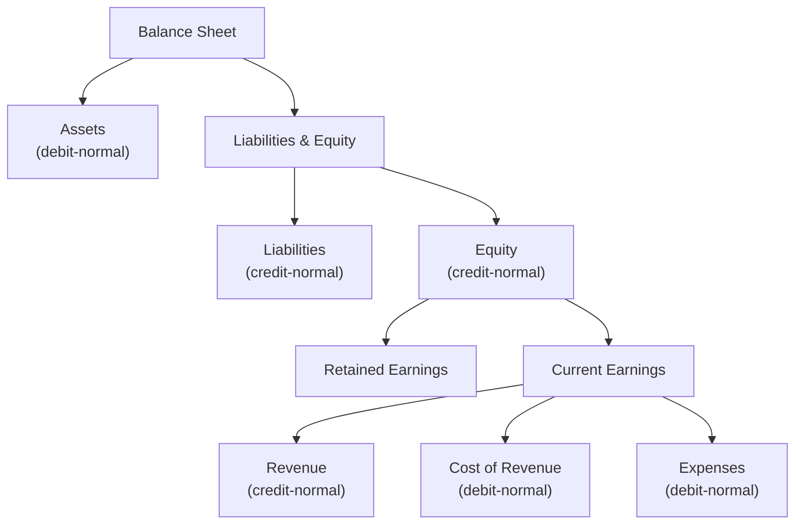

# Financial Reports

Financial reports in Lana are generated in real time from the Cala double-entry ledger. Unlike regulatory reports (which are batch-generated through the Dagster pipeline), financial statements are always current and reflect the latest state of all accounts. They are available through the admin panel and GraphQL API.

## Trial Balance

The trial balance lists all first-level accounts in the chart of accounts with their debit and credit balances for a specified date range. Its primary purpose is verification: total debits must equal total credits. If they do not, there is a bookkeeping error somewhere in the system.

### What It Shows

| Column | Description |
|--------|-------------|
| **Account** | Account code and name from the chart of accounts |
| **Opening Balance** | Balance at the start of the selected period |
| **Period Activity (Debit)** | Total debit movements during the period |
| **Period Activity (Credit)** | Total credit movements during the period |
| **Closing Balance** | Balance at the end of the selected period |

The trial balance aggregates balances across all child accounts under each first-level node using CALA account sets. Both USD and BTC currencies are supported and can be viewed separately.

### When to Use

- **Daily verification**: Confirm that the ledger is internally consistent (debits = credits).
- **Before monthly close**: Verify the trial balance before closing a month to catch discrepancies.
- **Investigating errors**: The trial balance is the first place to look when an accounting discrepancy is suspected.

## Balance Sheet

The balance sheet presents the bank's financial position at a specific date, organized into the fundamental accounting equation: **Assets = Liabilities + Equity**.

### Structure

The balance sheet is implemented as a hierarchy of CALA account sets. Each category (Assets, Liabilities, Equity) is an account set that contains the corresponding chart-of-accounts account sets as children. Equity includes a "Current Earnings" sub-section that contains Revenue, Cost of Revenue, and Expenses — this provides the link between the balance sheet and the P&L.

Both USD and BTC currencies are available. The balance layer can be filtered (settled vs. pending) to see confirmed-only or all-inclusive balances.

### When to Use

- **Financial position reporting**: Understand what the bank owns (assets), owes (liabilities), and the residual value (equity) at any point in time.
- **Regulatory reporting**: The balance sheet feeds into several regulatory report calculations.
- **Period-end review**: Before closing a fiscal year, verify that the balance sheet equation holds and that retained earnings are correct.

## Profit and Loss Statement

The profit and loss (P&L) statement shows the bank's financial performance over a period by calculating net income: **Net Income = Revenue - Cost of Revenue - Expenses**.

### Sections

| Section | Normal Balance | Components |
|---------|---------------|------------|
| **Revenue** | Credit | Interest income from credit facilities, fee income from structuring fees |
| **Cost of Revenue** | Debit | Direct costs associated with revenue generation |
| **Expenses** | Debit | Provisions for loan losses, operational expenses |

The P&L is structured similarly to the balance sheet: a root account set contains Revenue, Cost of Revenue, and Expenses as children, each linked to the corresponding chart-of-accounts categories.

At the end of each fiscal year, the closing process zeros out all P&L accounts and transfers the net result to retained earnings on the balance sheet (see [Period Closing](../accounting/closing)).

### When to Use

- **Performance tracking**: Monitor revenue and expenses over any time period.
- **Before fiscal year close**: Review the P&L before executing the year-end closing entry.
- **Variance analysis**: Compare period-over-period performance to identify trends.

## Ledger Account CSV Export

Individual ledger account transaction histories can be exported to CSV for detailed analysis. This is useful for reconciliation, auditing, or feeding data into external tools.

### How It Works

1. Navigate to a ledger account in the chart of accounts.
2. Request a CSV export.
3. The system asynchronously generates a CSV file containing the full transaction history.
4. A real-time notification (via GraphQL subscription) alerts the UI when the export is ready.
5. Generate a download link to retrieve the file.

### CSV Format

| Column | Description |
|--------|-------------|
| Recorded At | Timestamp of the transaction |
| Currency | USD or BTC |
| Debit Amount | Debit amount (if applicable) |
| Credit Amount | Credit amount (if applicable) |
| Description | Transaction description |
| Entry Type | Type of ledger entry |

## Admin Panel Walkthrough: Trial Balance

**Step 1.** Open the trial balance report.

**Step 2.** Switch currency view (example: BTC).

## Admin Panel Walkthrough: Balance Sheet

**Step 1.** Open the balance sheet report.

**Step 2.** Switch currency (USD/BTC).

**Step 3.** Filter by balance layer (example: pending).

## Admin Panel Walkthrough: Profit and Loss

**Step 1.** Open profit and loss report.

**Step 2.** Switch currency view.

**Step 3.** Filter by layer (example: pending).

