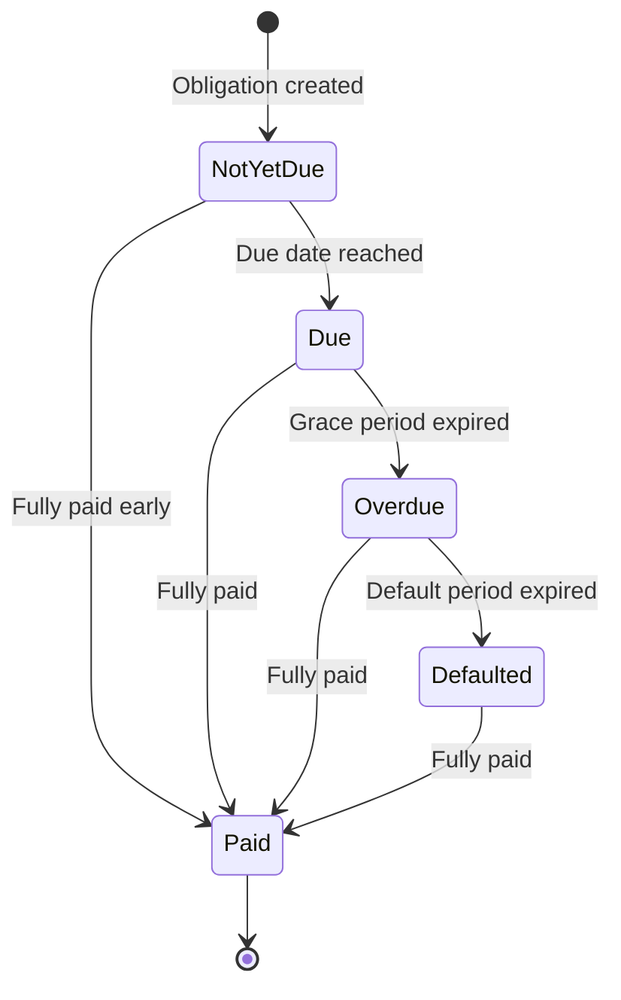

# Obligation

An obligation represents a specific amount that the borrower owes to the bank under a credit facility. Obligations are the fundamental units of debt tracking in the credit system. Every dollar owed by a borrower is recorded as an obligation with a defined type, amount, due date, and lifecycle status.

## How Obligations Are Created

Obligations are created automatically by the system in response to two types of events:

### Principal Obligations (from Disbursals)

When a disbursal is approved and settled, the system creates a principal obligation for the disbursed amount. This obligation represents the core debt that the borrower must repay. If a credit facility allows multiple disbursals, each settlement generates its own separate obligation, making it possible to track repayment against each individual drawdown.

### Interest Obligations (from Accrual Cycles)

At the end of each interest accrual cycle (typically monthly), the system consolidates all daily interest accruals for that period and creates an interest obligation for the total amount. This converts accrued interest from an accounting recognition into an actual payable debt. See [Interest Processing](interest-process) for details on how interest accrues and becomes obligations.

### One-Time Fee Obligations

When a disbursal is executed, a structuring fee may be charged based on the `one_time_fee_rate` defined in the facility terms. This fee is recognized at the time of disbursal.

## Obligation Data

Each obligation tracks:

| Field | Description |
|-------|-------------|
| **Type** | Either `Disbursal` (principal) or `Interest` |
| **Initial Amount** | The original amount of the obligation when created |
| **Outstanding Balance** | The remaining unpaid amount (initial amount minus all payment allocations received) |
| **Due Date** | The date when payment becomes expected |
| **Overdue Date** | The date when the obligation transitions to overdue if unpaid |
| **Defaulted Date** | The date when the obligation is classified as defaulted |
| **Liquidation Date** | The date when the obligation becomes eligible for liquidation proceedings |
| **Status** | The current lifecycle state (see below) |

## Obligation Lifecycle

Every obligation follows a time-driven state machine. Transitions happen automatically through background jobs that monitor dates and trigger status changes.

### Not Yet Due

The initial state for every new obligation. The borrower is aware of the upcoming payment but is not yet required to pay. Interest obligations enter this state when the accrual cycle closes and the obligation is created. Principal obligations enter this state when a disbursal settles.

### Due

The obligation's due date has arrived. The borrower is now expected to make payment. The system transitions obligations from Not Yet Due to Due automatically when the due date is reached through the obligation-due background job.

### Overdue

The borrower has failed to pay within the grace period after the due date. The grace period is controlled by the `obligation_overdue_duration_from_due` term parameter. For example, if this is set to 7 days, an obligation that was due on January 1st becomes overdue on January 8th. The obligation-overdue background job handles this transition.

Overdue obligations signal increasing credit risk and may trigger operational alerts or reporting requirements.

### Defaulted

The obligation has remained unpaid well beyond its due date. The default period is controlled by the `obligation_liquidation_duration_from_due` term parameter. This represents a more severe delinquency state and may trigger liquidation proceedings against the facility's collateral.

The obligation-defaulted background job handles this transition.

### Paid

The obligation has been fully satisfied through payment allocations. An obligation moves to Paid status as soon as its outstanding balance reaches zero, regardless of what state it was in before. This means obligations can be paid at any point in their lifecycle, from Not Yet Due through Defaulted.

## Timing Parameters

The timing of obligation state transitions is governed by parameters defined in the facility's [Terms](terms):

| Parameter | Controls |
|-----------|----------|
| `interest_due_duration_from_accrual` | How long after interest is accrued until the interest obligation becomes due |
| `obligation_overdue_duration_from_due` | Grace period after the due date before the obligation becomes overdue |
| `obligation_liquidation_duration_from_due` | Period after the due date before a defaulted obligation becomes eligible for liquidation |

These parameters allow the bank to configure different severity escalation timelines for different types of credit products. A short-term working capital facility might have tighter timelines than a long-term mortgage-style loan.

## Obligations and the Repayment Plan

The collection of all obligations for a credit facility forms the facility's repayment plan. The repayment plan provides a consolidated view showing each obligation's type, amount, due date, outstanding balance, and current status.

As events occur (new obligations created, payments allocated, status transitions), the repayment plan is automatically updated to reflect the current state. This gives operators and borrowers a real-time view of what has been paid, what is currently due, and what is upcoming.

## Relationship to Other Entities

- **Credit Facility**: Every obligation belongs to exactly one credit facility. The facility's terms govern the obligation's timing parameters and lifecycle rules.
- **Disbursals**: Each disbursal settlement creates one principal obligation.
- **Interest Accrual Cycles**: Each completed cycle creates one interest obligation.
- **Payments**: Payments are allocated to obligations through [Payment Allocations](payment), reducing their outstanding balance.
- **Collateralization**: The total outstanding obligations across all active facilities for a customer factor into collateral-to-loan value (CVL) calculations.
